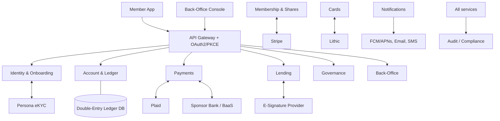

# Technical Architecture & API Specification — Digital Coop Bank

**Document ID:** 04_technical_architecture
**Status:** Final (single authoritative technical requirements document; supersedes the sprint_1–sprint_3 technical architect drafts)
**Upstream sources of truth:** `01_business_analysis.md` (Canonical Glossary & Decision Log DEC-1…DEC-20, capabilities CAP-1…CAP-13, features F-101…F-152) and `02_user_stories.md` (canonical backlog US-1.1…US-13.6, 60 stories across 13 epics). All entity names, statuses, and enum values in this document use the glossary **verbatim**. Superseded sprint terms (membership tokens, `YES/NO` votes, `PENDING_TOKEN`, $5/$10 share values, "Liquid Democracy", yield-donation routing) do not reappear here except in the reconciliation log.

**Conventions used throughout:**

* All monetary amounts are **USD, integer minor units (cents)** per DEC-18. The abstract type `Money` below means `BIGINT` minor units with implicit currency `USD` (an explicit `currency` column, fixed to `USD`, is carried on ledger rows for forward compatibility).
* All timestamps are UTC, ISO-8601 (`TIMESTAMPTZ`).
* All primary keys are UUIDv7 unless stated otherwise; `Member ID` (the member-facing identifier — non-guessable, non-sequential per DEC-28, e.g. `DCB-8K4W2M9X`) is a separate unique display attribute, never the PK.
* Enum machine values are `UPPER_SNAKE_CASE`; glossary-governed enums (`MembershipStatus`, `KycStatus`, `VoteChoice`, `ProposalCategory`, `ProposalStatus`, `BallotType`, `RecipientIdentifierType`, `LoanStatus`) are used exactly as defined in `01_business_analysis.md` §6.
* This is a requirements specification: no source code, no vendor SDK call signatures — abstract contracts only.

---

## 1. Architecture Overview

### 1.1 System Context

Digital Coop Bank is a purely digital cooperative banking platform: a mobile-first member application (iOS/Android, plus a member web app), a staff back-office web console, and a set of backend services behind a single API gateway. There are no branches and no paper processes; every regulated capability that the cooperative does not itself operate (identity verification, payment rails, card issuing, e-signature) is delivered through an integrated third-party provider.

| Actor / External System | Role in the System |
| :--- | :--- |
| Member app (iOS / Android / web) | All member-facing capabilities (EP-1…EP-11, EP-13 member views). Authenticates via OAuth 2.0 Authorization Code + PKCE. |
| Back-office console (web) | All P-5 staff capabilities (EP-12, EP-13 staff views). Separate staff identity realm, maker-checker on every mutating action. |
| **Persona** | eKYC vendor (DEC-5): document OCR, biometric selfie/liveness match, sanctions/PEP screening. Webhook-driven. |
| **Plaid** | External bank account linking and verification; open-banking transaction data for underwriting (US-6.2). |
| **Sponsor bank / BaaS provider** (entity and charter form is **pending counsel** — see `01` §6.3 item 3 and `05` OI-3 / R-1. The previous US deposit-insurance framing assumed a US sponsor-bank/BaaS structure that does not apply in Mongolia and is withdrawn with no replacement claim about final form. Whichever structure is confirmed, payment-rail settlement runs through a bank on the Bank of Mongolia settlement-agent register; final selection is a procurement decision, not a requirements change.) | FBO account structure, ACH origination/receipt, wire, real-time rails (FedNow), settlement of card network activity. <!-- TODO(rails): the US rails named in this column do not exist in Mongolia; it needs RTGS (Banksuljee), ACH+, and NETC card clearing. Separate backlog item — out of scope for the sponsor-bank correction. --> |
| **Stripe** | Card-payment capture for the one mandatory $25.00 membership share purchase (US-2.1) and its refunds. |
| **Lithic** (card issuer-processor) | Virtual and physical debit card issuance, PAN tokenization, Apple Pay / Google Pay provisioning, real-time authorization webhooks. |
| **E-signature provider** (Dropbox Sign or DocuSign class) | Legally binding e-signature ceremonies for loan agreements and guarantee pledge agreements (US-6.6). |
| **Notification channels** | FCM/APNs (push), SendGrid-class email, Twilio-class SMS — behind the platform's own Notification Service (US-11.1). |
| Credit bureau (optional pulls) | Optional bureau data for underwriting (US-6.2); adverse-action content obligations apply. |
| Regulators / auditors | Consume outputs of the Regulatory Reporting Suite (US-13.2) and the immutable audit log (US-13.3); never direct system actors. |

### 1.2 Service / Module Decomposition (aligned to the 13 epics)

A modular service architecture (deployable as a modular monolith at launch, service-separable later). Every service publishes domain events to a platform event bus and writes to the Audit Service; the Ledger Service is the only writer of financial postings.

| # | Service / Module | Epics | Owns (primary entities) | Notes |
| :--- | :--- | :--- | :--- | :--- |
| S-1 | Identity & Onboarding Service | EP-1 | Member (profile/KYC fields), KycSubmission, DeviceBinding, ConsentRecord | Persona integration; OAuth2/OIDC identity provider integration; step-up policy engine. |
| S-2 | Membership & Share Registry Service | EP-2 | MembershipShare, membership status machine | Enforces DEC-4 transitions; produces EligibilitySnapshots for ballots; Stripe integration for share purchase. |
| S-3 | Account & Ledger Service | EP-3 (core for all money epics) | Account, LedgerEntry, Transaction, SavingsGoal, GroupPot* entities; interest accrual engine | Double-entry, ACID, serializable isolation; source of truth for all balances; sponsor-bank reconciliation. |
| S-4 | Payments Service | EP-4 | ExternalAccountLink, Payee, ScheduledPayment, PaymentRequest | P2P (internal ledger settlement), ACH/wire/FedNow via sponsor bank, Plaid linking, recipient lookup per DEC-3. |
| S-5 | Card Service | EP-5 | Card (controls, wallet tokens) | Lithic integration; <200 ms authorization decisioning; emits settled-transaction events to Round-Up Service. |
| S-6 | Lending Service | EP-6 | LoanProduct, LoanApplication, Loan, RepaymentSchedule, RepaymentInstallment, LoanCircle, LoanCircleInvitation, PeerGuarantee, PooledLoanCircle(+Participant), CollectionsCase, SignedDocument | Underwriting engine, e-sign integration, servicing (disbursement, autopay, payoff), arrears monitoring. |
| S-7 | Dividend Service | EP-7 | PatronageFactorRecord, DividendDeclaration, DividendAllocation | Year-long factor accumulation; deterministic calculation runs; Dividend Estimator; statements. |
| S-8 | Governance Service | EP-8 | Proposal, ProposalCosignature, ProposalComment, Ballot, ElectionCandidate, VoteParticipation, VoteRecord, ProxyDelegation | Secret-ballot engine (participation/choice separation), DEC-8 delegation semantics, governance archive. |
| S-9 | Community Funding Service | EP-9 | CommunityProject, Backing, CommunityGrantPool, SurplusMatch | Pitch Board review workflow; ballot-governed Surplus Match release (with S-8). |
| S-10 | Round-Up Service | EP-10 | RoundUpConfig, RoundUpCapture | Consumes settled card transactions; batches transfers via S-3. |
| S-11 | Notification Service | EP-11 | NotificationEventType, Notification, NotificationPreference | Multi-channel dispatch, event catalog, quiet hours, regulatory-notice exemptions. |
| S-12 | Back-Office Service | EP-12 | StaffUser, MakerCheckerApproval, ComplianceCase (queues), ConfigurationParameter | 360° member view aggregation, work queues, governance administration, dividend run administration, product configuration registry. |
| S-13 | Compliance, Audit & Transparency Service | EP-13 | AuditLogEntry, RegulatoryReportRun, CapitalAllocationSnapshot, DataSubjectRequest | AML monitoring & SAR workflow, immutable (hash-chained) audit log, Transparent Capital Ledger, Impact Scorecard, privacy/retention. |

Platform-level components (not epic-specific): **API Gateway** (routing, OAuth2 token validation, rate limiting, idempotency-key enforcement), **Event Bus** (at-least-once domain events with outbox pattern), **Configuration Registry** (consumed from S-12 by all services with effective-dating), **Document Store** (encrypted object storage with WORM/Object-Lock buckets for receipts, agreements, statements).

### 1.3 Key Flows

**F-A — Onboarding to activation (EP-1 → EP-2; KPI-1.1 median ≤ 8 min).** The applicant starts an onboarding application (US-1.1); the application is saved server-side and resumable. Personal details are captured per the DEC-6 structured model; the eligibility/common-bond check (US-1.3) runs before any payment. KYC (US-1.2) runs through a Persona inquiry: `KycStatus` moves `NOT_STARTED → IN_PROGRESS` at document capture; Persona's webhook outcome maps to `APPROVED` (clear pass), `PENDING_REVIEW` (routed to the US-12.2 queue), or `REJECTED` (application ends; per DEC-4 no member record reaches a rejected membership status). On `KycStatus = APPROVED` the member record enters `MembershipStatus = PENDING_KYC → PENDING_PAYMENT` and the share purchase (US-2.1) is presented: $25.00 collected by Stripe (card/wallet) or bank transfer via the sponsor bank. On settlement the Ledger Service posts the share subscription (equity, non-withdrawable), the Share Registry issues the MembershipShare, the member transitions `PENDING_PAYMENT → ACTIVE`, the Primary Savings Account and Transaction Account open automatically (US-3.1/US-3.2), a virtual card is issued (US-5.1), and voting/borrowing/guaranteeing rights activate.

**F-B — Instant internal P2P (EP-4).** Sender resolves the recipient strictly via `RecipientIdentifierType = PHONE | EMAIL | MEMBER_ID` (DEC-3); the API returns the recipient's display name for confirmation, never the underlying identifier of record. On send (with a mandatory `Idempotency-Key`), the Ledger Service atomically writes the balanced LedgerEntry pair, the Transaction settles instantly at $0 fee, both parties are notified (US-11.1), and the transfer event feeds AML monitoring (US-13.1). Limits come from the Configuration Registry (US-12.5).

**F-C — Card authorization and Round-Up (EP-5 → EP-10).** Lithic forwards each authorization to the platform's decisioning webhook. The Card Service validates card status, member-configured controls (freeze, limits, category blocks — US-5.3), and available Transaction Account balance (holds included), responding within 200 ms. On settlement, the transaction posts to the Transaction Account and a settled-transaction event reaches the Round-Up Service, which computes the round-up per the member's RoundUpConfig (multiplier, monthly cap; whole-dollar amounts yield $0.00), accumulates it, and on reaching the batch threshold transfers it to the chosen destination — a Savings Goal or a Community Project, the only two destinations per DEC-12.

**F-D — Loan Circle lending, end to end (EP-6).** Borrower applies (US-6.1, `DRAFT → SUBMITTED`); underwriting (US-6.2) combines open-banking data (Plaid), optional bureau data, and cooperative history, producing approve / decline-with-reasons / referral to the US-12.3 queue. Optionally the borrower forms a Loan Circle (US-6.3): 3–5 ACTIVE members accept invitations and pledge savings or share capital (US-6.4); each guarantee pledge is e-signed (US-6.6), then locked (ledger hold excluded from withdrawals, transfers, and Round-Up sweeps), and underwriting applies the tiered rate reduction. On offer acceptance and loan agreement e-signature the loan disburses (`APPROVED → ACTIVE`), a RepaymentSchedule (standard, seasonal, or income-linked) is generated, and servicing runs autopay with retry. Principal repayments release pledges pro-rata; missed payments move the loan to `DELINQUENT`, trigger borrower and guarantor notifications at defined milestones, and open a CollectionsCase (US-6.8 → US-12.3). Terminal states: `PAID_OFF`, `DEFAULTED`, `WRITTEN_OFF` (admin-only, dual approval).

**F-E — Secret ballot with Proxy Delegation (EP-8).** When a Ballot is scheduled (US-12.4) the Share Registry captures an EligibilitySnapshot — the set of ACTIVE members at ballot open (US-2.3). A vote submission (step-up authenticated) is written as two decoupled records in one logical operation: a VoteParticipation row (member × ballot, no choice — enforces one-member-one-vote and computes the Governance Participation Rate) and an anonymous VoteRecord (choice `FOR | AGAINST | ABSTAIN` per DEC-1, or candidate selections for `BOARD_ELECTION` ballots), with no relational link between them; the member receives a verifiable receipt hash that never reveals content. Delegate-cast votes record `via_delegation = true` against the delegator's participation; a delegator's direct vote before close voids the delegate-cast vote for that ballot only (DEC-8). Certification (US-12.4, maker-checker) computes `PASSED`/`REJECTED` (reason `QUORUM_NOT_MET` where applicable) and publishes to the member-visible archive (US-8.7).

**F-F — Annual Patronage Dividend run (EP-7 → EP-12).** All year, the Dividend Service accumulates per-member PatronageFactorRecords (savings balances, transaction volume, loan repayment performance, governance participation) and serves the real-time Dividend Estimator (US-7.3, figures labeled "estimated" per DEC-15). After the AGM ratifies the annual accounts, P-5 creates a DividendDeclaration (US-12.6) with the ratified surplus and the 10% Community Grant pool allocation, runs a dry-run calculation (US-7.1) producing per-member DividendAllocations with explainability breakdowns, obtains dual approval, and executes: payouts post to each member's Primary Savings Account or reinvest as share capital per the member's standing election (US-7.2), within 5 business days (KPI-4.3). The run reconciles (sum of allocations = distributable pool) and generates statements and tax artifacts (US-7.4).

---

## 2. Unified Abstract Data Model

### 2.1 Reconciliation of the Sprint Draft Models

The three sprint drafts define conflicting data models; sprint_3's file is additionally corrupted (truncated mid-entity at `PeerGuarantee`, then restarted with a second, contradictory copy). This section records the adjudications; the catalog in §2.2+ is the **single canonical model**.

| Conflict | Sprint 1 | Sprint 2 | Sprint 3 | Canonical Resolution |
| :--- | :--- | :--- | :--- | :--- |
| Share par value / multiplicity | $10, multi-share holdings, `voting_weight` column, membership tiers | $25 | $5, one share per member | **$25.00 par, one mandatory share (DEC-11); one-member-one-vote is binary while ACTIVE — no weight column, no tiers.** |
| Membership status | `PENDING_CAPITALIZATION / ACTIVE_SHAREHOLDER / FOUNDING_MEMBER` | `PENDING_PAYMENT / ACTIVE / SUSPENDED` + `membership_token` | `PENDING_FUNDING / ACTIVE / SUSPENDED / INACTIVE` | **`MembershipStatus = PENDING_KYC \| PENDING_PAYMENT \| ACTIVE \| SUSPENDED \| CLOSED` (DEC-4). The "membership token" concept is retired.** |
| KYC status | 5 ad-hoc values | 4 ad-hoc values | 4 ad-hoc values | **`KycStatus = NOT_STARTED \| IN_PROGRESS \| PENDING_REVIEW \| APPROVED \| REJECTED` (DEC-19).** |
| Vote choices | `YES/NO/ABSTAIN` | `YES/NO/ABSTAIN` | `YES/NO/ABSTAIN` | **`VoteChoice = FOR \| AGAINST \| ABSTAIN` (DEC-1).** |
| Proposal categories | `FUNDING_ALLOCATION/POLICY_CHANGE/MEMBER_BYLAW` | `GREEN_LENDING/TREASURY_RATIOS/COMMUNITY_GRANTS/GENERAL` | `INTEREST_RATE/CREDIT_POLICY/COMMUNITY_INITIATIVE/BYLAWS` | **`ProposalCategory = COMMUNITY_GRANT \| FINANCIAL_POLICY \| GOVERNANCE_BYLAW` (DEC-2); board elections are `BallotType = BOARD_ELECTION`, not a category.** |
| Member name/address | first/last, no address | first/last, no address | Copy 1: structured name + address; Copy 2: single `legal_name`, no address | **DEC-6 three-part Mongolian model: `ner` (given name, the sort key), `etsgiin_ner` (patronymic, ordered first, NOT a family name), optional `ovog` (clan); Cyrillic canonical; plus verbatim `mrz_name_latin` and `registration_number` (the identity-matching key); structured postal address; `legal_name` derived from the three Cyrillic fields, read-only. All three drafts assumed a two-field Western name shape and are superseded on that point.** |
| Money representation | `DECIMAL(18,4)` | `DECIMAL(18,4)` | `DECIMAL` | **Integer minor units, `USD` (DEC-18).** |
| Ledger | Single `Transaction` row with source/destination | Same | Same | **`Transaction` (business event) + balanced double-entry `LedgerEntry` postings; balances are derived, never independently mutable.** |
| Lending constructs | `LoanApplication` only, $1,000 cap hard-coded | `SocialLoanCircle`, `CollateralPledge`, `Loan` | `LendingCircle` (ROSCA), `PeerGuarantee`, `Loan` (two conflicting copies) | **DEC-7 vocabulary: `LoanCircle` (+`LoanCircleInvitation`), `PeerGuarantee` (the guarantee pledge), `PooledLoanCircle` (ROSCA). Caps/rates are configuration (US-12.5), not schema constants. `LoanStatus` per DEC-20 replaces all three drafts' loan status sets.** |
| Loan servicing | Absent | Absent | Absent | **Gap closed: `RepaymentSchedule`, `RepaymentInstallment`, `CollectionsCase` added (US-6.7/US-6.8).** |
| Grant allocation voting | — | Points-based `GrantAllocationVote` | — | **Retired. Surplus Match release is governed by `COMMUNITY_GRANT` ballots on the standard voting engine (US-9.3).** |
| Yield donation | — | — | `YieldAllocationConfig` | **Excluded — the backing story (Sprint 3 CAT-3) was rejected from the canonical backlog; Round-Ups (DEC-12) and Backings (DEC-14) are the canonical contribution mechanisms.** |
| Secret ballot mechanics | `Vote` + `VoterParticipation` (hashed) | `VoteRegistry` + `AnonymizedVote` | `VoterRecord` + `Ballot` (anonymous) | **Retained as the strongest common idea: `VoteParticipation` (who voted) physically and relationally decoupled from `VoteRecord` (what was chosen). "Ballot" is reserved for the voting event per the glossary.** |

Entities in no draft but required by the canonical backlog and added here: `SavingsGoal`, `Payee`/`ScheduledPayment`, `PaymentRequest`, `ExternalAccountLink`, physical-card fulfilment fields, `LoanProduct`, `RepaymentSchedule`/`RepaymentInstallment`, `CollectionsCase`, `SignedDocument`, `PatronageFactorRecord`, `DividendDeclaration`/`DividendAllocation`, `ProposalCosignature`, `ProposalComment`, `EligibilitySnapshot`, `ElectionCandidate`, `CommunityGrantPool`/`SurplusMatch`, `NotificationEventType`/`Notification`/`NotificationPreference`, `StaffUser`, `MakerCheckerApproval`, `ComplianceCase`, `ConfigurationParameter`, `AuditLogEntry`, `RegulatoryReportRun`, `CapitalAllocationSnapshot`, `DataSubjectRequest`, `ConsentRecord`, `DeviceBinding`.

### 2.2 Identity & Membership (EP-1, EP-2)

#### E-1 Member
The natural person holding a membership record; exactly one voting right while `ACTIVE`. Per DEC-6/DEC-4/DEC-19.

| Attribute | Type | Notes |
| :--- | :--- | :--- |
| `id` | UUID PK | Internal identifier. |
| `member_id` | String, UQ | Member-facing ID (non-guessable, non-sequential per DEC-28, e.g. `DCB-8K4W2M9X`); a `RecipientIdentifierType` value. |
| `external_idp_id` | String, UQ | Subject ID in the OAuth2/OIDC identity provider. |
| `ner`, `etsgiin_ner`, `ovog?` | String, Cyrillic (encrypted) | DEC-6. `ner` = given name (identity + sort key); `etsgiin_ner` = patronymic, ordered before `ner`, **not** a family name; `ovog` = optional clan name. `legal_name` is derived from these three, read-only, never stored editable. |
| `mrz_name_latin` | String (encrypted) | DEC-6. Latin name captured verbatim from the document MRZ. Never derived from the Cyrillic fields, never member-editable. Sole source for card embossing and any Latin-form requirement. |
| `registration_number` | String(10), UQ (encrypted) | DEC-6. National registration number: 2 Cyrillic letters + 8 digits. **The identity-matching key** — duplicate detection, KYC correlation and screening correlation key on this and never on name. The stored (and unique-constrained) value is the one confirmed by the verified identity source; an applicant-entered value is provisional and a mismatch blocks the application (DEC-6(d)). Structural validation only; no check-digit formula is to be guessed. |
| `address_line_1`, `address_line_2?`, `city`, `region`, `postal_code`, `country` | String (encrypted) | DEC-6 structured postal address. |
| `email`, `phone_number` | String, UQ (encrypted; E.164 phone) | KYC-verified contact channels; P2P identifiers (DEC-3). |
| `date_of_birth` | Date (encrypted) | From KYC. |
| `membership_status` | `MembershipStatus` | `PENDING_KYC \| PENDING_PAYMENT \| ACTIVE \| SUSPENDED \| CLOSED` (DEC-4). |
| `kyc_status` | `KycStatus` | `NOT_STARTED \| IN_PROGRESS \| PENDING_REVIEW \| APPROVED \| REJECTED` (DEC-19). |
| `joined_at` | Timestamp? | Set at `PENDING_PAYMENT → ACTIVE`. |
| `dividend_election` | Enum `SAVINGS \| SHARE_REINVESTMENT` | Standing payout election (US-7.2); default `SAVINGS`. |
| `onboarding_state` | JSON | Save/resume step state + KPI-1.1 instrumentation timestamps (US-1.1). |
| `created_at`, `updated_at` | Timestamp | |

Relationships: 1—N KycSubmission, DeviceBinding, ConsentRecord, MembershipShare, Account, Card, LoanApplication, Loan, PeerGuarantee, Backing, Notification; 1—1 RoundUpConfig, NotificationPreference set; 1—N ProxyDelegation (as delegator; ≤1 per scope).

#### E-2 KycSubmission
One Persona verification attempt (retries create new rows). Owned by S-1.

* `id` UUID PK; `member_id` FK→Member (N:1).
* `persona_inquiry_id` String UQ — vendor reference (DEC-5).
* `document_type` Enum `PASSPORT | DRIVERS_LICENSE | NATIONAL_ID`.
* `ocr_extracted_fields` JSON (encrypted) — vendor OCR output mapped to DEC-6 fields for member confirmation.
* `screening_result` Enum `CLEAR | POTENTIAL_MATCH | MATCH` — sanctions/PEP watchlist outcome.
* `result` Enum `PASSED | NEEDS_REVIEW | FAILED`; `result_reasons` JSON — maps to member `KycStatus` `APPROVED / PENDING_REVIEW / REJECTED`.
* `evidence_refs` JSON — encrypted object-store URIs (ID images, selfie) with retention class.
* `submitted_at`, `resolved_at` Timestamps.

Relationships: N:1 Member; 0..1 ComplianceCase (type `KYC_REVIEW`) when `NEEDS_REVIEW`.

#### E-3 DeviceBinding
A trusted device enrolled for biometrics/MFA and step-up authentication (US-1.4).

* `id` UUID PK; `member_id` FK→Member.
* `device_fingerprint` String; `platform` Enum `IOS | ANDROID | WEB`; `push_token?` String.
* `biometric_enabled` Boolean; `status` Enum `ACTIVE | REVOKED`.
* `bound_at`, `last_seen_at`, `revoked_at?` Timestamps.

#### E-4 ConsentRecord
Append-only record of consent grant/withdrawal (US-1.5, US-13.6).

* `id` UUID PK; `member_id` FK→Member.
* `consent_type` Enum `TERMS_AND_BYLAWS | PRIVACY_POLICY | E_SIGN_DISCLOSURE | MARKETING | DATA_SHARING_OPEN_BANKING | IMPACT_SPOTLIGHT`.
* `action` Enum `GRANTED | WITHDRAWN`; `version` String (document version consented to).
* `recorded_at` Timestamp; `channel` String.

#### E-5 MembershipShare
The share registry entry (F-107): issuance and redemption of the one mandatory $25.00 par membership share (DEC-11). Additional/voluntary shares are out of launch scope, but the model supports N rows per member for share-reinvested dividends.

* `id` UUID PK; `member_id` FK→Member; `certificate_number` String UQ.
* `par_value` Money — `2500` ($25.00, DEC-11); configuration-sourced, never hard-coded elsewhere.
* `share_class` Enum `MEMBERSHIP | REINVESTED_PATRONAGE`.
* `status` Enum `ISSUED | REDEEMED`; `issued_at`, `redeemed_at?` Timestamps.
* `subscription_transaction_id` FK→Transaction; `redemption_transaction_id?` FK→Transaction — reconciles the registry to the equity ledger (US-2.3).

Relationships: N:1 Member. Voting eligibility is **binary**: holding the one `MEMBERSHIP` share while `ACTIVE` confers exactly one vote regardless of additional holdings (US-2.3).

### 2.3 Accounts & Double-Entry Ledger (EP-3)

#### E-6 Account
Every balance-holding construct, member-owned or internal. The four member deposit constructs per DEC-13 map to `account_type`; Savings Goals are sub-accounts of the Primary Savings Account.

| Attribute | Type | Notes |
| :--- | :--- | :--- |
| `id` | UUID PK | |
| `owner_member_id` | FK→Member, nullable | Null for `GROUP_POT` (owned via GroupPotMember) and `SYSTEM` accounts. |
| `account_number` | String UQ | Sponsor-bank-issued or internal number. |
| `account_type` | Enum | `MEMBERSHIP_SHARE \| PRIMARY_SAVINGS \| TRANSACTION \| GROUP_POT \| SYSTEM` (SYSTEM covers cash clearing, interest expense, surplus, Community Grant pool, suspense). |
| `balance` | Money (derived) | Materialized from LedgerEntry sums; never directly writable. |
| `available_balance` | Money (derived) | `balance` minus active holds (guarantee pledges, Group Pot pending approvals, card authorizations). |
| `interest_rate_config_ref` | FK→ConfigurationParameter, nullable | Rate parameters for `PRIMARY_SAVINGS` (US-3.1/US-12.5). |
| `status` | Enum `ACTIVE \| FROZEN \| CLOSED` | |
| `opened_at`, `closed_at?` | Timestamp | Primary Savings + Transaction accounts open automatically at member activation. |

Relationships: N:1 Member; 1—N LedgerEntry; 1—N SavingsGoal (savings only); 1—1 GroupPot (for `GROUP_POT`); 1—N Card (for `TRANSACTION`).

#### E-7 LedgerEntry
Immutable double-entry posting line. Every Transaction produces ≥2 entries that sum to zero.

* `id` UUID PK; `transaction_id` FK→Transaction; `account_id` FK→Account.
* `direction` Enum `DEBIT | CREDIT`; `amount` Money (positive); `currency` `USD`.
* `entry_type` Enum mirrors Transaction type + `HOLD_PLACED | HOLD_RELEASED | INTEREST_ACCRUAL | INTEREST_POSTING`.
* `savings_goal_id?` FK→SavingsGoal — sub-account attribution.
* `posted_at` Timestamp; `sequence` BIGINT monotonic per account.
* Append-only; corrections are reversing entries, never updates. Written to WORM storage tier per US-13.3.

#### E-8 Transaction
The business-level money movement grouping its LedgerEntries; the member-visible history row (US-3.2).

* `id` UUID PK; `idempotency_key` String UQ nullable — required for all money-movement API calls.
* `type` Enum `P2P_INTERNAL | EXTERNAL_ACH_IN | EXTERNAL_ACH_OUT | WIRE_OUT | RTP_IN | RTP_OUT | CARD_PURCHASE | CARD_REFUND | SHARE_SUBSCRIPTION | SHARE_REDEMPTION | INTEREST_POSTING | ROUND_UP_TRANSFER | GOAL_TRANSFER | GROUP_POT_CONTRIBUTION | GROUP_POT_OUTBOUND | LOAN_DISBURSEMENT | LOAN_REPAYMENT | GUARANTEE_APPLICATION | POOLED_CIRCLE_CONTRIBUTION | POOLED_CIRCLE_PAYOUT | DIVIDEND_PAYOUT | PROJECT_BACKING | BACKING_REFUND | SURPLUS_MATCH_DISBURSEMENT | FEE | ADJUSTMENT`.
* `status` Enum `PENDING | SETTLED | FAILED | CANCELLED | RETURNED`; `failure_reason?` String (e.g., ACH return code).
* `amount` Money; `currency` `USD`; `memo?` String(140).
* `counterparty` JSON — recipient identifier type/display name (P2P), external account ref, merchant descriptor (card), etc.
* `category?` String — automatic categorization (US-3.2); `receipt_ref?` String — WORM object-store URI of the shareable confirmation receipt.
* `initiated_by` FK→Member or StaffUser; `external_ref?` String (sponsor bank / Stripe / Lithic ID).
* `created_at`, `settled_at?` Timestamps.

Relationships: 1—N LedgerEntry (balanced); referenced by MembershipShare, RepaymentInstallment, Backing, DividendAllocation, RoundUpCapture.

#### E-9 SavingsGoal
Personal sub-account pot under the Primary Savings Account (DEC-13, US-3.3).

* `id` UUID PK; `member_id` FK→Member; `savings_account_id` FK→Account.
* `name` String(60); `emoji_or_image_ref?` String; `target_amount` Money; `target_date?` Date.
* `current_amount` Money (derived from attributed LedgerEntries).
* `auto_transfer` JSON `{amount, frequency, source_account_id, next_run_at}` — scheduled top-ups from the Transaction Account.
* `status` Enum `ACTIVE | ACHIEVED | ARCHIVED`; `created_at` Timestamp.
* Valid Round-Up destination (DEC-12).

#### E-10 GroupPot
Shared multi-member pot with collective m-of-n approval (DEC-13, US-3.4).

* `id` UUID PK; `account_id` FK→Account (`GROUP_POT`), UQ; `creator_member_id` FK→Member.
* `name` String(80); `purpose` String(280).
* `approval_threshold_m` Integer; approvers are the pot's ACTIVE members (creator/member roles only at launch).
* `status` Enum `ACTIVE | CLOSED`; `created_at` Timestamp.
* Shared sub-ledger (balance, history, per-member contribution breakdown) is derived from LedgerEntries + GroupPotMember rollups, visible to all pot members in real time.

#### E-11 GroupPotMember
* `id` UUID PK; `group_pot_id` FK→GroupPot; `member_id` FK→Member; UQ(group_pot_id, member_id).
* `role` Enum `CREATOR | MEMBER`; `invited_via` `RecipientIdentifierType` (`PHONE | EMAIL | MEMBER_ID`).
* `status` Enum `INVITED | ACTIVE | DECLINED | REMOVED | LEFT`; `total_contributed` Money (derived).
* `invited_at`, `responded_at?` Timestamps. Only ACTIVE members may be invited (US-3.4).

#### E-12 GroupPotApprovalRequest
Pending outbound transfer awaiting m-of-n approval (US-3.5).

* `id` UUID PK; `group_pot_id` FK→GroupPot; `transaction_id` FK→Transaction (held `PENDING`, funds placed on hold).
* `initiated_by_member_id` FK→Member; `amount` Money; `recipient` JSON; `purpose` String(280).
* `required_approvals` Integer (snapshot of m at creation); `status` Enum `PENDING | APPROVED_EXECUTED | REJECTED | CANCELLED_UNREACHABLE | EXPIRED`.
* `expires_at` Timestamp (configurable time-out with reminder nudges); `resolved_at?` Timestamp.
* Every decision is written to the pot ledger view and the immutable audit log (US-13.3).

#### E-13 GroupPotApprovalDecision
* `id` UUID PK; `approval_request_id` FK→E-12; `approver_member_id` FK→Member; UQ(request, approver).
* `decision` Enum `APPROVED | REJECTED`; `decided_at` Timestamp; `auth_context` JSON (step-up evidence).

### 2.4 Payments & Transfers (EP-4)

#### E-14 ExternalAccountLink
A verified external bank account (US-4.2), linked via Plaid (or micro-deposit fallback).

* `id` UUID PK; `member_id` FK→Member.
* `plaid_item_ref?`, `processor_token_ref?` String (encrypted) — vendor references; account/routing numbers are tokenized at the sponsor bank, never stored raw.
* `institution_name`, `account_mask`, `account_subtype` String.
* `verification_method` Enum `PLAID_INSTANT | MICRO_DEPOSIT`; `status` Enum `PENDING_VERIFICATION | VERIFIED | RELINK_REQUIRED | REMOVED`.
* `open_banking_consent` Boolean — reuse of transaction data for underwriting requires explicit consent (E-4).
* `created_at`, `verified_at?` Timestamps.

#### E-15 Payee
Bill-pay payee managed by the member (US-4.3).

* `id` UUID PK; `member_id` FK→Member; `name` String(100).
* `payee_type` Enum `INTERNAL_MEMBER | EXTERNAL_ACCOUNT | BILLER`; `target_ref` — recipient identifier (DEC-3) or ExternalAccountLink/biller details.
* `status` Enum `ACTIVE | ARCHIVED`; `created_at` Timestamp.

#### E-16 ScheduledPayment
Future-dated or recurring payment schedule over internal or external rails (US-4.3).

* `id` UUID PK; `member_id` FK→Member; `source_account_id` FK→Account; `payee_id` FK→Payee.
* `amount` Money; `rail` Enum `INTERNAL_P2P | ACH | WIRE | RTP`.
* `schedule` JSON `{type: ONE_OFF | RECURRING, start_date, frequency?, end_date?}`; `next_run_at` Timestamp.
* `retry_policy` JSON — insufficient-funds retries with member notification (US-11.1).
* `status` Enum `ACTIVE | PAUSED | COMPLETED | CANCELLED | FAILED`; `created_at`, `updated_at` Timestamps.
* 1—N Transaction (each execution).

#### E-17 PaymentRequest
Expense split / request-to-pay among members (US-4.4).

* `id` UUID PK; `requester_member_id` FK→Member; `origin_transaction_id?` FK→Transaction (split of an existing entry) or ad-hoc amount.
* `split_mode` Enum `EQUAL | CUSTOM`; `total_amount` Money.
* `shares` child rows: `{debtor identified per RecipientIdentifierType, amount, status: PENDING | PAID | DECLINED | CANCELLED, settled_transaction_id?}` — settlement auto-reconciles via US-4.1 P2P.
* `reminders_sent` Integer; `status` Enum `OPEN | PARTIALLY_SETTLED | SETTLED | CANCELLED | EXPIRED`; `created_at`, `expires_at` Timestamps.
* Splitting with non-members is out of scope (US-4.4).

### 2.5 Card Management (EP-5)

#### E-18 Card
Virtual or physical debit card on the Transaction Account (US-5.1–US-5.3). PAN/CVV never stored — Lithic tokens only (PCI scope reduction).

| Attribute | Type | Notes |
| :--- | :--- | :--- |
| `id` | UUID PK | |
| `member_id` FK→Member; `funding_account_id` FK→Account (`TRANSACTION`) | | |
| `card_type` | Enum `VIRTUAL \| PHYSICAL` | Virtual issued automatically at Transaction Account opening. |
| `issuer_card_ref` | String UQ | Lithic card token. |
| `masked_pan`, `expiry_month`, `expiry_year` | String/Int | Display only. |
| `embossed_name` | String | Copied verbatim from `mrz_name_latin` (DEC-6); **never transliterated from the Cyrillic name fields**; physical only. Absent `mrz_name_latin`, no physical card may be produced. |
| `status` | Enum `PENDING_ACTIVATION \| ACTIVE \| FROZEN \| REPORTED_LOST \| TERMINATED` | Freeze declines with explanatory notification (US-5.3). |
| `fulfilment` | JSON, nullable | Physical only: `{shipped_at?, carrier?, tracking_ref?, delivered_at?, stage: ORDERED\|PRINTED\|SHIPPED\|DELIVERED}` (US-5.2). |
| `controls` | JSON | `{per_period_limits: [{period, amount}], channel_toggles: {online, atm, contactless}, mcc_blocks: [category]}` — evaluated at authorization time, effective in seconds, changes audit-logged. |
| `wallet_tokens` | JSON | Apple Pay / Google Pay provisioning records (US-5.1). |
| `pin_set` | Boolean | PIN itself lives at the issuer-processor only. |
| `created_at`, `activated_at?`, `terminated_at?` | Timestamp | Lost/stolen replacement reuses the order flow (US-5.2). |

### 2.6 Lending & Loan Circles (EP-6)

#### E-19 LoanProduct
Configured lending product (personal, micro-business). Parameters live in the Configuration Registry (US-12.5) — never hard-coded (supersedes Sprint 1's $1,000/enum-term constants).

* `id` UUID PK; `name` String; `product_type` Enum `PERSONAL | MICRO_BUSINESS`.
* `amount_min`, `amount_max` Money (config-sourced); `term_options_months` Integer[]; `base_rate_apr_bps` Integer (basis points).
* `circle_rate_discount_tiers` JSON — pledged-coverage-ratio → APR discount (bps) tiers (US-6.4).
* `schedule_types_allowed` Enum[] `STANDARD | SEASONAL | INCOME_LINKED`.
* `status` Enum `ACTIVE | RETIRED`; `config_version_ref` FK→ConfigurationParameter.

#### E-20 LoanApplication
Origination record through decisioning and offer (US-6.1/US-6.2). Uses `LoanStatus` (DEC-20) for its origination segment.

* `id` UUID PK; `applicant_member_id` FK→Member (must be `ACTIVE`, US-2.2); `loan_product_id` FK→LoanProduct.
* `requested_amount` Money; `requested_term_months` Integer; `purpose` String(500); `affordability_inputs` JSON (declared income/expenses).
* `status` `LoanStatus` subset `DRAFT | SUBMITTED | UNDER_REVIEW | APPROVED` (+ terminal `DECLINED_CLOSED` application outcome recorded as `decision.outcome`; declined applications never become Loans).
* `decision` JSON — engine output: `{outcome: APPROVE | DECLINE | REFER, reasons[], adverse_action_ref?, cooperative_history_factors: {savings_score, repayment_score, participation_score}, open_banking_summary_ref?, bureau_ref?, model_version}` — fully logged for fair-lending review (US-13.3).
* `offer` JSON — `{amount, term_months, standard_apr_bps, discounted_apr_bps?, schedule_preview_ref, expires_at}`; shows standard vs. peer-guaranteed rate side by side when a LoanCircle is attached.
* `loan_circle_id?` FK→LoanCircle; `referral_case_id?` FK→ComplianceCase-style loan referral (handled in US-12.3 queue).
* `created_at`, `submitted_at?`, `decided_at?` Timestamps.

#### E-21 LoanCircle
Peer-guarantee group of 3–5 ACTIVE members vouching for one borrower (DEC-7, US-6.3).

* `id` UUID PK; `borrower_member_id` FK→Member; `loan_application_id` FK→LoanApplication UQ.
* `status` Enum `FORMING | FORMED | ACTIVE | RELEASED | DISSOLVED` — `FORMED` when 3–5 invitees have accepted; `ACTIVE` while the backed loan is outstanding.
* `min_members` = 3, `max_members` = 5 (DEC-7, config-asserted).
* `created_at`, `formed_at?` Timestamps.

#### E-22 LoanCircleInvitation
* `id` UUID PK; `loan_circle_id` FK→LoanCircle; `invitee_member_id` FK→Member (ACTIVE only); UQ(circle, invitee).
* `addressed_via` `RecipientIdentifierType`; `disclosure` JSON — amount, term, requested pledge, risk statement shown before acceptance (US-6.3).
* `status` Enum `SENT | ACCEPTED | DECLINED | EXPIRED | WITHDRAWN` — declining is frictionless and private.
* `sent_at`, `responded_at?` Timestamps.

#### E-23 PeerGuarantee
The **guarantee pledge** (DEC-7): a guarantor's locked portion of savings or share capital backing the borrower (US-6.4).

| Attribute | Type | Notes |
| :--- | :--- | :--- |
| `id` | UUID PK | |
| `loan_circle_id` FK→LoanCircle; `guarantor_member_id` FK→Member; `loan_id?` FK→Loan | | Attached to the Loan at disbursement. |
| `pledge_source` | Enum `SAVINGS \| SHARE_CAPITAL` | Share-capital enforceability behind `jurisdiction_flag` (Open Item 2). |
| `source_account_id` | FK→Account | Account the hold is placed on. |
| `pledged_amount` | Money | ≤ available balance at pledge time. |
| `released_amount` | Money | Cumulative pro-rata release on principal repayment. |
| `applied_amount` | Money | Amount applied on `DEFAULTED` per product rules. |
| `hold_ledger_entry_id` | FK→LedgerEntry | The hold posting; excluded from withdrawal, transfer, and Round-Up sweeps. |
| `agreement_document_id` | FK→SignedDocument | E-signed pledge agreement spelling out default consequences (US-6.6). |
| `status` | Enum `PENDING_SIGNATURE \| LOCKED \| PARTIALLY_RELEASED \| RELEASED \| APPLIED_TO_DEFAULT \| CANCELLED` | |
| `created_at`, `locked_at?`, `released_at?` | Timestamp | Guarantor exposure dashboard aggregates over this entity. |

#### E-24 Loan
The servicing entity, created at disbursement (`APPROVED → ACTIVE`, US-6.7). Lifecycle = `LoanStatus` (DEC-20).

* `id` UUID PK; `loan_application_id` FK→LoanApplication UQ; `borrower_member_id` FK→Member; `loan_product_id` FK→LoanProduct; `loan_circle_id?` FK→LoanCircle.
* `principal_amount` Money; `outstanding_principal` Money (derived); `accrued_interest` Money (derived); `apr_bps` Integer (post-discount).
* `disbursement_transaction_id` FK→Transaction; `disbursement_account_id` FK→Account.
* `status` `LoanStatus` — `ACTIVE | DELINQUENT | PAID_OFF | DEFAULTED | WRITTEN_OFF` in servicing (`DRAFT…APPROVED` live on the application); `DELINQUENT` entry/exit drives US-6.8 alerts; `WRITTEN_OFF` admin-only under dual approval (US-12.3).
* `autopay` JSON `{enabled, source_account_id, retry_policy}`; `days_past_due` Integer (derived).
* `agreement_document_id` FK→SignedDocument; `disbursed_at`, `maturity_date`, `closed_at?` Timestamps.
* Relationships: 1—N RepaymentSchedule (versioned; one `ACTIVE`), 1—N PeerGuarantee, 0..N CollectionsCase.

#### E-25 RepaymentSchedule
Versioned schedule header — regenerated (new version) on restructuring/hardship reschedule; prior versions retained for audit (US-6.7/US-6.8).

* `id` UUID PK; `loan_id` FK→Loan; `version` Integer; UQ(loan, version).
* `schedule_type` Enum `STANDARD | SEASONAL | INCOME_LINKED`; `seasonal_profile?` JSON (month-weighting for flexible plans).
* `installment_count` Integer; `first_due_date` Date; `status` Enum `ACTIVE | SUPERSEDED`.
* `origin` Enum `ORIGINATION | RESTRUCTURE | HARDSHIP_RESCHEDULE`; `approved_via?` FK→MakerCheckerApproval (staff reschedules).
* `created_at` Timestamp. 1—N RepaymentInstallment.

#### E-26 RepaymentInstallment
* `id` UUID PK; `repayment_schedule_id` FK→E-25; `sequence` Integer; UQ(schedule, sequence).
* `due_date` Date; `principal_due`, `interest_due`, `total_due` Money; `paid_amount` Money.
* `status` Enum `SCHEDULED | DUE | PAID | PARTIALLY_PAID | MISSED | RESCHEDULED | WAIVED`.
* `payment_transaction_ids` UUID[] — repayment Transactions applied; extra payments and payoff quotes recompute remaining installments (US-6.7).
* `paid_at?` Timestamp. `MISSED` transitions feed arrears monitoring and pro-rata pledge release stalls (US-6.8/US-6.4).

#### E-27 PooledLoanCircle
The ROSCA variant (DEC-7, US-6.5): fixed monthly contribution, rotating lump-sum payout, order fixed at creation.

* `id` UUID PK; `name` String(80); `creator_member_id` FK→Member.
* `contribution_amount` Money; `cycle_count` Integer (= participant count); `current_cycle` Integer; `collection_day_of_month` Integer.
* `payout_order_mode` Enum `AGREED | RANDOMIZED` — fixed at creation.
* `backstop_rules` JSON — configurable missed-contribution handling (alerts to circle, retry, halt thresholds).
* `status` Enum `FORMING | ACTIVE | COMPLETED | HALTED`; `created_at`, `activated_at?` Timestamps.
* Full circle ledger (contributions, payouts, arrears) is a derived view over Transactions, visible to all participants.

#### E-28 PooledLoanCircleParticipant
* `id` UUID PK; `pooled_loan_circle_id` FK→E-27; `member_id` FK→Member (ACTIVE only); UQ(circle, member).
* `payout_position` Integer UQ within circle; `payout_status` Enum `WAITING | PAID`.
* `funding_account_id` FK→Account; `missed_contributions` Integer; `joined_at` Timestamp.

#### E-29 CollectionsCase
Arrears/hardship case (US-6.8), worked in the Loan Operations Console (US-12.3).

* `id` UUID PK; `loan_id` FK→Loan; `borrower_member_id` FK→Member.
* `trigger` Enum `EARLY_WARNING | FAILED_COLLECTION | DELINQUENT_MILESTONE | HARDSHIP_REQUEST`.
* `hardship_request?` JSON — borrower's proposed reschedule (self-service), routed to US-12.3 for approval.
* `guarantor_notifications` JSON — log of guarantor alerts at defined `DELINQUENT` milestones before any pledge draw (US-6.8).
* `assigned_staff_id?` FK→StaffUser; `status` Enum `OPEN | IN_PROGRESS | RESOLVED_CURED | RESOLVED_RESCHEDULED | ESCALATED_DEFAULT | CLOSED`.
* `opened_at`, `closed_at?` Timestamps; supports KPI-2.5 (NPL ≤ 1.8% Year 1).

#### E-30 SignedDocument
E-signature ceremony record + encrypted vault entry (US-6.6). Applies to loan agreements, guarantee pledge agreements, and future agreement types; templates are configuration.

* `id` UUID PK; `document_type` Enum `LOAN_AGREEMENT | GUARANTEE_PLEDGE_AGREEMENT | MEMBERSHIP_CONFIRMATION | OTHER_AGREEMENT`.
* `subject_refs` JSON — linked domain entities (loan, pledge, member).
* `provider_envelope_ref` String — e-sign vendor envelope ID; `signer_member_ids` UUID[]; identity-bound via step-up auth (US-1.4).
* `document_sha256` String — tamper-evidence hash of the executed PDF; `storage_ref` String — encrypted WORM object-store URI.
* `status` Enum `DRAFT | SENT | SIGNED | DECLINED | VOIDED | EXPIRED`; `sent_at`, `completed_at?` Timestamps.
* Members access their own documents; staff access via US-12.3 with audit.

### 2.7 Dividends & Surplus (EP-7)

#### E-31 PatronageFactorRecord
Per-member, per-period accumulation of the weighted patronage factors (DEC-10, US-7.1). Also feeds the real-time Dividend Estimator (US-7.3).

* `id` UUID PK; `member_id` FK→Member; `fiscal_year` Integer; `period` Enum `MONTH`; UQ(member, year, period_key).
* `avg_savings_balance` Money; `transaction_volume` Money; `loan_repayment_performance_score` Decimal(5,4); `governance_participation_score` Decimal(5,4) — delegated participation counts for the delegator (DEC-16).
* `computed_at` Timestamp; recomputable deterministically from ledger/governance history.

#### E-32 DividendDeclaration
One annual Patronage Dividend run (DEC-10, US-7.1/US-12.6).

* `id` UUID PK; `fiscal_year` Integer UQ.
* `ratified_surplus` Money — AGM-ratified input; `agm_record_ref` String — mandatory linkage to the ratifying AGM record.
* `distributable_pool` Money; `community_grant_allocation` Money — the 10% Community Grant pool feed (KPI-4.2).
* `factor_weights` JSON + `factor_weights_config_ref` FK→ConfigurationParameter — weights are configuration subject to `FINANCIAL_POLICY` ballots, never hard-coded.
* `status` Enum `DRAFT | CALCULATED | PENDING_APPROVAL | APPROVED | EXECUTING | COMPLETED | RECONCILED | CANCELLED` — dual approval (MakerCheckerApproval) required before `EXECUTING`.
* `calculation_run_ref` String — deterministic run ID for re-runs; `reconciliation_report_ref?` String (entitlements vs. postings vs. pool).
* `declared_at`, `approved_at?`, `executed_at?` Timestamps — payout within 5 business days of ratification (KPI-4.3).

#### E-33 DividendAllocation
Per-member entitlement within a declaration (US-7.1/US-7.2).

* `id` UUID PK; `dividend_declaration_id` FK→E-32; `member_id` FK→Member; UQ(declaration, member).
* `entitlement_amount` Money; `explainability` JSON — full per-factor breakdown shown to the member.
* `payout_destination` Enum `SAVINGS | SHARE_REINVESTMENT` — snapshot of the member's standing election at execution.
* `payout_transaction_id?` FK→Transaction; `reinvested_share_id?` FK→MembershipShare.
* `status` Enum `CALCULATED | PAID | REINVESTED | FAILED_RETRYING | ESCALATED`; `paid_at?` Timestamp.
* `statement_ref?`, `tax_document_ref?` String — annual statement and jurisdictional tax artifacts (US-7.4).

### 2.8 Democratic Governance (EP-8)

#### E-34 Proposal
Member-initiated proposal per DEC-2/DEC-9 (US-8.2).

* `id` UUID PK; `author_member_id` FK→Member (ACTIVE).
* `title` String(150); `summary` String(500); `body` Text.
* `category` `ProposalCategory` — `COMMUNITY_GRANT | FINANCIAL_POLICY | GOVERNANCE_BYLAW` (DEC-2).
* `status` `ProposalStatus` — `DRAFT | SUBMITTED | OPEN_FOR_VOTING | PASSED | REJECTED | WITHDRAWN` (DEC-9); `rejection_reason?` Enum incl. `QUORUM_NOT_MET`; `WITHDRAWN` available to the author before ballot open.
* `cosignature_threshold` Integer (config); `cosignature_count` Integer (derived) — auto-transition `DRAFT → SUBMITTED` at threshold, entering the US-12.4 queue.
* `ballot_id?` FK→Ballot — set at scheduling; `OPEN_FOR_VOTING` is set only by ballot scheduling.
* `linked_project_id?` FK→CommunityProject (for `COMMUNITY_GRANT` release proposals, US-9.3).
* `created_at`, `submitted_at?`, `resolved_at?` Timestamps.

#### E-35 ProposalCosignature
* `id` UUID PK; `proposal_id` FK→Proposal; `member_id` FK→Member (ACTIVE); UQ(proposal, member); `signed_at` Timestamp.

#### E-36 ProposalComment
Threaded discussion post on a proposal (US-8.6).

* `id` UUID PK; `proposal_id` FK→Proposal; `parent_comment_id?` FK→self; `author_member_id` FK→Member.
* `body` Text; `status` Enum `VISIBLE | HIDDEN_BY_MODERATOR | REMOVED | AUTHOR_DELETED`; `moderation_reason?` String (moderation actions audit-logged).
* `report_count` Integer; `created_at` Timestamp.
* Threads lock automatically (read-only) when the proposal enters `OPEN_FOR_VOTING`.

#### E-37 Ballot
A voting event (glossary: **Ballot**; `BallotType = PROPOSAL | BOARD_ELECTION`, DEC-2). Scheduled, certified, and published by US-12.4.

| Attribute | Type | Notes |
| :--- | :--- | :--- |
| `id` | UUID PK | |
| `ballot_type` | `BallotType` | `PROPOSAL \| BOARD_ELECTION`. |
| `proposal_id?` | FK→Proposal | For `PROPOSAL` ballots. |
| `title`, `context_pack` | String / JSON | Rationale, discussion link, category (US-8.1). |
| `opens_at`, `closes_at` | Timestamp | Voting window. |
| `quorum_rule` | JSON | Configured quorum (% of eligible) and result-visibility rules. |
| `seats?` | Integer | `BOARD_ELECTION` only: choose up to N seats (US-8.3). |
| `eligibility_snapshot_id` | FK→EligibilitySnapshot | Captured at ballot open (US-2.3). |
| `status` | Enum `SCHEDULED \| OPEN \| CLOSED \| CERTIFIED` | |
| `results` | JSON, set at certification | Tallies per `VoteChoice` (or per candidate), turnout, **Governance Participation Rate** (DEC-16), outcome `PASSED \| REJECTED` (+ `QUORUM_NOT_MET`), certified-by maker-checker refs. |
| `certified_at?` | Timestamp | Published to the archive (US-8.7). |

#### E-38 EligibilitySnapshot
Point-in-time set of vote-eligible members at ballot open (US-2.3), produced by the Share Registry.

* `id` UUID PK; `ballot_id` FK→Ballot UQ; `captured_at` Timestamp.
* `eligible_member_count` Integer; `snapshot_ref` String — immutable stored member-ID set (hashed at rest); `registry_hash` String — tamper evidence for certification (US-12.4).

#### E-39 VoteParticipation
Who voted — never how. One row per member per ballot; enforces one-member-one-vote.

* `id` UUID PK; `ballot_id` FK→Ballot; `member_id` FK→Member; UQ(ballot, member).
* `via_delegation` Boolean; `delegate_member_id?` FK→Member — set when a delegate cast it (delegated participation counts toward the delegator's Governance Participation Rate, DEC-16).
* `superseded_by_direct_vote` Boolean — set when the delegator's direct vote voids the delegate-cast choice for this ballot (DEC-8); the delegate is never shown the delegator's choice.
* `receipt_hash` String UQ — verifiable receipt returned to the voter; reveals no vote content.
* `voted_at` Timestamp; `auth_context` JSON (step-up evidence, US-1.4).

#### E-40 VoteRecord
The anonymous choice. **No member FK, no relational or storage-level link to VoteParticipation** (separate storage node/keyspace); tally-only reads.

* `id` UUID PK; `ballot_id` FK→Ballot.
* `choice?` `VoteChoice` — `FOR | AGAINST | ABSTAIN` (DEC-1); for `PROPOSAL` ballots.
* `candidate_selections?` UUID[] — ≤ `seats` ElectionCandidate ids; for `BOARD_ELECTION` ballots.
* `validity_proof` String — blind-token proof binding the record to a valid (unlinkable) participation; `voided` Boolean — set (via proof, not identity) when a direct vote overrides a delegate-cast record.
* `cast_at` Timestamp (coarsened to protect timing correlation).

#### E-41 ProxyDelegation
Category-scoped, single-level, instantly revocable Proxy Delegation (DEC-8, US-8.4/US-8.5).

* `id` UUID PK; `delegator_member_id` FK→Member; `delegate_member_id` FK→Member (ACTIVE; consent recorded).
* `scope` — `proposal_category?` `ProposalCategory` or `ballot_type_scope?` = `BOARD_ELECTION`; UQ(delegator, scope) where status `ACTIVE` — exactly one delegate per scope.
* `status` Enum `ACTIVE | REVOKED | AUTO_VOIDED` — auto-voids with notification if the delegate becomes `SUSPENDED`/`CLOSED` (US-8.5).
* Single-level enforcement: a delegate cannot re-delegate a received vote — asserted server-side on every delegate-cast vote.
* `created_at`, `revoked_at?` Timestamps; changes require step-up auth.

#### E-42 ElectionCandidate
Candidate slate entry for a `BOARD_ELECTION` ballot (US-8.3, administered via US-12.4).

* `id` UUID PK; `ballot_id` FK→Ballot; `member_id` FK→Member; UQ(ballot, member).
* `statement` Text; `profile_ref?` String (photo/bio object ref).
* `votes_received?` Integer — populated only at certification; `elected` Boolean; `term` JSON `{starts_on, ends_on}` — term tracking for elected directors.

### 2.9 Community Funding Hub & Round-Ups (EP-9, EP-10)

#### E-43 CommunityProject
A listed initiative on the Pitch Board (DEC-14, US-9.1).

* `id` UUID PK; `submitter_member_id?` FK→Member; `submitter_org?` JSON (registered local organization).
* `title` String(120); `goals` Text; `budget` JSON; `timeline` JSON; `impact_description` Text; `documents` JSON (object refs).
* `funding_goal` Money; `deadline` Timestamp; `all_or_nothing` Boolean (configurable refund rule, US-9.2).
* `amount_backed`, `amount_matched`, `amount_disbursed` Money (derived).
* `status` Enum `SUBMITTED | IN_REVIEW | PUBLISHED | DECLINED | FUNDED | UNSUCCESSFUL_REFUNDED | COMPLETED`; `review` JSON (approve/decline with reasons, US-12 review queue).
* `updates` 1—N project-poster updates pushed to backers; `impact_report` JSON — raised/matched/disbursed/spent-by-category + outcomes, modeled figures labeled "estimated" (DEC-15, US-9.4).
* `created_at`, `published_at?` Timestamps. Valid Round-Up destination when `PUBLISHED` (DEC-12).

#### E-44 Backing
A member's direct contribution to a Community Project from the Primary Savings Account (DEC-14, US-9.2).

* `id` UUID PK; `project_id` FK→CommunityProject; `member_id` FK→Member.
* `amount` Money; `recurring?` JSON `{frequency, next_run_at}`; `source` Enum `SAVINGS | ROUND_UP`.
* `transaction_id` FK→Transaction; `refund_transaction_id?` FK→Transaction (goal-missed refunds).
* `status` Enum `SETTLED | REFUNDED`; `created_at` Timestamp.

#### E-45 CommunityGrantPool
The surplus-funded Community Grant pool, per fiscal year (DEC-14, KPI-4.2).

* `id` UUID PK; `fiscal_year` Integer UQ; `funded_from_declaration_id` FK→DividendDeclaration (the 10% allocation, US-12.6).
* `pool_account_id` FK→Account (`SYSTEM`); `budget` Money; `committed` Money; `disbursed` Money (derived).
* `status` Enum `OPEN | EXHAUSTED | CLOSED` — matching halts automatically when the pool (or a project cap) is exhausted (US-9.3).

#### E-46 SurplusMatch
Match accrual/release for one project from the pool (≤ 1:1, DEC-14, US-9.3).

* `id` UUID PK; `pool_id` FK→CommunityGrantPool; `project_id` FK→CommunityProject; UQ(pool, project).
* `match_ratio_bps` Integer (≤ 10000 = 1:1); `project_cap` Money; `accrued_amount` Money (against eligible Backings).
* `release_ballot_id?` FK→Ballot — release is governed by a `COMMUNITY_GRANT` ballot, never staff discretion.
* `released_amount` Money; `release_transaction_ids` UUID[] — full traceability of every matched dollar.
* `status` Enum `ACCRUING | PENDING_BALLOT | RELEASED | HALTED_CAP | HALTED_POOL`.

#### E-47 RoundUpConfig
Per-member Round-Up settings (DEC-12, US-10.1). One row per member.

* `id` UUID PK; `member_id` FK→Member UQ.
* `enabled` Boolean; `destination_type` Enum `SAVINGS_GOAL | COMMUNITY_PROJECT` (the only two destinations, DEC-12); `savings_goal_id?` FK→SavingsGoal; `project_id?` FK→CommunityProject (must be `PUBLISHED`).
* `multiplier` Integer ∈ {1, 2, 3}; `monthly_cap?` Money; `accumulated_pending` Money; `batch_threshold` Money (config default $5.00).
* `updated_at` Timestamp — changes take effect on the next card transaction.

#### E-48 RoundUpCapture
One computed round-up on a settled card transaction (US-10.2).

* `id` UUID PK; `member_id` FK→Member; `card_transaction_id` FK→Transaction UQ.
* `base_amount` Money; `roundup_amount` Money (whole-dollar transactions produce 0); `multiplier_applied` Integer; `capped` Boolean.
* `status` Enum `ACCUMULATED | TRANSFERRED | SKIPPED_INSUFFICIENT_FUNDS | SKIPPED_CAP`; `transfer_transaction_id?` FK→Transaction (batched `ROUND_UP_TRANSFER` with clearly labeled ledger entries linking purchase and Round-Up).
* `captured_at` Timestamp.

### 2.10 Notifications (EP-11)

#### E-49 NotificationEventType
Governed event catalog entry (US-11.1) — new event types are configuration, not code forks.

* `id` UUID PK; `event_key` String UQ (e.g., `payment.received`, `ballot.closing_soon`, `loan.delinquent`, `pledge.release`, `dividend.paid`, `pot.approval_requested`, `project.update`).
* `category` Enum `PAYMENTS | CARDS | GROUP_POTS | GOVERNANCE | LENDING | GUARANTEES | DIVIDENDS | PROJECTS | SECURITY_REGULATORY | SYSTEM`.
* `default_channels` Enum[] `PUSH | EMAIL | SMS | IN_APP`; `template_refs` JSON; `deep_link_pattern` String.
* `suppressible` Boolean — `false` for regulatory/security notices (fraud alerts, mandated disclosures), which bypass quiet hours and are clearly marked (US-11.2).

#### E-50 Notification
* `id` UUID PK; `member_id` FK→Member; `event_type_id` FK→E-49; `payload` JSON; `deep_link` String.
* `channel_dispatches` JSON — per-channel status `{channel, status: QUEUED | SENT | DELIVERED | FAILED | SUPPRESSED_PREFS | HELD_QUIET_HOURS, at}`.
* `read_at?` Timestamp (in-app inbox); `created_at` Timestamp.

#### E-51 NotificationPreference
* `id` UUID PK; `member_id` FK→Member; UQ(member, category, channel).
* `category` (E-49 category); `channel` Enum; `enabled` Boolean.
* `quiet_hours` JSON `{start_local, end_local, timezone}` (member-level row); honored at dispatch except for non-suppressible notices.

### 2.11 Admin, Compliance & Transparency (EP-12, EP-13)

#### E-52 StaffUser
P-5 back-office identity — separate realm from members; a staff user is never a Member row.

* `id` UUID PK; `staff_idp_id` String UQ; `display_name` String; `email` String UQ.
* `roles` Enum[] `OPS_ADMIN | COMPLIANCE_OFFICER | LOAN_OFFICER | GOVERNANCE_ADMIN | FINANCE_ADMIN | AUDITOR | SUPER_ADMIN` (see RBAC matrix §5.1).
* `status` Enum `ACTIVE | SUSPENDED | DEACTIVATED`; MFA mandatory; `created_at` Timestamp.

#### E-53 MakerCheckerApproval
Generic four-eyes envelope for every mutating back-office action (all of EP-12).

* `id` UUID PK; `action_type` String (e.g., `MEMBER_STATUS_TRANSITION`, `KYC_REJECTION`, `LOAN_WRITE_OFF`, `BALLOT_CERTIFICATION`, `CONFIG_CHANGE`, `DIVIDEND_EXECUTION`).
* `subject_ref` JSON — target entity type + id; `proposed_change` JSON (before/after).
* `maker_staff_id` FK→StaffUser; `checker_staff_id?` FK→StaffUser — must differ from maker (enforced).
* `status` Enum `PENDING | APPROVED | REJECTED | EXPIRED | CANCELLED`; `maker_note`, `checker_note` String.
* `created_at`, `decided_at?` Timestamps; every decision audit-logged (US-13.3).

#### E-54 ComplianceCase
Unified work-queue case for KYC escalations, AML alerts, and SAR workflow (US-12.2, US-13.1); loan referrals and collections use E-20/E-29 but share the queue UX.

* `id` UUID PK; `case_type` Enum `KYC_REVIEW | AML_ALERT | SAR | FRAUD | DISPUTE`.
* `subject_member_id?` FK→Member; `source_refs` JSON (KycSubmission, Transactions, monitoring-rule hits).
* `alert_details?` JSON — rule/scenario id, score, matched pattern (tunable rule sets, US-13.1).
* `sar_package?` JSON — narrative, evidence bundle refs, filing-ready output; dual review required; **tipping-off safeguard: no member-visible traces of this entity, ever**.
* `assigned_staff_id?` FK→StaffUser; `sla_due_at` Timestamp; `priority` Enum `LOW | MEDIUM | HIGH | CRITICAL`.
* `status` Enum `OPEN | ASSIGNED | IN_REVIEW | PENDING_APPROVAL | ESCALATED | CLOSED_APPROVED | CLOSED_REJECTED | CLOSED_FILED | CLOSED_NO_ACTION`; decisions with reason codes; four-eyes on rejections.
* `opened_at`, `closed_at?` Timestamps.

#### E-55 ConfigurationParameter
Versioned, effective-dated configuration registry (US-12.5) — "configuration is the execution of democracy".

* `id` UUID PK; `key` String (e.g., `savings.interest_rate_bps`, `share.par_value_cents`, `p2p.limits`, `underwriting.params`, `patronage.factor_weights`, `roundup.batch_threshold_cents`, `eligibility.common_bond_rules`).
* `value` JSON; `version` Integer; UQ(key, version); `effective_from`, `effective_to?` Timestamps.
* `approval_id` FK→MakerCheckerApproval (dual approval mandatory).
* `governing_ballot_id?` FK→Ballot — **mandatory** when the parameter is governed by a certified `FINANCIAL_POLICY` / `GOVERNANCE_BYLAW` outcome.
* `created_by` FK→StaffUser; `created_at` Timestamp.

#### E-56 AuditLogEntry
Platform-wide append-only, tamper-evident audit event (US-13.3). Foundational — every service writes here.

* `id` UUID PK; `sequence` BIGINT monotonic; `prev_hash`, `entry_hash` String — hash chain for tamper evidence.
* Standard envelope: `actor` JSON (member/staff/system + auth context), `action` String, `subject` JSON (entity type + id), `before?`/`after?` JSON, `occurred_at` Timestamp, `correlation_id` UUID.
* Storage: WORM (write-once-read-many); scoped query/export for audits; retention per record class (E-57 rules).

#### E-57 DataSubjectRequest
DSAR/deletion workflow with statutory deadline tracking (US-13.6).

* `id` UUID PK; `member_id` FK→Member; `request_type` Enum `ACCESS | DELETION | RECTIFICATION | PORTABILITY`.
* `status` Enum `RECEIVED | IN_PROGRESS | PENDING_REDACTION | DELIVERED | PARTIALLY_FULFILLED | REJECTED_LEGAL_BASIS`; `deadline_at` Timestamp.
* `fulfilment_package_ref?` String; `retention_overrides` JSON — financial-records retention obligations that lawfully override deletion, itemized.
* `received_at`, `resolved_at?` Timestamps. Retention/erasure rules by record class run automatically; post-`CLOSED` member data handling follows these rules (US-2.4).

#### E-58 RegulatoryReportRun
One execution of a catalog report (US-13.2).

* `id` UUID PK; `report_key` String (capital adequacy, liquidity, deposit-to-loan, portfolio quality/NPL — definitions configuration-driven per Open Item 3).
* `as_of` Timestamp (point-in-time snapshot); `output_ref` String (export in required format); `schedule_ref?` String.
* `threshold_breaches` JSON — KPI-2.3/2.4/2.5 breach alerts to P-5.
* `status` Enum `RUNNING | COMPLETED | FAILED | SUBMITTED`; `submission_log` JSON; `run_at` Timestamp.

#### E-59 CapitalAllocationSnapshot
Daily-or-better snapshot behind the member-facing Transparent Capital Ledger (DEC-15, US-13.4) and the Impact Scorecard's attribution basis (US-13.5).

* `id` UUID PK; `as_of` Timestamp UQ.
* `total_managed_funds` Money; `allocations` JSON — per category (local loans, green lending, Community Grants, liquidity reserves) `{amount, percentage}` reconciling to 100%.
* `spotlights` JSON — anonymized/consented funded-project highlights; all modeled figures labeled `"estimated"` (DEC-15).
* `source_ledger_hash` String — reconciliation proof against the ledger.

### 2.12 Relationship Overview (cardinality summary)

```mermaid
erDiagram
    MEMBER ||--o{ KYC_SUBMISSION : "verifies via"
    MEMBER ||--o{ MEMBERSHIP_SHARE : "holds"
    MEMBER ||--o{ ACCOUNT : "owns"
    ACCOUNT ||--o{ LEDGER_ENTRY : "posts"
    TRANSACTION ||--|{ LEDGER_ENTRY : "balances"
    ACCOUNT ||--o{ SAVINGS_GOAL : "subdivides"
    GROUP_POT ||--|| ACCOUNT : "backed by"
    GROUP_POT ||--o{ GROUP_POT_MEMBER : "has"
    GROUP_POT ||--o{ GROUP_POT_APPROVAL_REQUEST : "gates outbound"
    GROUP_POT_APPROVAL_REQUEST ||--o{ GROUP_POT_APPROVAL_DECISION : "collects"
    MEMBER ||--o{ CARD : "spends with"
    MEMBER ||--o{ EXTERNAL_ACCOUNT_LINK : "links"
    MEMBER ||--o{ SCHEDULED_PAYMENT : "schedules"
    MEMBER ||--o{ PAYMENT_REQUEST : "requests"
    LOAN_PRODUCT ||--o{ LOAN_APPLICATION : "configures"
    LOAN_APPLICATION ||--o| LOAN_CIRCLE : "may attach"
    LOAN_CIRCLE ||--o{ LOAN_CIRCLE_INVITATION : "invites"
    LOAN_CIRCLE ||--o{ PEER_GUARANTEE : "secured by"
    LOAN_APPLICATION ||--o| LOAN : "becomes"
    LOAN ||--o{ REPAYMENT_SCHEDULE : "versions"
    REPAYMENT_SCHEDULE ||--o{ REPAYMENT_INSTALLMENT : "contains"
    LOAN ||--o{ COLLECTIONS_CASE : "may open"
    POOLED_LOAN_CIRCLE ||--o{ POOLED_LOAN_CIRCLE_PARTICIPANT : "rotates among"
    MEMBER ||--o{ PATRONAGE_FACTOR_RECORD : "accrues"
    DIVIDEND_DECLARATION ||--o{ DIVIDEND_ALLOCATION : "allocates"
    PROPOSAL ||--o{ PROPOSAL_COSIGNATURE : "gathers"
    PROPOSAL ||--o{ PROPOSAL_COMMENT : "discusses"
    PROPOSAL ||--o| BALLOT : "scheduled as"
    BALLOT ||--|| ELIGIBILITY_SNAPSHOT : "freezes"
    BALLOT ||--o{ VOTE_PARTICIPATION : "records who"
    BALLOT ||--o{ VOTE_RECORD : "records what (unlinked)"
    BALLOT ||--o{ ELECTION_CANDIDATE : "slates"
    MEMBER ||--o{ PROXY_DELEGATION : "delegates"
    COMMUNITY_PROJECT ||--o{ BACKING : "raises"
    COMMUNITY_GRANT_POOL ||--o{ SURPLUS_MATCH : "matches"
    MEMBER ||--|| ROUND_UP_CONFIG : "configures"
    ROUND_UP_CONFIG ||--o{ ROUND_UP_CAPTURE : "captures"
    MEMBER ||--o{ NOTIFICATION : "receives"
    STAFF_USER ||--o{ MAKER_CHECKER_APPROVAL : "makes/checks"
    MEMBER ||--o{ COMPLIANCE_CASE : "subject of"
```

**Deliberate non-links:** `VOTE_PARTICIPATION` and `VOTE_RECORD` share only `ballot_id` — no key, index, or storage co-location connects a member to a choice. `ComplianceCase` rows of type `AML_ALERT`/`SAR` have no member-visible projection (tipping-off safeguard).

---
## 3. API Contracts

### 3.0 Conventions

* **Base path:** `/api/v1`. Member-facing resources sit at the root; staff/back-office resources under `/api/v1/admin/...` (separate staff token audience). Inbound vendor webhooks under `/api/v1/webhooks/...` (signature-verified, no OAuth).
* **AuthN:** OAuth 2.0 Authorization Code + PKCE (members) / staff SSO (back-office); `Authorization: Bearer <JWT>` on every call except webhooks and the pre-auth onboarding bootstrap. Roles per the RBAC matrix (§5.1). "Member (ACTIVE)" means the endpoint additionally requires `MembershipStatus = ACTIVE` (US-2.2). "Step-up" means a fresh MFA/biometric assertion is required (US-1.4).
* **Idempotency:** every money-movement `POST` requires an `Idempotency-Key` header (UUID); replays return the original result (`409 IDEMPOTENCY_CONFLICT` on same key + different payload).
* **Money:** integer minor units + `"currency": "USD"` (DEC-18). Timestamps ISO-8601 UTC.
* **Errors:** uniform envelope `{ "error": { "code", "message", "details[]", "correlation_id" } }`. Common codes apply everywhere and are not repeated per row: `401 UNAUTHENTICATED`, `403 FORBIDDEN` / `403 MEMBER_NOT_ACTIVE`, `404 NOT_FOUND`, `409 STATE_CONFLICT`, `422 VALIDATION_FAILED`, `429 RATE_LIMITED`.
* **Pagination:** cursor-based — `?cursor=&limit=` → `{items[], next_cursor}` on all list endpoints.
* Read endpoints return the resource representations implied by the §2 entities; response-key columns below list the distinctive keys only.

### 3.1 EP-1 — Identity, Onboarding & KYC

| Method & Path | Auth | Request body (keys) | Response (keys) | Key error cases |
| :--- | :--- | :--- | :--- | :--- |
| `POST /api/v1/onboarding/applications` | Public (bootstrap token issued on verified contact channel) | `email`, `phone_number`, `channel_verification_code` | `application_id`, `resume_token`, `steps[]`, `kyc_status:"NOT_STARTED"` | `409 APPLICATION_EXISTS`; `422 CHANNEL_UNVERIFIED` |
| `GET /api/v1/onboarding/applications/current` | Applicant | — | `application_id`, `current_step`, `saved_data`, `progress_pct`, `kpi_timestamps` | `404 NO_APPLICATION` |
| `PATCH /api/v1/onboarding/applications/current` | Applicant | Step payloads incl. DEC-6 fields: `ner`, `etsgiin_ner`, `ovog?`, `registration_number` (provisional — the verified value is authoritative per DEC-6(d)), `address_line_1..country`, `date_of_birth` (`mrz_name_latin` is KYC-populated, not client-supplied) | `current_step`, `validation_results` | `422 VALIDATION_FAILED` (per-field); `409 REGISTRATION_NUMBER_MISMATCH` |
| `POST /api/v1/onboarding/eligibility-check` | Applicant | `eligibility_answers` (data-driven per config `eligibility.common_bond_rules`) | `eligible` Boolean, `failed_criteria[]`, `remediation[]` | `409 ALREADY_CHECKED_PASSED` |
| `POST /api/v1/onboarding/kyc/sessions` | Applicant | — (server creates Persona inquiry) | `persona_inquiry_id`, `session_token`, `kyc_status:"IN_PROGRESS"` | `409 KYC_ALREADY_APPROVED`; `502 VENDOR_UNAVAILABLE` |
| `GET /api/v1/onboarding/kyc/status` | Applicant | — | `kyc_status` (DEC-19), `retry_guidance?` (blur/glare/lighting), `pending_review` Boolean | — |
| `POST /api/v1/auth/mfa/enrollments` | Applicant/Member | `factor_type` (`TOTP\|SMS\|BIOMETRIC`), `device_fingerprint`, `platform` | `enrollment_id`, `binding_challenge` | `409 FACTOR_EXISTS` |
| `POST /api/v1/auth/step-up` | Member | `factor_response`, `action_context` | `step_up_token` (short-lived), `expires_at` | `401 STEP_UP_FAILED`; `423 FACTOR_LOCKED` |
| `GET /api/v1/auth/devices` / `DELETE /api/v1/auth/devices/{id}` | Member (delete: step-up) | — | `devices[]{id, platform, bound_at, last_seen_at}` / `status:"REVOKED"` | `409 LAST_DEVICE` |
| `GET /api/v1/members/me` | Member (any status) | — | Profile per E-1 incl. derived `legal_name` (read-only), `membership_status`, `member_id`, `joined_at` | — |
| `PATCH /api/v1/members/me/profile` | Member; step-up for KYC-relevant fields | DEC-6 fields, `email`, `phone_number` | Updated profile, `reverification_required` Boolean (name/address/phone/email changes trigger re-verification or admin review) | `422 LEGAL_NAME_NOT_EDITABLE` |
| `GET /api/v1/members/me/consents` / `PUT /api/v1/members/me/consents/{consent_type}` | Member | `action` (`GRANTED\|WITHDRAWN`), `version` | `consent_records[]` (append-only history) | `409 CONSENT_REQUIRED_FOR_SERVICE` |

### 3.2 EP-2 — Membership Shares & Equity

| Method & Path | Auth | Request body (keys) | Response (keys) | Key error cases |
| :--- | :--- | :--- | :--- | :--- |
| `POST /api/v1/onboarding/share-purchase` | Applicant with `kyc_status=APPROVED` (`MembershipStatus=PENDING_PAYMENT`); Idempotency-Key | `payment_method` (`CARD\|BANK_TRANSFER\|WALLET`), `payment_token` (Stripe) or `external_account_link_id`, `amount:2500`, `currency:"USD"` | `transaction_id`, `status`, `share:{certificate_number, par_value:2500}`, `membership_status:"ACTIVE"` (on settlement), `member_id`, `confirmation_pack_refs` (share record, bylaws copy) | `402 PAYMENT_FAILED`; `409 WRONG_MEMBERSHIP_STATE`; `422 AMOUNT_MISMATCH` (must equal configured par) |
| `GET /api/v1/onboarding/share-purchase/{transaction_id}` | Applicant | — | `status` (`PENDING\|SETTLED\|FAILED`), `membership_status` | — |
| `GET /api/v1/members/me/membership` | Member (any status) | — | `membership_status` + practical-meaning copy, `rights:{vote, borrow, guarantee}`, `member_id`, `joined_at` | — |
| `GET /api/v1/members/me/shares` | Member | — | `shares[]{certificate_number, share_class, par_value, status, issued_at}`, `total_equity` | — |
| `GET /api/v1/members/me/closure-preconditions` | Member (ACTIVE) | — | `eligible` Boolean, `blockers[]` (`ACTIVE_OR_DELINQUENT_LOAN`, `LOCKED_GUARANTEE_PLEDGE`, `GROUP_POT_MEMBERSHIP`, `NONZERO_BALANCES`), `sweep_options` | — |
| `POST /api/v1/members/me/closure-requests` | Member (ACTIVE); step-up | `sweep_external_account_link_id`, `confirmation` | `closure_request_id`, `status`, `redemption:{amount:2500, terms_ref}` (configurable rule, Open Item 1), resulting `membership_status:"CLOSED"` on completion | `409 PRECONDITIONS_NOT_MET` (with blockers) |
| Admin — `GET /api/v1/admin/shares/registry` | AUDITOR / OPS_ADMIN / GOVERNANCE_ADMIN | filters | `entries[]` (issuance/redemption history), `equity_ledger_reconciliation` | — |
| Admin — `POST /api/v1/admin/ballots/{ballot_id}/eligibility-snapshot` | GOVERNANCE_ADMIN (also invoked automatically at ballot open) | — | `snapshot_id`, `eligible_member_count`, `registry_hash` | `409 SNAPSHOT_EXISTS`; `409 BALLOT_NOT_OPENING` |
| Admin — `POST /api/v1/admin/members/{id}/status-transitions` | OPS_ADMIN (maker); maker-checker | `target_status` (DEC-4 value), `reason`, `case_note` | `approval_id`, `status:"PENDING"` (effective only after checker approval; illegal transitions rejected) | `422 ILLEGAL_TRANSITION`; `409 PENDING_TRANSITION_EXISTS` |

### 3.3 EP-3 — Savings & Deposit Accounts

| Method & Path | Auth | Request body (keys) | Response (keys) | Key error cases |
| :--- | :--- | :--- | :--- | :--- |
| `GET /api/v1/accounts` | Member | — | `accounts[]{id, account_type, balance, available_balance, status}` | — |
| `GET /api/v1/accounts/{id}` | Member (owner) | — | Account detail + `accrued_interest_mtd` (savings) | — |
| `GET /api/v1/accounts/{id}/transactions` | Member (owner) | query: `q`, `category`, `date_from/to`, `cursor` | `items[]{transaction per E-8}`, `next_cursor` | — |
| `GET /api/v1/transactions/{id}` / `GET /api/v1/transactions/{id}/receipt` | Member (party) | — | Full detail / `receipt_url` (pre-signed, WORM source) | `404` if not a party |
| `GET /api/v1/accounts/{id}/interest-history` | Member (owner, savings) | — | `postings[]{period, amount}`, `earned_to_date`, `current_rate_bps`, `last_posting_at` | `409 NOT_INTEREST_BEARING` |
| `GET /api/v1/accounts/{id}/settings` / `PUT /api/v1/accounts/{id}/settings` | Member (owner) | `nickname?`, `statement_delivery`, `low_balance_alert_threshold?` | Updated settings | — |
| `POST /api/v1/savings-goals` | Member (ACTIVE) | `name`, `emoji_or_image_ref?`, `target_amount`, `target_date?`, `auto_transfer?` | SavingsGoal per E-9 | `409 GOAL_LIMIT_REACHED` |
| `GET /api/v1/savings-goals` / `PATCH /api/v1/savings-goals/{id}` / `DELETE /api/v1/savings-goals/{id}` | Member (owner) | PATCH: any E-9 mutable field | Goal(s) with `current_amount`, `progress_pct` | `409 GOAL_HAS_BALANCE` (delete requires prior withdrawal) |
| `POST /api/v1/savings-goals/{id}/transfers` | Member (owner); Idempotency-Key | `direction` (`FUND\|WITHDRAW`), `amount` (withdraw returns gentle-confirmation copy flag) | `transaction_id`, `goal_balance` | `422 INSUFFICIENT_FUNDS` |
| `POST /api/v1/group-pots` | Member (ACTIVE) | `name`, `purpose`, `approval_threshold_m`, `invitations[]{identifier_type: PHONE\|EMAIL\|MEMBER_ID, identifier}` | GroupPot per E-10 + `members[]` | `422 THRESHOLD_EXCEEDS_MEMBERS`; `422 INVITEE_NOT_ACTIVE` |
| `POST /api/v1/group-pots/{id}/invitations` / `POST /api/v1/group-pots/invitations/{id}/respond` | Creator / invitee | respond: `response` (`ACCEPT\|DECLINE`) | Invitation status, pot membership | `410 INVITATION_EXPIRED` |
| `GET /api/v1/group-pots/{id}` / `GET /api/v1/group-pots/{id}/ledger` | Pot member | query: cursor | Pot detail / shared sub-ledger: `balance`, `entries[]`, `contribution_breakdown[]{member, total}` — real-time, visible to all pot members | `403` non-member |
| `POST /api/v1/group-pots/{id}/contributions` | Pot member; Idempotency-Key | `amount`, `source_account_id` | `transaction_id` (inbound needs no approval) | `422 INSUFFICIENT_FUNDS` |
| `POST /api/v1/group-pots/{id}/outbound-requests` | Pot member; Idempotency-Key | `amount`, `recipient` (internal account / DEC-3 identifier / external), `purpose` | ApprovalRequest per E-12: `approval_request_id`, `required_approvals`, `expires_at`; funds held; approvers notified | `422 INSUFFICIENT_POT_FUNDS` |
| `POST /api/v1/group-pots/outbound-requests/{id}/decision` | Designated approver; step-up | `decision` (`APPROVED\|REJECTED`) | `approvals_received`, request `status`; on threshold: `transaction_id` executed + all members notified; unreachable threshold ⇒ `CANCELLED_UNREACHABLE` | `409 ALREADY_DECIDED`; `410 REQUEST_EXPIRED` |

### 3.4 EP-4 — Payments & Transfers

| Method & Path | Auth | Request body (keys) | Response (keys) | Key error cases |
| :--- | :--- | :--- | :--- | :--- |
| `POST /api/v1/payments/recipient-lookup` | Member (ACTIVE) | `identifier_type` (`PHONE\|EMAIL\|MEMBER_ID`, DEC-3), `identifier` | `recipient_display_name` (Mongolian short form = patronymic initial + given name per DEC-35, e.g. "Ц. Бат"), `recipient_ref` (opaque, short-lived) — confirmation before send | `404 RECIPIENT_NOT_FOUND` (uniform response; no membership enumeration); `429 LOOKUP_THROTTLED` (per-sender recipient-lookup velocity cap, US-12.5 config seed per DEC-35; no hard-coded threshold) |
| `POST /api/v1/payments/p2p` | Member (ACTIVE); Idempotency-Key; step-up above config limit | `source_account_id`, `recipient_ref`, `amount`, `memo?` | `transaction_id`, `status:"SETTLED"` (instant, $0 fee), `settled_at`, `receipt_url` | `422 INSUFFICIENT_FUNDS`; `422 LIMIT_EXCEEDED` (per-txn/velocity, config US-12.5); `409 RECIPIENT_NOT_ACTIVE` |
| `POST /api/v1/external-accounts` | Member (ACTIVE) | `plaid_public_token` or `micro_deposit_details` | ExternalAccountLink per E-14 | `502 PLAID_UNAVAILABLE`; `422 VERIFICATION_FAILED` |
| `GET /api/v1/external-accounts` / `DELETE /api/v1/external-accounts/{id}` | Member | — | `links[]` / `status:"REMOVED"` | `409 LINK_IN_USE` (active schedules) |
| `POST /api/v1/payments/external` | Member (ACTIVE); Idempotency-Key; step-up above threshold | `direction` (`INBOUND\|OUTBOUND`), `rail` (`ACH\|WIRE\|RTP`), `source_account_id`/`external_account_link_id`, `amount`, `memo?` | `transaction_id`, `status:"PENDING"`, `expected_settlement`, `cutoff_notice?`, `fees` (config) | `422 LIMIT_EXCEEDED`; `422 RAIL_UNAVAILABLE`; `402 FEE_BALANCE_INSUFFICIENT` |
| `GET /api/v1/payments/{transaction_id}` | Member (party) | — | Status tracking incl. `RETURNED` + `failure_reason` (return code) | — |
| `POST /api/v1/payees` / `GET /api/v1/payees` / `PATCH /api/v1/payees/{id}` / `DELETE /api/v1/payees/{id}` | Member (ACTIVE) | `name`, `payee_type`, `target_ref` | Payee per E-15 | `409 PAYEE_IN_USE` |
| `POST /api/v1/payments/schedules` | Member (ACTIVE); step-up for external | `source_account_id`, `payee_id`, `amount`, `rail`, `schedule{type, start_date, frequency?, end_date?}`, `retry_policy?` | ScheduledPayment per E-16, `next_run_at` | `422 PAST_START_DATE` |
| `GET /api/v1/payments/schedules` / `PATCH /api/v1/payments/schedules/{id}` / `DELETE /api/v1/payments/schedules/{id}` | Member (owner) | PATCH: pause/edit fields | Schedule(s); failures notify via US-11.1 with retry policy | `409 EXECUTION_IN_FLIGHT` |
| `POST /api/v1/payment-requests` | Member (ACTIVE) | `origin_transaction_id?` or `total_amount`, `split_mode` (`EQUAL\|CUSTOM`), `shares[]{identifier_type, identifier, amount?}`, `note?` | PaymentRequest per E-17 with per-share status | `422 SHARES_SUM_MISMATCH`; `422 NON_MEMBER_RECIPIENT` |
| `GET /api/v1/payment-requests?direction=sent\|received` | Member | — | Requests with `shares[].status` (who has paid) | — |
| `POST /api/v1/payment-requests/{id}/settle` | Debtor member; Idempotency-Key | `source_account_id` | One-tap settle via P2P; `settled_transaction_id`, auto-reconciled | `409 ALREADY_PAID` |
| `POST /api/v1/payment-requests/{id}/remind` / `POST /api/v1/payment-requests/{id}/cancel` | Requester | — | `reminders_sent` / `status:"CANCELLED"` | `429 REMINDER_THROTTLED` |

### 3.5 EP-5 — Card Management

| Method & Path | Auth | Request body (keys) | Response (keys) | Key error cases |
| :--- | :--- | :--- | :--- | :--- |
| `GET /api/v1/cards` | Member | — | `cards[]{id, card_type, masked_pan, status, controls, fulfilment?}` (virtual card auto-issued at Transaction Account opening) | — |
| `POST /api/v1/cards/{id}/credentials` | Member (owner); **step-up** | `step_up_token` | Short-lived reveal token for issuer-hosted PAN/CVV display (PCI: PAN never transits platform) | `401 STEP_UP_REQUIRED`; `409 CARD_NOT_ACTIVE` |
| `POST /api/v1/cards/{id}/wallet-tokens` | Member (owner) | `wallet` (`APPLE_PAY\|GOOGLE_PAY`), `device_payload` | `provisioning_payload` (issuer push-provisioning), `status` | `502 ISSUER_UNAVAILABLE` |
| `POST /api/v1/cards/physical` | Member (ACTIVE) | `delivery_address?` (defaults to DEC-6 profile address), `replacement_for_card_id?` (lost/stolen reuses this flow) | Card per E-18 (`card_type:"PHYSICAL"`, `status:"PENDING_ACTIVATION"`, `embossed_name` copied verbatim from `mrz_name_latin`), `fulfilment.stage` | `422 ADDRESS_INCOMPLETE`; `422 MRZ_NAME_UNAVAILABLE` |
| `GET /api/v1/cards/{id}/fulfilment` | Member (owner) | — | `stage`, `carrier?`, `tracking_ref?` | — |
| `POST /api/v1/cards/{id}/activate` | Member (owner); step-up | `last4_confirmation` | `status:"ACTIVE"` | `422 LAST4_MISMATCH` |
| `PUT /api/v1/cards/{id}/pin` | Member (owner); **step-up** | `pin_set_token` (issuer-hosted widget handshake) | `pin_set:true` | `401 STEP_UP_REQUIRED` |
| `POST /api/v1/cards/{id}/freeze` / `POST /api/v1/cards/{id}/unfreeze` | Member (owner) | — | `status` — effective in seconds; freeze declines carry explanatory notification | `409 CARD_TERMINATED` |
| `PUT /api/v1/cards/{id}/controls` | Member (owner) | `per_period_limits[]`, `channel_toggles{online, atm, contactless}`, `mcc_blocks[]` | Updated `controls` (applied at authorization time; change audit-logged US-13.3) | `422 LIMIT_ABOVE_PRODUCT_MAX` |

### 3.6 EP-6 — Lending & Loan Circles

| Method & Path | Auth | Request body (keys) | Response (keys) | Key error cases |
| :--- | :--- | :--- | :--- | :--- |
| `GET /api/v1/loan-products` | Member (ACTIVE) | — | `products[]{id, product_type, amount_min/max, term_options_months, base_rate_apr_bps, schedule_types_allowed}` | — |
| `POST /api/v1/loan-applications` | Member (ACTIVE) | `loan_product_id`, `requested_amount`, `requested_term_months`, `purpose`, `affordability_inputs` | Application per E-20 (`status:"DRAFT"`), `repayment_estimate` (live estimator) | `403 MEMBER_NOT_ACTIVE`; `422 AMOUNT_OUT_OF_RANGE` |
| `PATCH /api/v1/loan-applications/{id}` / `POST /api/v1/loan-applications/{id}/submit` | Applicant | draft edits / — | submit ⇒ `status:"SUBMITTED"` then decisioning (`UNDER_REVIEW`) | `409 NOT_DRAFT` |
| `GET /api/v1/loan-applications/{id}` | Applicant | — | `status` (DEC-20), `decision{outcome, reasons[], adverse_action_ref?, cooperative_history_factors}` (rate discounts itemized), `offer?{standard_apr_bps, discounted_apr_bps?, expires_at}` — standard vs. circle-discounted side by side | — |
| `POST /api/v1/loan-applications/{id}/offer-acceptance` | Applicant; step-up | `accepted_schedule_type` | `agreement_document_id` (e-sign ceremony starts, US-6.6) | `410 OFFER_EXPIRED` |
| `POST /api/v1/loan-circles` | Applicant (borrower) | `loan_application_id` | Circle per E-21 (`status:"FORMING"`) | `409 CIRCLE_EXISTS` |
| `POST /api/v1/loan-circles/{id}/invitations` | Borrower | `invitations[]{identifier_type, identifier, requested_pledge?}` (full disclosure pack auto-attached) | Invitations per E-22 (max 5 accepted, DEC-7) | `422 INVITEE_NOT_ACTIVE`; `422 CIRCLE_FULL` |
| `POST /api/v1/loan-circles/invitations/{id}/respond` | Invitee (ACTIVE) | `response` (`ACCEPT\|DECLINE`) — decline frictionless & private | Invitation status; circle ⇒ `FORMED` at 3–5 acceptances | `410 INVITATION_EXPIRED` |
| `POST /api/v1/loan-circles/{id}/pledges` | Circle member; **step-up** | `pledge_source` (`SAVINGS\|SHARE_CAPITAL`), `source_account_id`, `pledged_amount` | PeerGuarantee per E-23 (`status:"PENDING_SIGNATURE"`), `agreement_document_id`; on signature ⇒ `LOCKED` + ledger hold; underwriting re-prices tiered discount | `422 EXCEEDS_AVAILABLE_BALANCE`; `422 SHARE_PLEDGE_UNAVAILABLE_IN_JURISDICTION` |
| `GET /api/v1/members/me/guarantees` | Member | — | Guarantor dashboard: `pledges[]{loan_ref, pledged/released/applied amounts, status}`, `total_exposure` | — |
| `POST /api/v1/pooled-circles` | Member (ACTIVE) | `name`, `contribution_amount`, `collection_day_of_month`, `payout_order_mode`, `participants[]{identifier_type, identifier, payout_position?}` | PooledLoanCircle per E-27 (`FORMING`; schedule fixed at creation) | `422 POSITION_CONFLICT` |
| `POST /api/v1/pooled-circles/invitations/{id}/respond` / `GET /api/v1/pooled-circles/{id}` / `GET /api/v1/pooled-circles/{id}/ledger` | Invitee / participant | `response` | Circle detail: `current_cycle`, `next_collection_at`, `payout_schedule[]`; full circle ledger visible to all participants (collections, payouts, missed-contribution alerts + backstop actions) | `409 CIRCLE_ACTIVE` (composition locked) |
| `GET /api/v1/documents` / `GET /api/v1/documents/{id}` | Member (own docs) | — | Vault list per E-30, `download_url` (encrypted, watermarked) | — |
| `POST /api/v1/documents/{id}/signature-sessions` | Named signer; **step-up** | — | `signing_url` (provider-embedded ceremony; identity-bound, timestamped, tamper-evident) | `409 ALREADY_SIGNED` |
| `GET /api/v1/loans` / `GET /api/v1/loans/{id}` | Borrower | — | Loan per E-24: `status` (DEC-20), `outstanding_principal`, `days_past_due`, `schedule_version` | — |
| `GET /api/v1/loans/{id}/schedule` | Borrower | — | Active RepaymentSchedule + `installments[]` (amortization + history views) | — |
| `PUT /api/v1/loans/{id}/autopay` | Borrower; step-up | `enabled`, `source_account_id`, `retry_policy?` | Autopay config | `422 ACCOUNT_NOT_OWNED` |
| `POST /api/v1/loans/{id}/payments` | Borrower; Idempotency-Key | `amount` (extra payments allowed), `source_account_id` | `transaction_id`, updated installment states, pro-rata pledge release triggered (US-6.4) | `422 EXCEEDS_PAYOFF` |
| `GET /api/v1/loans/{id}/payoff-quote` | Borrower | query: `as_of?` | `payoff_amount`, `valid_until`, `interest_saved` | — |
| `POST /api/v1/loans/{id}/hardship-requests` | Borrower | `reason`, `proposed_schedule{type, params}` | CollectionsCase per E-29 (`trigger:"HARDSHIP_REQUEST"`, routed to US-12.3 for approval), `status` | `409 OPEN_HARDSHIP_EXISTS` |

Arrears early warnings, guarantor `DELINQUENT`-milestone alerts, and collection retries (US-6.8) are engine-driven and delivered through EP-11 notifications; their staff-side handling surfaces in §3.12 (US-12.3).

### 3.7 EP-7 — Dividends & Surplus Distribution

| Method & Path | Auth | Request body (keys) | Response (keys) | Key error cases |
| :--- | :--- | :--- | :--- | :--- |
| `GET /api/v1/dividends/estimate` | Member (ACTIVE) | — | `estimated_annual_dividend` (labeled `"estimated"`, DEC-15), `factor_breakdown{savings, transactions, repayment, participation}`, `behavior_suggestions[]{action, estimated_effect}`, `surplus_forecast_ref`, `as_of` (refreshed ≥ daily) | — |
| `GET /api/v1/members/me/patronage-factors` | Member | query: `fiscal_year` | PatronageFactorRecords per E-31 (transparency into inputs) | — |
| `PUT /api/v1/members/me/dividend-election` | Member (ACTIVE) | `payout_destination` (`SAVINGS\|SHARE_REINVESTMENT`) | Standing election (effective if set before run execution) | `409 RUN_EXECUTING` |
| `GET /api/v1/dividends/allocations` | Member | query: `fiscal_year` | `allocations[]{fiscal_year, entitlement_amount, explainability, payout_destination, status, paid_at}` + notification deep-link parity | — |
| `GET /api/v1/dividends/statements/{fiscal_year}` | Member | — | `statement_url`, `tax_documents[]{type, url}` (jurisdictional artifacts, US-7.4) | `404 NOT_YET_GENERATED` |
| Admin — `POST /api/v1/admin/dividends/runs` | FINANCE_ADMIN | `fiscal_year`, `ratified_surplus`, `agm_record_ref` (mandatory), `community_grant_allocation` (10%, KPI-4.2) | DividendDeclaration per E-32 (`status:"DRAFT"`) | `409 RUN_EXISTS_FOR_YEAR`; `422 AGM_REF_REQUIRED` |
| Admin — `POST /api/v1/admin/dividends/runs/{id}/calculate` | FINANCE_ADMIN | `dry_run:true\|false` | `calculation_run_ref`, `totals{sum_entitlements, distributable_pool}` (must reconcile), `sample_allocations[]`, `exceptions[]` — deterministic re-runs supported | `409 SURPLUS_NOT_SET` |
| Admin — `POST /api/v1/admin/dividends/runs/{id}/approve` | Second FINANCE_ADMIN (checker ≠ maker) | `approval_note` | `status:"APPROVED"` via MakerCheckerApproval | `403 MAKER_CANNOT_CHECK` |
| Admin — `POST /api/v1/admin/dividends/runs/{id}/execute` | FINANCE_ADMIN; Idempotency-Key | — | `status:"EXECUTING"`, live progress ref; per-member payouts per standing election within 5 business days (KPI-4.3); failed postings retried then escalated | `409 NOT_APPROVED` |
| Admin — `GET /api/v1/admin/dividends/runs/{id}/reconciliation` | FINANCE_ADMIN / AUDITOR | — | `reconciliation{entitlements, postings, pool, deltas[]}`, `exceptions[]`, immutable run record ref | — |

### 3.8 EP-8 — Democratic Governance & Voting

| Method & Path | Auth | Request body (keys) | Response (keys) | Key error cases |
| :--- | :--- | :--- | :--- | :--- |
| `GET /api/v1/ballots?filter=open\|voted\|closed` | Member (ACTIVE) | — | `ballots[]{id, ballot_type (PROPOSAL\|BOARD_ELECTION), title, category?, closes_at, participation_rate_live, has_voted, delegation_active?}` | — |
| `GET /api/v1/ballots/{id}` | Member (ACTIVE) | — | Full context: rationale, discussion link, `quorum_rule`, `seats?`, `candidates[]?` (profiles & statements for elections), eligibility per snapshot | — |
| `POST /api/v1/ballots/{id}/votes` | Eligible member per EligibilitySnapshot; **step-up** | `choice` (`FOR\|AGAINST\|ABSTAIN`, DEC-1) **or** `candidate_selections[]` (≤ `seats`) for `BOARD_ELECTION` | `receipt_hash` (verifiable, content-free), `participation_recorded:true`; direct vote supersedes any delegate-cast vote on this ballot (DEC-8) | `409 ALREADY_VOTED_DIRECTLY`; `403 NOT_ON_SNAPSHOT`; `410 BALLOT_CLOSED`; `422 TOO_MANY_SELECTIONS` |
| `GET /api/v1/ballots/{id}/receipt/{receipt_hash}` | Holder of receipt | — | `valid:true`, `counted:true`, `superseded:false` — never the choice | `404 RECEIPT_UNKNOWN` |
| `POST /api/v1/proposals` | Member (ACTIVE) | `title`, `summary`, `body`, `category` (`COMMUNITY_GRANT\|FINANCIAL_POLICY\|GOVERNANCE_BYLAW`, DEC-2) | Proposal per E-34 (`status:"DRAFT"`, DEC-9), `cosignature_threshold` | `422 INVALID_CATEGORY` |
| `PATCH /api/v1/proposals/{id}` / `POST /api/v1/proposals/{id}/withdraw` | Author | draft edits / — | `WITHDRAWN` available to author before ballot open (DEC-9) | `409 NOT_WITHDRAWABLE_AFTER_OPEN` |
| `GET /api/v1/proposals` / `GET /api/v1/proposals/{id}` | Member | filters: `status`, `category` | Proposals incl. `cosignature_count` progress bar toward threshold | — |
| `POST /api/v1/proposals/{id}/cosignatures` | Member (ACTIVE) | — | `cosignature_count`; at threshold auto-`SUBMITTED` → US-12.4 queue | `409 ALREADY_COSIGNED`; `409 NOT_IN_DRAFT` |
| `GET /api/v1/proposals/{id}/comments` / `POST /api/v1/proposals/{id}/comments` | Member (ACTIVE) | `body`, `parent_comment_id?` | Threaded comments; auto-locked read-only at `OPEN_FOR_VOTING` | `423 THREAD_LOCKED` |
| `POST /api/v1/comments/{id}/reports` | Member | `reason` | `report_id` (moderation queue; hide/remove with reason, audit-logged) | `429 REPORT_THROTTLED` |
| `POST /api/v1/proxy-delegations` | Member (ACTIVE); **step-up** | `scope{proposal_category?\|ballot_type_scope:"BOARD_ELECTION"}`, `delegate{identifier_type, identifier}` | Delegation per E-41; delegate consent flow; strictly single-level (server-enforced, DEC-8) | `409 SCOPE_ALREADY_DELEGATED`; `422 DELEGATE_NOT_ACTIVE`; `422 SELF_DELEGATION`; `422 REDELEGATION_FORBIDDEN` |
| `GET /api/v1/proxy-delegations` | Member | — | Governance dashboard: current delegations per scope (given and received) | — |
| `DELETE /api/v1/proxy-delegations/{id}` | Delegator; step-up | — | `status:"REVOKED"` — instant, restores direct voting for scope; delegate `SUSPENDED/CLOSED` ⇒ `AUTO_VOIDED` with notification | — |
| `GET /api/v1/governance/archive` | Member (read-only, all members) | filters: `type`, `year`, `q` | Permanent archive per US-8.7: full DEC-9 lifecycle per proposal, `PASSED/REJECTED` outcomes (incl. `QUORUM_NOT_MET`), certified election results + turnout + Governance Participation Rate per ballot (DEC-16), minutes refs; tamper-evidence hashes | — |

### 3.9 EP-9 — Community Funding Hub

| Method & Path | Auth | Request body (keys) | Response (keys) | Key error cases |
| :--- | :--- | :--- | :--- | :--- |
| `POST /api/v1/community-projects` | Member (ACTIVE) or registered org | `title`, `goals`, `budget`, `timeline`, `impact_description`, `funding_goal`, `deadline`, `documents[]` | Project per E-43 (`status:"SUBMITTED"` → admin review before publication) | `422 DOCS_REQUIRED` |
| `GET /api/v1/community-projects?status=PUBLISHED` / `GET /api/v1/community-projects/{id}` | Member | — | Pitch Board: funding progress (backed/matched/goal), updates feed, match status | — |
| `POST /api/v1/community-projects/{id}/backings` | Member (ACTIVE); Idempotency-Key | `amount`, `recurring?{frequency}`, `source_account_id` (Primary Savings) | Backing per E-44, `transaction_id`, live progress; refunds automatic on missed all-or-nothing goal | `422 INSUFFICIENT_FUNDS`; `409 PROJECT_NOT_PUBLISHED`; `410 DEADLINE_PASSED` |
| `GET /api/v1/members/me/backings` | Member | — | Contribution history + per-project status/updates | — |
| `GET /api/v1/community-projects/{id}/match-status` | Member | — | `match_ratio_bps`, `project_cap`, `accrued_amount`, `released_amount`, `release_ballot_ref?`, `halted_reason?` — full traceability of matched dollars | — |
| `GET /api/v1/community-projects/{id}/impact` | Member | — | Allocation report (raised/matched/disbursed/spent-by-category) + outcomes; modeled figures labeled `"estimated"` (DEC-15); share card ref | — |
| Admin — `GET /api/v1/admin/community-projects?status=SUBMITTED` / `POST /api/v1/admin/community-projects/{id}/review` | OPS_ADMIN (maker-checker) | `decision` (`APPROVE\|DECLINE`), `reasons` | `status:"PUBLISHED"\|"DECLINED"` | — |
| Admin — `GET /api/v1/admin/grant-pools/{fiscal_year}` / `POST /api/v1/admin/grant-pools/{fiscal_year}/matches` | FINANCE_ADMIN | matches: `project_id`, `match_ratio_bps`, `project_cap` | Pool per E-45, SurplusMatch per E-46 (`ACCRUING`); release only via certified `COMMUNITY_GRANT` ballot — never staff discretion; auto-halt on cap/pool exhaustion | `409 POOL_EXHAUSTED`; `422 RATIO_ABOVE_1_TO_1` |

### 3.10 EP-10 — Round-Up Savings

| Method & Path | Auth | Request body (keys) | Response (keys) | Key error cases |
| :--- | :--- | :--- | :--- | :--- |
| `GET /api/v1/round-ups/config` / `PUT /api/v1/round-ups/config` | Member (ACTIVE) | `enabled`, `destination_type` (`SAVINGS_GOAL\|COMMUNITY_PROJECT` — only two, DEC-12), `savings_goal_id?` or `project_id?`, `multiplier` (1/2/3), `monthly_cap?` | RoundUpConfig per E-47; effective on next card transaction | `422 DESTINATION_REQUIRED`; `409 PROJECT_NOT_PUBLISHED` |
| `GET /api/v1/round-ups/activity` | Member | query: `period` | `captures[]{base_amount, roundup_amount, status, linked purchase + transfer ledger refs}`, `accumulated_pending`, `running_total`, `impact_summary` (labeled `"estimated"`) | — |

Capture computation, accumulation, threshold-batched `ROUND_UP_TRANSFER` execution, and insufficient-funds skip (US-10.2) are internal engine behavior on settled-card-transaction events — no public write endpoint.

### 3.11 EP-11 — Notifications & Engagement

| Method & Path | Auth | Request body (keys) | Response (keys) | Key error cases |
| :--- | :--- | :--- | :--- | :--- |
| `GET /api/v1/notifications?filter=unread` | Member | — | In-app inbox: `items[]{event_key, payload, deep_link, created_at, read_at}` | — |
| `POST /api/v1/notifications/{id}/read` / `POST /api/v1/notifications/read-all` | Member | — | `read_at` | — |
| `POST /api/v1/notifications/push-registrations` | Member | `platform`, `push_token`, `device_binding_id` | Registration for FCM/APNs dispatch | `422 UNBOUND_DEVICE` |
| `GET /api/v1/notifications/preferences` / `PUT /api/v1/notifications/preferences` | Member | Matrix: `entries[]{category, channel, enabled}`, `quiet_hours{start_local, end_local, timezone}` | Preference matrix per E-51; regulatory/security notices exempt from suppression and flagged `suppressible:false` | `422 CANNOT_DISABLE_REGULATORY` |
| Admin — `GET /api/v1/admin/notification-event-types` / `POST /api/v1/admin/notification-event-types` | OPS_ADMIN (maker-checker) | Catalog entry per E-49 | Event catalog CRUD — new event types via configuration, not code | `409 EVENT_KEY_EXISTS` |

### 3.12 EP-12 — Admin & Back-Office (staff console; all mutations maker-checker + audit-logged)

| Method & Path | Auth (staff role) | Request body (keys) | Response (keys) | Key error cases |
| :--- | :--- | :--- | :--- | :--- |
| `GET /api/v1/admin/members?q=` | OPS_ADMIN, COMPLIANCE_OFFICER, AUDITOR (read) | — | Search results (name/member_id/email/phone) | — |
| `GET /api/v1/admin/members/{id}` | same | — | 360° view: profile, `membership_status` + `kyc_status`, accounts, loans, guarantees, governance activity (participation only — never vote content), cases, unified timeline | — |
| `POST /api/v1/admin/members/{id}/notes` | OPS_ADMIN | `note`, `case_ref?` | Case note (incl. card-dispute operational notes at launch, US-5.1) | — |
| `POST /api/v1/admin/members/{id}/status-transitions` | OPS_ADMIN (maker) | see §3.2 | Maker-checker envelope; DEC-4 transitions only | `422 ILLEGAL_TRANSITION` |
| `POST /api/v1/admin/approvals/{id}/decision` | Any role holding checker rights for the `action_type`; checker ≠ maker | `decision` (`APPROVE\|REJECT`), `note` | MakerCheckerApproval resolution; target action executes on approval | `403 MAKER_CANNOT_CHECK`; `410 APPROVAL_EXPIRED` |
| `GET /api/v1/admin/cases?type=KYC_REVIEW\|AML_ALERT\|SAR&status=` | COMPLIANCE_OFFICER | — | Queue with SLA timers, priorities, assignment state | — |
| `POST /api/v1/admin/cases/{id}/assign` | COMPLIANCE_OFFICER | `assignee_staff_id` | Assignment | `409 ALREADY_ASSIGNED` |
| `GET /api/v1/admin/cases/{id}/evidence` | COMPLIANCE_OFFICER | — | Persona evidence pack / transaction bundle / member 360 link | — |
| `POST /api/v1/admin/cases/{id}/decision` | COMPLIANCE_OFFICER; rejections four-eyes | `decision` (KYC: `APPROVE`→`KycStatus=APPROVED` \| `REJECT`→`REJECTED` + `reason_codes[]`; AML: `DISMISS\|ESCALATE_SAR`) | Case resolution + downstream state changes; SAR escalation opens `SAR` case with narrative/evidence assembly, dual review, filing-ready output; no member-visible traces | `422 REASON_CODES_REQUIRED` |
| `GET /api/v1/admin/loan-referrals` | LOAN_OFFICER | — | US-6.2 referral queue: full application, data inputs, engine recommendation | — |
| `POST /api/v1/admin/loan-applications/{id}/decision` | LOAN_OFFICER (maker-checker) | `decision` (`APPROVE\|DECLINE\|COUNTER_OFFER`), `terms?`, `reasons` | Decision + adverse-action artifact on decline | — |
| `POST /api/v1/admin/loans/{id}/restructures` | LOAN_OFFICER (maker-checker) | `new_schedule{type, params}`, `hardship_case_id?` | New RepaymentSchedule version (`origin:"RESTRUCTURE"\|"HARDSHIP_RESCHEDULE"`); prior version retained | `409 PENDING_RESTRUCTURE` |
| `GET /api/v1/admin/pledges?loan_id=` / `POST /api/v1/admin/pledges/{id}/actions` | LOAN_OFFICER (maker-checker) | `action` (`PARTIAL_RELEASE\|APPLY_TO_DEFAULT`), `amount` | Pledge administration per US-6.4 rules | `422 EXCEEDS_PLEDGED` |
| `GET /api/v1/admin/collections-cases` / `POST /api/v1/admin/collections-cases/{id}/actions` | LOAN_OFFICER | workflow actions | Collections management (feeds KPI-2.5 portfolio data to US-13.2) | — |
| `POST /api/v1/admin/loans/{id}/write-off` | LOAN_OFFICER (maker) + second approver (dual) | `justification` | `DEFAULTED → WRITTEN_OFF` under dual approval only | `422 NOT_DEFAULTED` |
| `GET /api/v1/admin/proposals?status=SUBMITTED` | GOVERNANCE_ADMIN | — | Review/scheduling queue (US-8.2 threshold arrivals) | — |
| `POST /api/v1/admin/ballots` | GOVERNANCE_ADMIN (maker-checker) | `ballot_type` (`PROPOSAL\|BOARD_ELECTION`), `proposal_id?`, `opens_at`, `closes_at`, `quorum_rule`, `seats?`, `result_visibility` | Ballot per E-37 (`SCHEDULED`); proposal ⇒ `OPEN_FOR_VOTING` at open (only path that sets it, DEC-9); snapshot auto-captured at open | `422 WINDOW_INVALID`; `409 PROPOSAL_NOT_SUBMITTED` |
| `POST /api/v1/admin/ballots/{id}/candidates` / `PATCH /api/v1/admin/candidates/{id}` | GOVERNANCE_ADMIN | `member_id`, `statement`, `profile_ref` | Candidate-slate administration (US-8.3) | `409 BALLOT_OPEN` (slate locked) |
| `POST /api/v1/admin/ballots/{id}/certify` | GOVERNANCE_ADMIN (maker-checker) | — | Certified `results` (tallies, turnout, Governance Participation Rate per DEC-16, `PASSED/REJECTED` + `QUORUM_NOT_MET`), publication to archive (US-8.7), elected terms recorded | `409 BALLOT_NOT_CLOSED` |
| `GET /api/v1/admin/config-parameters?key=` | OPS_ADMIN, FINANCE_ADMIN, AUDITOR (read) | — | Versions with effective dates, approvals, `governing_ballot_id` links | — |
| `POST /api/v1/admin/config-parameters` | Role per parameter domain (maker-checker) | `key`, `value`, `effective_from`, `governing_ballot_id?` | New version pending checker approval; ballot link **mandatory** for `FINANCIAL_POLICY`/`GOVERNANCE_BYLAW`-governed keys | `422 BALLOT_LINK_REQUIRED`; `422 EFFECTIVE_DATE_PAST` |
| Dividend run administration | FINANCE_ADMIN | — | See §3.7 admin rows (US-12.6) | — |

### 3.13 EP-13 — Compliance, Risk & Transparency

| Method & Path | Auth | Request body (keys) | Response (keys) | Key error cases |
| :--- | :--- | :--- | :--- | :--- |
| Admin — `GET /api/v1/admin/aml/rules` / `PUT /api/v1/admin/aml/rules/{id}` | COMPLIANCE_OFFICER (maker-checker) | Scenario/rule tuning params | Tunable rule sets + scenario management (US-13.1); model-governance doc refs | — |
| Admin — `GET /api/v1/admin/aml/alerts` | COMPLIANCE_OFFICER | filters | Alerts across P2P, external, cards, Group Pots, Loan Circles, Backings → ComplianceCase queue (§3.12) | — |
| Admin — `POST /api/v1/admin/reports/runs` / `GET /api/v1/admin/reports/runs/{id}` / `GET /api/v1/admin/reports/catalog` | COMPLIANCE_OFFICER, FINANCE_ADMIN, AUDITOR (read) | `report_key`, `as_of`, `schedule?` | RegulatoryReportRun per E-58: point-in-time snapshot, export formats, submission log, KPI-2.3/2.4/2.5 breach alerts | `409 SNAPSHOT_UNAVAILABLE` |
| Admin — `GET /api/v1/admin/audit-log?actor=&subject=&from=&to=` | AUDITOR, COMPLIANCE_OFFICER (scoped) | — | Hash-chained entries per E-56, chain-verification result, scoped export | `403 SCOPE_EXCEEDED` |
| `GET /api/v1/capital-ledger` | Member | query: `as_of?` | Transparent Capital Ledger (DEC-15): allocations reconciling to 100% with drill-down `GET /api/v1/capital-ledger/categories/{category}`, consented project spotlights, refreshed ≥ daily | — |
| `GET /api/v1/members/me/impact-scorecard` | Member | — | Per-member proportional attribution over E-59 + project outcomes; every figure labeled `"estimated"` with methodology link one tap away; optional share-card ref | `404 INSUFFICIENT_DATA` |
| `POST /api/v1/members/me/data-requests` | Member (any status incl. post-CLOSED via support channel) | `request_type` (`ACCESS\|DELETION\|RECTIFICATION\|PORTABILITY`) | DataSubjectRequest per E-57 with `deadline_at` | `409 OPEN_REQUEST_EXISTS` |
| `GET /api/v1/members/me/data-requests/{id}` | Requester | — | Status; on delivery `fulfilment_package_ref` + itemized `retention_overrides` | — |
| Admin — `GET /api/v1/admin/data-requests` / `POST /api/v1/admin/data-requests/{id}/actions` | COMPLIANCE_OFFICER | compile/redact/deliver/reject actions | DSAR workflow with deadline tracking; erasure respects financial-records retention | `422 RETENTION_CONFLICT` |

### 3.14 Inbound Webhooks (vendor-authenticated, not member/staff endpoints)

| Path | Source | Purpose | Verification |
| :--- | :--- | :--- | :--- |
| `POST /api/v1/webhooks/persona` | Persona | Inquiry outcome → `KycStatus` transitions; screening hits → ComplianceCase | HMAC signature + replay window |
| `POST /api/v1/webhooks/stripe` | Stripe | Share-purchase payment_intent settlement/failure → US-2.1 activation | Signature header |
| `POST /api/v1/webhooks/lithic/authorization` | Lithic | Real-time auth decisioning (≤ 200 ms response) | mTLS + HMAC |
| `POST /api/v1/webhooks/lithic/events` | Lithic | Settlements (→ Round-Up), card lifecycle, fulfilment updates | HMAC |
| `POST /api/v1/webhooks/baas` | Sponsor bank / BaaS | ACH/wire/RTP status, returns (with codes), inbound credits | mTLS + signature |
| `POST /api/v1/webhooks/plaid` | Plaid | Item status (relink required), transaction refresh for underwriting | JWT verification |
| `POST /api/v1/webhooks/esign` | E-signature provider | Envelope completed/declined → pledge lock, loan disbursement triggers | HMAC + envelope hash check |

### 3.15 Story → Endpoint Traceability (all 60 stories)

Legend: **M** = member app endpoint(s); **A** = admin/back-office endpoint(s) (staff console); **E** = internal engine/webhook behavior specified here but not a public endpoint.

| Story | Primary endpoints (representative) | Surface |
| :--- | :--- | :--- |
| US-1.1 | `POST/GET/PATCH /onboarding/applications*` | M |
| US-1.2 | `POST /onboarding/kyc/sessions`, `GET /onboarding/kyc/status`, `POST /webhooks/persona` | M + E |
| US-1.3 | `POST /onboarding/eligibility-check` (rules from `eligibility.common_bond_rules` config) | M |
| US-1.4 | `POST /auth/mfa/enrollments`, `POST /auth/step-up`, `GET/DELETE /auth/devices*` | M |
| US-1.5 | `GET /members/me`, `PATCH /members/me/profile`, `GET/PUT /members/me/consents*` | M |
| US-2.1 | `POST /onboarding/share-purchase`, `GET /onboarding/share-purchase/{id}`, `POST /webhooks/stripe` | M + E |
| US-2.2 | `GET /members/me/membership` (member view); `POST /admin/members/{id}/status-transitions` + domain rules asserted on every guarded endpoint | M + A |
| US-2.3 | `GET /members/me/shares`, `GET /admin/shares/registry`, `POST /admin/ballots/{id}/eligibility-snapshot` | M + A |
| US-2.4 | `GET /members/me/closure-preconditions`, `POST /members/me/closure-requests` | M |
| US-3.1 | `GET /accounts*`, `GET /accounts/{id}/interest-history` (auto-open at activation = E) | M + E |
| US-3.2 | `GET /accounts/{id}/transactions`, `GET /transactions/{id}(/receipt)`, `GET/PUT /accounts/{id}/settings` | M |
| US-3.3 | `POST/GET/PATCH/DELETE /savings-goals*`, `POST /savings-goals/{id}/transfers` | M |
| US-3.4 | `POST /group-pots`, invitations endpoints, `GET /group-pots/{id}(/ledger)`, `POST /group-pots/{id}/contributions` | M |
| US-3.5 | `POST /group-pots/{id}/outbound-requests`, `POST /group-pots/outbound-requests/{id}/decision` | M |
| US-4.1 | `POST /payments/recipient-lookup`, `POST /payments/p2p` | M |
| US-4.2 | `POST/GET/DELETE /external-accounts*`, `POST /payments/external`, `GET /payments/{id}`, `POST /webhooks/baas`, `POST /webhooks/plaid` | M + E |
| US-4.3 | `POST/GET/PATCH/DELETE /payees*`, `POST/GET/PATCH/DELETE /payments/schedules*` | M |
| US-4.4 | `POST /payment-requests`, `GET /payment-requests`, `POST /payment-requests/{id}/settle\|remind\|cancel` | M |
| US-5.1 | `GET /cards`, `POST /cards/{id}/credentials`, `POST /cards/{id}/wallet-tokens` (auto-issue = E; disputes via `POST /admin/members/{id}/notes`) | M + E + A |
| US-5.2 | `POST /cards/physical`, `GET /cards/{id}/fulfilment`, `POST /cards/{id}/activate`, `PUT /cards/{id}/pin` | M |
| US-5.3 | `POST /cards/{id}/freeze\|unfreeze`, `PUT /cards/{id}/controls`, `POST /webhooks/lithic/authorization` (enforcement) | M + E |
| US-6.1 | `GET /loan-products`, `POST/PATCH /loan-applications*`, `POST /loan-applications/{id}/submit`, `GET /loan-applications/{id}` (offer) | M |
| US-6.2 | Decision engine = E; surfaced via `GET /loan-applications/{id}` (`decision`, itemized cooperative-history discounts); referrals → `GET /admin/loan-referrals` | E + M + A |
| US-6.3 | `POST /loan-circles`, `POST /loan-circles/{id}/invitations`, `POST /loan-circles/invitations/{id}/respond` | M |
| US-6.4 | `POST /loan-circles/{id}/pledges`, `GET /members/me/guarantees`; lock/release = E via ledger holds; pricing via US-6.2 | M + E |
| US-6.5 | `POST /pooled-circles`, respond/detail/ledger endpoints; collection & payout engine = E | M + E |
| US-6.6 | `GET /documents*`, `POST /documents/{id}/signature-sessions`, `POST /webhooks/esign` | M + E |
| US-6.7 | `GET /loans*`, `GET /loans/{id}/schedule`, `PUT /loans/{id}/autopay`, `POST /loans/{id}/payments`, `GET /loans/{id}/payoff-quote`; disbursement on signature = E | M + E |
| US-6.8 | `POST /loans/{id}/hardship-requests` (member); early-warning/guarantor alerts = E via EP-11; staff side `GET/POST /admin/collections-cases*` | M + E + A |
| US-7.1 | `POST /admin/dividends/runs`, `POST /admin/dividends/runs/{id}/calculate`; factor accumulation = E (`GET /members/me/patronage-factors` transparency) | A + E + M |
| US-7.2 | `PUT /members/me/dividend-election`, `GET /dividends/allocations`; batch payout = A execute + E | M + A + E |
| US-7.3 | `GET /dividends/estimate` | M |
| US-7.4 | `GET /dividends/statements/{fiscal_year}`; aggregate extract via `POST /admin/reports/runs` (`report_key=dividend_tax_aggregate`) | M + A |
| US-8.1 | `GET /ballots*`, `POST /ballots/{id}/votes`, `GET /ballots/{id}/receipt/{hash}` | M |
| US-8.2 | `POST/PATCH /proposals*`, `POST /proposals/{id}/cosignatures`, `POST /proposals/{id}/withdraw` | M |
| US-8.3 | `GET /ballots/{id}` (candidates), `POST /ballots/{id}/votes` (`candidate_selections`, choose-up-to-N); admin slate/certify in US-12.4 rows | M + A |
| US-8.4 | `POST /proxy-delegations`, `GET /proxy-delegations` | M |
| US-8.5 | `DELETE /proxy-delegations/{id}`; direct-vote override via `POST /ballots/{id}/votes` (DEC-8 supersession) | M |
| US-8.6 | `GET/POST /proposals/{id}/comments`, `POST /comments/{id}/reports`; moderation via admin case queue | M + A |
| US-8.7 | `GET /governance/archive` | M |
| US-9.1 | `POST /community-projects`, `GET /community-projects*`; review via `POST /admin/community-projects/{id}/review` | M + A |
| US-9.2 | `POST /community-projects/{id}/backings`, `GET /members/me/backings`; goal-missed refunds = E | M + E |
| US-9.3 | `GET /community-projects/{id}/match-status`; pool/match admin `GET/POST /admin/grant-pools/*`; release via `COMMUNITY_GRANT` ballots (US-8.1/12.4 endpoints) | M + A + E |
| US-9.4 | `GET /community-projects/{id}/impact` | M |
| US-10.1 | `GET/PUT /round-ups/config` | M |
| US-10.2 | `GET /round-ups/activity`; capture/routing engine = E on Lithic settlement events | M + E |
| US-11.1 | `GET /notifications*`, `POST /notifications/{id}/read`, `POST /notifications/push-registrations`; catalog via `GET/POST /admin/notification-event-types` | M + A + E |
| US-11.2 | `GET/PUT /notifications/preferences` | M |
| US-12.1 | `GET /admin/members*`, `GET /admin/members/{id}` (360°), `POST /admin/members/{id}/notes\|status-transitions`, `POST /admin/approvals/{id}/decision` | A |
| US-12.2 | `GET /admin/cases*`, `POST /admin/cases/{id}/assign\|decision`, `GET /admin/cases/{id}/evidence` | A |
| US-12.3 | `GET /admin/loan-referrals`, `POST /admin/loan-applications/{id}/decision`, `POST /admin/loans/{id}/restructures\|write-off`, `GET/POST /admin/pledges*`, `GET/POST /admin/collections-cases*` | A |
| US-12.4 | `GET /admin/proposals`, `POST /admin/ballots`, `POST /admin/ballots/{id}/candidates`, `POST /admin/ballots/{id}/certify` | A |
| US-12.5 | `GET/POST /admin/config-parameters*` | A |
| US-12.6 | `POST /admin/dividends/runs*` (create/calculate/approve/execute), `GET /admin/dividends/runs/{id}/reconciliation` | A |
| US-13.1 | Monitoring engine = E; `GET/PUT /admin/aml/rules*`, `GET /admin/aml/alerts`, SAR via `POST /admin/cases/{id}/decision` | E + A |
| US-13.2 | `GET /admin/reports/catalog`, `POST /admin/reports/runs`, `GET /admin/reports/runs/{id}` | A |
| US-13.3 | Audit write API = internal (every service); query/export via `GET /admin/audit-log` | E + A |
| US-13.4 | `GET /capital-ledger(/categories/{category})` | M |
| US-13.5 | `GET /members/me/impact-scorecard` | M |
| US-13.6 | `POST/GET /members/me/data-requests*`; `GET/POST /admin/data-requests*`; retention automation = E | M + A + E |

Every one of the 60 stories has at least one concrete endpoint or an explicitly designated engine/webhook mechanism plus its observing endpoint; no story is unmapped. Gaps called out in earlier drafts are closed: profile management (`/members/me/profile`, §3.1), savings settings (`/accounts/{id}/settings`, interest history, §3.3), account linking (`/external-accounts`, §3.4), and board-election ballots (candidate slates + `candidate_selections` voting + certification, §3.8/§3.12).

---
## 4. Third-Party Integrations

Vendor selections follow the decision log where one exists (Persona per DEC-5); other named vendors are the working canonical choices for consistent contracts and test fixtures — substituting an equivalent later is an integration change, not a requirements change. Every integration follows four platform rules: (1) all inbound webhooks are signature-verified, replay-protected, and idempotent; (2) every vendor call carries a correlation ID logged to US-13.3; (3) vendor outage degrades gracefully with member-facing status, queued retry, and staff alerting — never silent failure; (4) no vendor stores platform credentials beyond scoped, rotatable API keys held in the secrets manager.

### 4.1 Persona — eKYC (DEC-5; US-1.2)

**Scope:** document capture + OCR into DEC-6 fields, biometric selfie match with liveness, sanctions/PEP watchlist screening.

**Flow:**
1. Backend creates a Persona inquiry (`POST /onboarding/kyc/sessions`), stores `persona_inquiry_id` on KycSubmission, returns the session token; `KycStatus → IN_PROGRESS`.
2. The member completes capture in the Persona-embedded flow; media uploads go directly to Persona (images never transit or persist on platform servers beyond encrypted evidence references).
3. Persona webhook posts the outcome (HMAC-verified). Backend fetches full inquiry results server-to-server (never trusting webhook payload alone), maps OCR output to DEC-6 fields for member confirmation, and applies the decision matrix: clear pass → `KycStatus = APPROVED` (member → `PENDING_PAYMENT`); ambiguous → `PENDING_REVIEW` + ComplianceCase in the US-12.2 queue with SLA timer; hard fail → `REJECTED`, application ends (DEC-4).
4. Retry guidance (blur/glare/lighting) surfaces via `GET /onboarding/kyc/status`; each retry is a new KycSubmission row.

**Failure handling:** Persona unavailable ⇒ `502 VENDOR_UNAVAILABLE`, onboarding state preserved for resume (US-1.1), KPI-1.1 clock annotated. Webhook missed ⇒ reconciliation poller re-queries open inquiries every 5 minutes. Screening `POTENTIAL_MATCH` always routes to manual review — never auto-approved. Ongoing (post-onboarding) re-screening runs on Persona watchlist reports; hits open `AML_ALERT` cases.

### 4.2 Plaid — External Account Linking & Open-Banking Data (US-4.2, US-6.2)

**Flow (linking):** client launches Plaid Link → `public_token` → backend exchanges for `access_token` → creates a processor token for the sponsor bank → ExternalAccountLink `VERIFIED`. Micro-deposit fallback for unsupported institutions.
**Flow (underwriting):** with explicit `DATA_SHARING_OPEN_BANKING` consent (E-4), the underwriting engine pulls transaction history for income/affordability analysis; summaries (not raw feeds) are stored on the application's `decision` record.
**Failure handling:** `ITEM_LOGIN_REQUIRED` ⇒ link status `RELINK_REQUIRED` + member notification; Plaid outage never blocks underwriting entirely — the engine degrades to cooperative-history + declared-affordability rules with the degradation recorded in `decision.model_version`.

### 4.3 Sponsor Bank / BaaS — Money Rails (US-2.1 bank-transfer leg, US-4.2, US-4.3, US-7.2)

**Scope:** FBO account structure mirroring the platform ledger, ACH origination/receipt, outbound wire, FedNow as available, settlement of Lithic network activity.
**Flow (outbound ACH example):** member request passes limits/step-up → Transaction `PENDING` + ledger hold → payment instruction to BaaS with the platform `Idempotency-Key` → BaaS webhooks (`sent`, `settled`, `returned`) drive Transaction status; returns post reversing ledger entries with the return code in `failure_reason` and notify the member with retry options (US-4.3 policy).
**Failure handling:** cut-off calendars enforced pre-submission; daily three-way reconciliation (platform ledger ↔ BaaS FBO report ↔ card-network settlement) with any break opening a `HIGH` ComplianceCase; duplicate-webhook tolerance via external_ref idempotency; rail unavailable (e.g., FedNow) ⇒ offer ACH fallback explicitly, never silent downgrade.

### 4.4 Stripe — Membership Share Purchase (US-2.1)

**Flow:** onboarding client tokenizes card/wallet via Stripe Elements → `POST /onboarding/share-purchase` creates a payment intent for exactly the configured par value (2500 cents, DEC-11) with `member_ref` metadata → on `payment_intent.succeeded` (webhook) the ledger posts `SHARE_SUBSCRIPTION` (credit Membership Share equity account, debit Stripe clearing), MembershipShare is issued, member → `ACTIVE`, confirmation pack (share record, bylaws) is generated.
**Failure handling:** payment failure keeps the member in `PENDING_PAYMENT` with retry (card, other card, or bank-transfer alternative via §4.3); asynchronous settlement (e.g., delayed wallet captures) is handled by webhook-driven activation; refunds on aborted applications reverse the ledger and void the share; Stripe outage ⇒ bank-transfer path remains available. Amounts other than the configured par are rejected server-side (`422 AMOUNT_MISMATCH`).

### 4.5 Lithic — Card Issuing & Processing (EP-5, EP-10)

**Flow (issuance):** on Transaction Account opening the Card Service creates a virtual card at Lithic, storing only the card token and masked PAN (PCI scope reduction — PAN/CVV reveal uses Lithic's hosted components behind step-up). Physical orders submit the DEC-6 address and the verbatim `mrz_name_latin` for embossing — the platform performs no Cyrillic-to-Latin transliteration (DEC-6(b)); fulfilment webhooks update `fulfilment.stage`.
**Flow (authorization):** Lithic ASA (active-stance authorization) webhook → Card Service evaluates card status, member controls (freeze/limits/MCC blocks), and available balance from a Redis-cached balance view → APPROVE/DECLINE **within 200 ms**. Settlements post Transactions and emit events consumed by the Round-Up Service (US-10.2).
**Failure handling:** if the decision webhook times out, the configured stand-in rule applies (conservative low-limit approval for card-present, decline for high-risk MCCs), with all stand-in activity reconciled and flagged next cycle; wallet-provisioning failures surface actionable errors; card-control writes are synchronous to Lithic with local cache invalidation (effective in seconds, US-5.3).

### 4.6 E-Signature Provider — Agreements (US-6.6)

**Flow:** Lending Service renders the agreement from a configuration-managed template (loan agreement or guarantee pledge agreement with default consequences per US-6.4) → creates a provider envelope bound to the signer's verified identity → member signs in an embedded ceremony gated by step-up auth → completion webhook delivers the executed PDF; the platform stores it encrypted in the WORM vault with its SHA-256 in SignedDocument, then fires the domain consequence (pledge `LOCKED` + ledger hold, or loan disbursement `APPROVED → ACTIVE`).
**Failure handling:** declined/expired envelopes cancel the dependent action (pledge `CANCELLED`, offer lapse) with notifications; hash mismatch between provider PDF and stored copy blocks the domain consequence and opens a ComplianceCase; provider outage queues ceremonies with member-visible status.

### 4.7 Notification Channels — FCM/APNs, Email, SMS (EP-11)

**Flow:** domain events → Notification Service resolves the NotificationEventType, applies member preferences and quiet hours (suppression never applied to `suppressible:false` regulatory/security notices), renders per-channel templates, dispatches (FCM/APNs push, SendGrid-class email, Twilio-class SMS), and records per-channel delivery status on the Notification row; every notification carries a deep link.
**Failure handling:** per-channel retry with backoff; invalid push tokens pruned against DeviceBindings; email/SMS provider failover to a secondary route for `SECURITY_REGULATORY` category; delivery failures of mandatory notices escalate to the staff console.

### 4.8 Credit Bureau (optional; US-6.2)

Optional soft/hard pulls under member authorization; bureau attributes enter the `decision` record with adverse-action reason mapping. Bureau outage degrades to the non-bureau decisioning path; the degradation is recorded for fair-lending review.

---

## 5. Non-Functional Requirements

### 5.1 Security

**Authentication.** OAuth 2.0 Authorization Code with PKCE for all member clients; OIDC ID tokens; access tokens RS256-signed JWTs, ≤ 15 min lifetime, rotating refresh tokens bound to DeviceBindings; staff SSO with mandatory MFA and short sessions. Step-up authentication (fresh biometric/MFA assertion, single-use token) is required for: external payments above configured thresholds, card credential reveal and PIN set, vote submission, Proxy Delegation create/revoke, guarantee pledges, closure requests, and KYC-relevant profile changes (US-1.4).

**RBAC role matrix.** Server-side enforcement on every endpoint; member rights additionally gated on `MembershipStatus = ACTIVE` for vote/borrow/guarantee (US-2.2). ✓ = allowed; MC = allowed as maker under maker-checker; R = read-only.

| Capability | MEMBER (ACTIVE) | MEMBER (SUSPENDED) | OPS_ADMIN | COMPLIANCE_OFFICER | LOAN_OFFICER | GOVERNANCE_ADMIN | FINANCE_ADMIN | AUDITOR |
| :--- | :--- | :--- | :--- | :--- | :--- | :--- | :--- | :--- |
| Own accounts, payments, cards | ✓ | R (funds access per policy; no new credit) | — | — | — | — | — | — |
| Vote / delegate / cosign | ✓ | — | — | — | — | — | — | — |
| Borrow / guarantee / pool | ✓ | — | — | — | — | — | — | — |
| Member 360° view | — | — | ✓ | ✓ | ✓ (lending scope) | R | R | R |
| Membership status transitions | — | — | MC | — | — | — | — | — |
| KYC/AML case decisions | — | — | — | MC (rejections four-eyes) | — | — | — | R |
| SAR workflow | — | — | — | MC (dual review) | — | — | — | — |
| Loan decisions / restructure / write-off | — | — | — | — | MC (write-off dual) | — | — | R |
| Ballot scheduling / certification | — | — | — | — | — | MC | — | R |
| Config parameters | — | — | MC (ops keys) | — | MC (underwriting keys) | — | MC (rates/fees/weights) | R |
| Dividend runs | — | — | — | — | — | — | MC (execute dual) | R |
| Audit log / reports | — | — | — | ✓ (scoped) | — | — | R | ✓ |
| Vote content (choices) | own receipt only | — | **never** | **never** | **never** | **never** | **never** | **never** (tallies only) |

`SUPER_ADMIN` administers staff identities and roles only — it holds **no** member-data or financial capability, and no role can read individual vote choices or member-visible traces of SAR cases.

**Encryption & data protection.** TLS 1.3 (TLS 1.2 minimum for third-party integrations that do not yet support 1.3) — mTLS for vendor webhooks where supported; certificate pinning in mobile clients; AES-256-GCM at rest with KMS-managed keys, per-data-class key separation, and annual rotation; field-level encryption for PII columns flagged in §2; PAN/CVV never stored or transited (Lithic-hosted, PCI-DSS scope reduction); secrets in a managed vault, never in code or config files.

**Idempotency & financial integrity.** `Idempotency-Key` mandatory on all money-movement POSTs, persisted with request hash and response for ≥ 72 h; the double-entry ledger is append-only under `SERIALIZABLE` isolation — balances are derived, corrections are reversing entries; holds (pledges, pot approvals, card auths) are ledger postings, not mutable flags; all external instructions carry end-to-end idempotency references.

**Secret-ballot protocol.** Participation and choice are separated at the schema, key, and storage-node level (E-39/E-40); receipts prove inclusion without revealing content; delegate override voids by blind proof, not identity; timestamps on choice records are coarsened. No API, report, or admin surface joins the two.

### 5.2 Performance SLAs

| Operation | Target |
| :--- | :--- |
| Card authorization decision (Lithic webhook, end-to-end) | ≤ 200 ms hard ceiling (stand-in rules beyond) |
| Internal P2P ledger settlement | ≤ 3 s end-to-end; p95 API response ≤ 500 ms |
| Read APIs (balances, ballot lists, dashboards) | p95 ≤ 300 ms; p99 ≤ 800 ms (read replicas + Redis caches) |
| Write APIs (non-ledger) | p95 ≤ 500 ms |
| Vote submission | p95 ≤ 1 s incl. step-up validation; ballot-close tally within 5 min of close |
| KYC end-to-end (clear pass) | supports KPI-1.1: platform-side processing ≤ 30 s of vendor completion |
| Dividend batch run | 100k members calculated ≤ 1 h; payouts complete within the 5-business-day KPI-4.3 window |
| Notification dispatch | p95 ≤ 30 s event-to-push; regulatory notices ≤ 5 min all channels |
| Round-Up capture | processed ≤ 5 min after card settlement event |

Rate limits at the gateway (per token): reads 120/min, money movement 30/min, auth/KYC 10/min; vote and pledge endpoints additionally queue-serialized per member to eliminate race conditions.

### 5.3 Availability & Scalability

* **Availability:** ≥ 99.9% monthly for core payment and account services (KPI-5.2); governance and dividend surfaces ≥ 99.5%. Multi-AZ deployment; ledger database with synchronous replica failover (RPO = 0, RTO ≤ 15 min); cross-region disaster recovery RPO ≤ 5 min, RTO ≤ 4 h; vendor-outage degradation modes per §4.
* **Scalability:** stateless API services on container orchestration with horizontal autoscaling; targets 100k members / 18 months (KPI-1.3) with 10× headroom on transaction volume; CQRS read models for dashboards (Dividend Estimator, Transparent Capital Ledger, participation rates) fed by the event bus; vote and ledger tables partitioned by ballot/account; background engines (interest accrual, Round-Up batching, arrears scanning, factor accumulation) run as idempotent, checkpointed jobs off the request path.
* **Zero-downtime releases:** rolling deploys, backward-compatible API versioning under `/api/v1`, expand-migrate-contract schema changes.

### 5.4 Auditability & Compliance

* **Immutable audit log (US-13.3):** every financial, governance, and administrative action writes the E-56 envelope to hash-chained WORM storage; chain verification runs continuously; the audit service is deployed from platform inception (foundational, per the backlog note).
* **KYC/AML:** onboarding screening (§4.1) plus ongoing monitoring (US-13.1) across every money-movement type; tunable rules with versioned scenario governance; SAR preparation with dual review and tipping-off safeguards; four-eyes on all compliance rejections.
* **Maker-checker everywhere:** no EP-12 mutation takes effect without a second, distinct staff approver (E-53); checker ≠ maker enforced at the data layer.
* **Fair lending:** every underwriting decision persists inputs, model version, and reasons; adverse-action artifacts generated on decline; decisions reproducible for review.
* **Governance defensibility:** eligibility snapshots, receipt verification, certified results with quorum reasoning, and Governance Participation Rate (DEC-16) recorded per ballot; the archive (US-8.7) is backed by the same WORM guarantees.
* **Regulatory reporting (US-13.2):** point-in-time snapshots, configuration-driven report definitions (charter-dependent, Open Item 3), submission logs, KPI-2.3/2.4/2.5 breach alerting.

### 5.5 Data Privacy & Retention

* **Consent enforcement (US-1.5/US-13.6):** processing purposes checked against ConsentRecords at use time (e.g., open-banking underwriting requires explicit consent); consent history is append-only.
* **Retention by record class:** financial and AML records retained per statutory minima (these lawfully override deletion requests and are itemized in DSAR responses); KYC evidence retained per regulatory schedule then cryptographically erased; marketing data deleted on withdrawal; post-`CLOSED` member data enters the retention pipeline automatically (US-2.4).
* **DSAR workflow (US-13.6):** intake, compilation, redaction, and delivery within statutory deadlines with tracked `deadline_at`; deletion executes as cryptographic erasure of encryption keys where physical deletion conflicts with WORM audit storage.
* **Minimization:** vote choices never linked to identity; KYC media held by Persona with platform-side references only; PAN held by Lithic; external account numbers tokenized at the sponsor bank; analytics and estimator outputs use aggregates, and all modeled member-facing figures are labeled "estimated" (DEC-15).

---

*End of document. This file, with `01_business_analysis.md` and `02_user_stories.md`, forms the authoritative requirements baseline; the sprint_1–sprint_3 technical architect drafts are superseded in full.*
