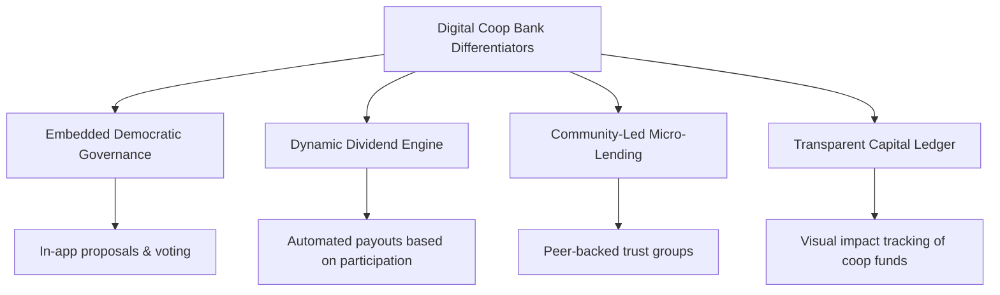

# Market Research and Competitive Analysis: Digital Coop Bank

This document outlines the market landscape, competitor profiles, expected industry capabilities, and strategic differentiators for **Digital Coop Bank**, a purely digital cooperative banking platform.

---

## 1. Target Market Overview

The target market for Digital Coop Bank spans several key demographics seeking alternatives to traditional centralized banking institutions:

| Target Segment | Core Needs | Pain Points with Traditional Banks |
| :--- | :--- | :--- |
| **Values-Aligned & Ethical Consumers** | Transparency, ethical investment of deposits, environmental/social impact. | Funding of fossil fuels, lack of transparency on where deposits are invested. |
| **Gig Workers & Freelancers** | Flexible financial services, collective bargaining/benefits, simple digital setups. | High fees, unpredictable income penalties, lack of peer support systems. |
| **Community-Led Cooperatives** | Democratic governance, shared capital pools, transparent dividend distribution. | Offline/paper governance, expensive commercial banking fees, manual accounting. |
| **Tech-Savvy Gen Z & Millennials** | High-quality digital UX, automated micro-savings, community-centric features. | Clunky legacy apps, hidden fees, impersonal institutional branding. |

### Market Opportunities
1. **The Rise of "Ethical Finance":** Modern consumers increasingly prefer financial institutions that prioritize social responsibility and ESG (Environmental, Social, and Governance) factors.
2. **Growth of the Passion & Gig Economy:** More workers are operating independently and forming decentralized, cooperative networks that require bespoke, member-owned financial tooling.
3. **Regulatory Openness:** Open banking APIs and banking-as-a-service (BaaS) enable digital-first platforms to scale quickly without the traditional brick-and-mortar overhead.

---

## 2. Competitor Profiles

To position Digital Coop Bank, we analyze four analogous or competing platforms that represent credit unions, ethical neobanks, digital-first cooperatives, and social finance platforms.

### A. Alliant Credit Union
* **Type:** Digital-First Credit Union (US)
* **Value Proposition:** High-yield savings and low-rate loans backed by a member-owned cooperative model.
* **Key Features:**
  * Fully digital member onboarding and document submission.
  * Standard checking/savings accounts and share certificates (CDs).
  * Competitive loan rates (auto, mortgage, personal).
  * Member dividend payouts (in the form of higher savings yields and lower loan rates).
* **Market Positioning:** Traditional credit union scaling via digital channels, targeting cost-conscious consumers seeking institutional reliability without brick-and-mortar visits.

### B. Aspiration
* **Type:** Sustainable & Ethical Neobank (US)
* **Value Proposition:** Clean money, zero fossil fuel investments, and automated tree-planting with transactions.
* **Key Features:**
  * "Pay What Is Fair" fee structure (including $0).
  * Impact tracking (Aspiration Impact Measurement score for user spending).
  * Automated round-ups to plant trees.
  * Sustainable mutual funds and investment products.
* **Market Positioning:** A lifestyle brand targeting climate-conscious consumers, proving that ethical and sustainable values can drive high user acquisition.

### C. Opolis
* **Type:** Digital Member-Owned Employment Cooperative (Global/Web3)
* **Value Proposition:** Next-generation benefit and shared-services infrastructure for independent workers.
* **Key Features:**
  * Member-owned and democratically governed framework.
  * Co-op share distribution based on usage and network contributions.
  * Shared benefits administration (healthcare, compliance, payroll).
  * Democratic voting on platform governance.
* **Market Positioning:** An innovative, decentralized cooperative for freelancers, proving that democratic ownership and shared rewards can scale globally using digital infrastructure.

### D. Bunq
* **Type:** Social & Community-Focused Neobank (Europe)
* **Value Proposition:** "The Bank of the Free" — premium features for easy group spending, travel, and green investing.
* **Key Features:**
  * Group expense sharing and shared sub-accounts.
  * Open API for developer integrations and custom workflows.
  * Multi-currency accounts and real-time exchange rates.
  * Direct customer feedback integration for product roadmaps.
* **Market Positioning:** A highly interactive, premium fintech product targeting digital nomads, families, and micro-collectives.

---

## 3. Common Industry Capabilities

Any modern digital banking platform in this space is expected to support a baseline of features:

1. **Digital Onboarding & KYC:** Mobile-first identity verification (KYC/AML) completed in under 5 minutes.
2. **Savings & Share Accounts:** Multi-tier savings accounts representing member shares with clear yield tracking.
3. **Core Transactional Banking:** Instant peer-to-peer transfers, virtual/physical debit cards, and transaction categorization.
4. **Member Dashboard:** Real-time visibility into personal finances, cooperative capital, and active community initiatives.
5. **Basic Security & Compliance:** Multi-factor authentication, card freezing, deposit insurance representation, and data encryption.

---

## 4. Strategic Differentiators for Digital Coop Bank

To stand out against traditional neobanks and digitized credit unions, Digital Coop Bank will leverage its cooperative nature as a primary product feature, rather than just a legal structure.

### 1. Embedded Democratic Governance
* **Concept:** Instead of annual mail-in voting sheets, governance is gamified and integrated directly into the application.
* **Details:** Members can propose initiatives (e.g., funding a local community garden), discuss them in-app, and cast their votes directly from their dashboards using a "one member, one vote" model.

### 2. Dynamic Dividend Engine
* **Concept:** Payouts are not just based on flat interest rates but on holistic contribution.
* **Details:** A smart contract or automated engine calculates quarterly dividend distributions based on shares held, transactional activity, and participation in democratic votes, returning profit directly to the community.

### 3. Community-Led Micro-Lending & Peer Trust Networks
* **Concept:** Lending is decentralized and community-vetted, reducing risk through social trust.
* **Details:** Members can create or join "Trust Circles" to co-sign or pool collateral for peer-to-peer microloans, making access to credit more democratic and affordable.

### 4. Transparent Capital Ledger
* **Concept:** Complete transparency over where coop funds are deployed.
* **Details:** A real-time, visual map showing how the coop's collective reserves are being utilized (e.g., % in local business loans, % in green bonds, % in liquidity reserves) to maintain absolute trust and accountability.
