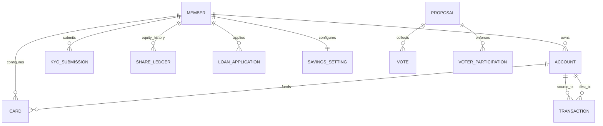
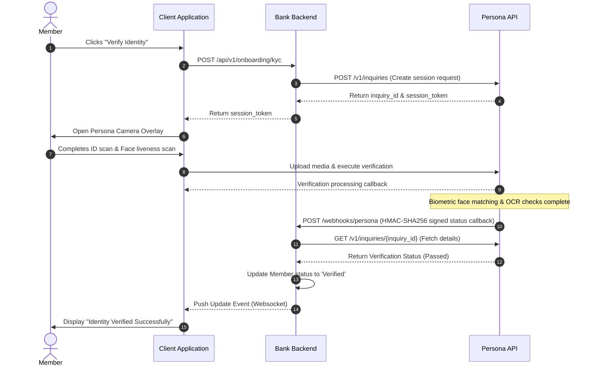
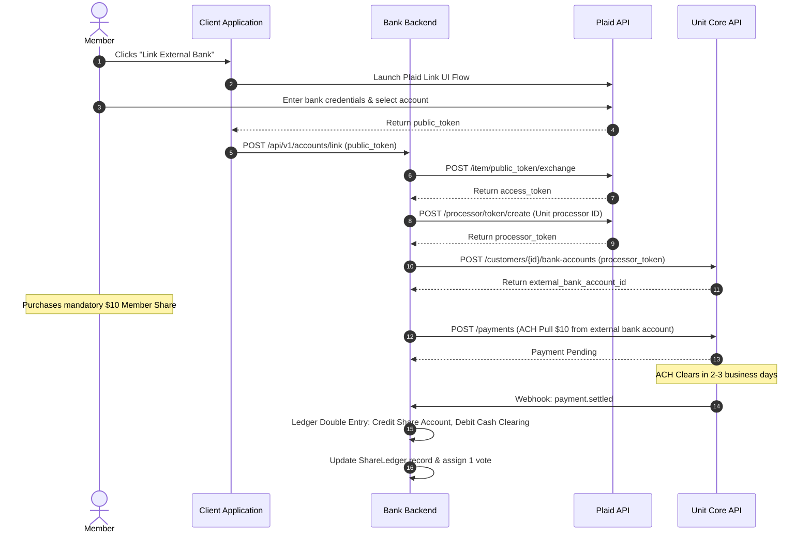
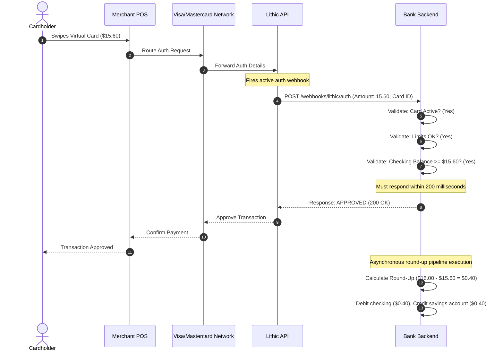

# Digital Coop Bank: Technical Requirements Specification (Sprint 1 MVP)

This document translates the Sprint 1 MVP functional user stories, QA acceptance criteria, and domain capabilities into a structured technical specification for development. It outlines the abstract database schema, REST API endpoints with structured request/response validations, third-party system integration flows, and non-functional requirements.

---

## 1. Abstract Data Model

This section defines the relational entities, primary attributes, data types, constraints, and relationships that govern the platform's storage architecture.

### 1.1 Core Entities & Attributes

#### 1. Member
Tracks the physical identity, credentials, registration state, and cooperative membership status of a member.
*   **Primary Key (PK)**: `id` (UUID, Auto-generated)
*   **Unique Keys (UQ)**: `member_id`, `email`, `phone_number`
*   **Attributes Table**:

| Column Name | Data Type | Nullable | Description & Constraints |
| :--- | :--- | :--- | :--- |
| `id` | UUID | No | Unique internal identifier for the member. |
| `member_id` | VARCHAR(8) | No | Unique alphanumeric display ID (e.g., `DCB-9821`). |
| `first_name` | VARCHAR(50) | No | Legal first name (encrypted at rest). |
| `last_name` | VARCHAR(50) | No | Legal last name (encrypted at rest). |
| `email` | VARCHAR(255) | No | Email address (encrypted at rest, normalized for uniqueness). |
| `phone_number` | VARCHAR(20) | No | Phone number in E.164 format (encrypted at rest). |
| `password_hash` | VARCHAR(255) | No | Salted password hash (Argon2id). |
| `membership_tier`| VARCHAR(30) | No | Enum: `PENDING_CAPITALIZATION`, `ACTIVE_SHAREHOLDER`, `FOUNDING_MEMBER`. |
| `kyc_status` | VARCHAR(30) | No | Enum: `UNSTARTED`, `PENDING_VERIFICATION`, `PASSED`, `FAILED`, `PENDING_MANUAL`. |
| `join_date` | TIMESTAMP | Yes | Timestamp when member completed onboarding & KYC. |
| `created_at` | TIMESTAMP | No | Record creation timestamp. |
| `updated_at` | TIMESTAMP | No | Record update timestamp. |

#### 2. KYCSubmission
Stores the metadata, image references, and verification results of a member's e-KYC process.
*   **Primary Key (PK)**: `id` (UUID, Auto-generated)
*   **Foreign Key (FK)**: `member_id` referencing `Member.id` (1-to-Many to allow multiple retries)
*   **Unique Keys (UQ)**: `third_party_reference`
*   **Attributes Table**:

| Column Name | Data Type | Nullable | Description & Constraints |
| :--- | :--- | :--- | :--- |
| `id` | UUID | No | Unique internal identifier. |
| `member_id` | UUID | No | Reference to the uploading member. |
| `document_type` | VARCHAR(30) | No | Enum: `PASSPORT`, `DRIVERS_LICENSE`, `NATIONAL_ID`. |
| `third_party_reference` | VARCHAR(255) | Yes | External transaction ID from Persona/Jumio. |
| `document_image_ref` | VARCHAR(512) | No | Secure reference (S3 URI) to encrypted ID image. |
| `selfie_image_ref` | VARCHAR(512) | No | Secure reference (S3 URI) to encrypted selfie image. |
| `confidence_score` | DECIMAL(5, 2) | Yes | Biometric face match confidence percentage (0.00 to 100.00). |
| `status` | VARCHAR(30) | No | Enum: `PENDING`, `APPROVED`, `REJECTED`, `MANUAL_REVIEW`. |
| `created_at` | TIMESTAMP | No | Timestamp of submission. |
| `updated_at` | TIMESTAMP | No | Timestamp of status change. |

#### 3. Account
Represents savings, checking, and share accounts.
*   **Primary Key (PK)**: `id` (UUID, Auto-generated)
*   **Foreign Key (FK)**: `member_id` referencing `Member.id` (1-to-Many)
*   **Unique Keys (UQ)**: `account_number`
*   **Attributes Table**:

| Column Name | Data Type | Nullable | Description & Constraints |
| :--- | :--- | :--- | :--- |
| `id` | UUID | No | Unique internal identifier. |
| `member_id` | UUID | No | Reference to the owner member. |
| `account_number` | VARCHAR(34) | No | IBAN or domestic routing account format. |
| `account_type` | VARCHAR(30) | No | Enum: `CHECKING`, `SAVINGS`, `SHARE_ACCOUNT`. |
| `balance` | DECIMAL(18, 4) | No | Current ledger balance (Default: `0.0000`). |
| `currency` | VARCHAR(3) | No | ISO currency code (e.g., `USD`). |
| `status` | VARCHAR(30) | No | Enum: `ACTIVE`, `FROZEN`, `CLOSED`. |
| `created_at` | TIMESTAMP | No | Creation timestamp. |
| `updated_at` | TIMESTAMP | No | Balance update timestamp. |

#### 4. Card
Represents virtual debit cards configured by members.
*   **Primary Key (PK)**: `id` (UUID, Auto-generated)
*   **Foreign Keys (FK)**: 
    *   `member_id` referencing `Member.id` (1-to-Many)
    *   `account_id` referencing `Account.id` (checking account funding source)
*   **Unique Keys (UQ)**: `tokenized_pan`
*   **Attributes Table**:

| Column Name | Data Type | Nullable | Description & Constraints |
| :--- | :--- | :--- | :--- |
| `id` | UUID | No | Unique internal identifier. |
| `member_id` | UUID | No | Reference to cardholder. |
| `account_id` | UUID | No | Linked checking account for funding. |
| `cardholder_name` | VARCHAR(100) | No | Name printed on card. |
| `tokenized_pan` | VARCHAR(256) | No | Encrypted token representing card number (PAN). |
| `masked_pan` | VARCHAR(19) | No | Masked number for UI display (e.g., `XXXX-XXXX-XXXX-9821`). |
| `expiry_month` | INT | No | Expiry month (1-12). |
| `expiry_year` | INT | No | Expiry year (4-digit format). |
| `status` | VARCHAR(30) | No | Enum: `ACTIVE`, `FROZEN`, `TERMINATED`. |
| `daily_spend_limit` | DECIMAL(18, 4) | No | Max daily spend amount. |
| `monthly_spend_limit`| DECIMAL(18, 4) | Yes | Max monthly spend amount. |
| `created_at` | TIMESTAMP | No | Card issuance timestamp. |
| `updated_at` | TIMESTAMP | No | Card status update timestamp. |

#### 5. Transaction
The master ledger recording all financial movements.
*   **Primary Key (PK)**: `id` (UUID, Auto-generated)
*   **Foreign Keys (FK)**:
    *   `source_account_id` referencing `Account.id` (Null for deposits/ACH pulls)
    *   `destination_account_id` referencing `Account.id` (Null for withdrawals)
*   **Unique Keys (UQ)**: `idempotency_key`
*   **Attributes Table**:

| Column Name | Data Type | Nullable | Description & Constraints |
| :--- | :--- | :--- | :--- |
| `id` | UUID | No | Unique transaction identifier. |
| `source_account_id` | UUID | Yes | Source account (deducted). |
| `destination_account_id`| UUID | Yes | Destination account (credited). |
| `amount` | DECIMAL(18, 4) | No | Transaction amount (positive value). |
| `currency` | VARCHAR(3) | No | ISO currency code (e.g., `USD`). |
| `type` | VARCHAR(30) | No | Enum: `P2P_INTERNAL`, `DEBIT_CARD`, `SHARE_PURCHASE`, `SAVINGS_ROUNDUP`, `LOAN_DISBURSEMENT`, `LOAN_REPAYMENT`. |
| `status` | VARCHAR(30) | No | Enum: `PENDING`, `SETTLED`, `FAILED`. |
| `idempotency_key` | VARCHAR(255) | Yes | Unique request key to prevent duplicate processing. |
| `reference_memo` | VARCHAR(255) | Yes | User-facing transaction description. |
| `metadata` | JSON | Yes | Optional context (e.g., card ID, round-up parent ID). |
| `created_at` | TIMESTAMP | No | Initiated timestamp. |
| `settled_at` | TIMESTAMP | Yes | Completion timestamp. |

#### 6. ShareLedger
Maintains historical equity transactions and calculates active member shares and voting weights.
*   **Primary Key (PK)**: `id` (UUID, Auto-generated)
*   **Foreign Keys (FK)**:
    *   `member_id` referencing `Member.id` (1-to-Many)
    *   `transaction_id` referencing `Transaction.id`
*   **Attributes Table**:

| Column Name | Data Type | Nullable | Description & Constraints |
| :--- | :--- | :--- | :--- |
| `id` | UUID | No | Unique ledger ID. |
| `member_id` | UUID | No | Reference to the member shareholder. |
| `transaction_id` | UUID | No | Reference to financial payment transaction. |
| `shares_transacted` | INT | No | Number of shares transacted. Positive for purchase, negative for redemption. |
| `share_price_usd` | DECIMAL(18, 4) | No | Price per share at transaction time (e.g., $10.00). |
| `total_amount_usd` | DECIMAL(18, 4) | No | Total capital transacted. |
| `running_share_balance`| INT | No | Post-transaction share balance. |
| `voting_weight` | INT | No | 1 if balance >= 1, 0 otherwise (cooperative model). |
| `created_at` | TIMESTAMP | No | Timestamp of ledger entry. |

#### 7. Proposal
Represents active democratic proposals put forward to the cooperative membership.
*   **Primary Key (PK)**: `id` (UUID, Auto-generated)
*   **Foreign Key (FK)**: `proposer_member_id` referencing `Member.id` (1-to-Many)
*   **Attributes Table**:

| Column Name | Data Type | Nullable | Description & Constraints |
| :--- | :--- | :--- | :--- |
| `id` | UUID | No | Unique proposal identifier. |
| `proposer_member_id` | UUID | No | Member ID submitting the proposal. |
| `title` | VARCHAR(150) | No | Header of the proposal. |
| `description` | TEXT | No | Deep detailed text body. |
| `category` | VARCHAR(30) | No | Enum: `FUNDING_ALLOCATION`, `POLICY_CHANGE`, `MEMBER_BYLAW`. |
| `status` | VARCHAR(30) | No | Enum: `DRAFT`, `ACTIVE`, `PASSED`, `REJECTED`. |
| `voting_start_date` | TIMESTAMP | No | Timestamp when voting opens. |
| `voting_end_date` | TIMESTAMP | No | Timestamp when voting closes. |
| `total_votes_yes` | INT | No | Cached yes votes count. |
| `total_votes_no` | INT | No | Cached no votes count. |
| `total_votes_abstain`| INT | No | Cached abstain votes count. |
| `created_at` | TIMESTAMP | No | Creation date. |

#### 8. Vote
Stores the individual anonymous voting choices.
*   **Primary Key (PK)**: `id` (UUID, Auto-generated)
*   **Foreign Key (FK)**: `proposal_id` referencing `Proposal.id` (1-to-Many)
*   **Unique Keys (UQ)**: `verification_receipt_hash`
*   **Attributes Table**:

| Column Name | Data Type | Nullable | Description & Constraints |
| :--- | :--- | :--- | :--- |
| `id` | UUID | No | Unique vote identifier. |
| `proposal_id` | UUID | No | Reference to the proposal. |
| `vote_choice` | VARCHAR(20) | No | Enum: `YES`, `NO`, `ABSTAIN`. |
| `verification_receipt_hash`| VARCHAR(64) | No | SHA-256 hash containing verification proof for member's audit. |
| `created_at` | TIMESTAMP | No | Vote submission timestamp. |

#### 9. VoterParticipation
A mapping table to enforce the "One Member, One Vote" rule and prevent double voting without exposing who voted for what.
*   **Primary Key (PK)**: `id` (UUID, Auto-generated)
*   **Foreign Key (FK)**: `proposal_id` referencing `Proposal.id`
*   **Attributes Table**:

| Column Name | Data Type | Nullable | Description & Constraints |
| :--- | :--- | :--- | :--- |
| `id` | UUID | No | Unique record ID. |
| `proposal_id` | UUID | No | Proposal being voted on. |
| `hashed_member_id` | VARCHAR(64) | No | Double-hashed value of member ID + proposal salt to anonymize identity. |
| `has_voted` | BOOLEAN | No | Set to TRUE upon voting. |
| `created_at` | TIMESTAMP | No | Verification record timestamp. |

#### 10. LoanApplication
Handles member requests for co-op microloans up to $1,000.
*   **Primary Key (PK)**: `id` (UUID, Auto-generated)
*   **Foreign Key (FK)**: `member_id` referencing `Member.id` (1-to-Many)
*   **Attributes Table**:

| Column Name | Data Type | Nullable | Description & Constraints |
| :--- | :--- | :--- | :--- |
| `id` | UUID | No | Unique loan ID. |
| `member_id` | UUID | No | Reference to the borrowing member. |
| `requested_amount` | DECIMAL(18, 4) | No | Requested principle (max $1000.00). |
| `coop_participation_score`| INT | No | Calculated score (0-100) based on member data. |
| `interest_rate` | DECIMAL(5, 4) | No | Dynamic APR (e.g. 0.0525 for 5.25%). |
| `term_months` | INT | No | Term options (e.g. 3, 6, 12). |
| `monthly_repayment_amount`| DECIMAL(18, 4) | No | Principal + interest payment. |
| `purpose` | TEXT | No | Statement of use. |
| `status` | VARCHAR(30) | No | Enum: `PENDING`, `APPROVED`, `ACTIVE`, `REJECTED`, `REPAID`. |
| `created_at` | TIMESTAMP | No | Date of application. |
| `updated_at` | TIMESTAMP | No | Date of status change. |

#### 11. CapitalProject
Represents the cooperative's asset portfolio (green bonds, local business loans, infrastructure, liquidity).
*   **Primary Key (PK)**: `id` (UUID, Auto-generated)
*   **Attributes Table**:

| Column Name | Data Type | Nullable | Description & Constraints |
| :--- | :--- | :--- | :--- |
| `id` | UUID | No | Unique project identifier. |
| `name` | VARCHAR(150) | No | Name of project / asset category. |
| `description` | TEXT | No | Detailed explanation of capital use. |
| `category` | VARCHAR(30) | No | Enum: `GREEN_BONDS`, `LOCAL_BUSINESS_LOANS`, `COMMUNITY_INFRASTRUCTURE`, `CASH_LIQUIDITY_RESERVES`. |
| `allocated_amount` | DECIMAL(18, 4) | No | Amount allocated in USD. |
| `current_yield_rate`| DECIMAL(5, 4) | No | APR generated by project. |
| `status` | VARCHAR(30) | No | Enum: `ACTIVE`, `COMPLETED`. |
| `created_at` | TIMESTAMP | No | Date of investment. |

#### 12. SavingsSetting
Configures the smart savings round-ups feature.
*   **Primary Key (PK)**: `id` (UUID, Auto-generated)
*   **Foreign Keys (FK)**:
    *   `member_id` referencing `Member.id` (1-to-1)
    *   `checking_account_id` referencing `Account.id`
    *   `savings_account_id` referencing `Account.id`
*   **Attributes Table**:

| Column Name | Data Type | Nullable | Description & Constraints |
| :--- | :--- | :--- | :--- |
| `id` | UUID | No | Unique identifier. |
| `member_id` | UUID | No | Reference to the member. |
| `checking_account_id`| UUID | No | Checking account to monitor. |
| `savings_account_id` | UUID | No | Target savings goal account. |
| `round_up_enabled` | BOOLEAN | No | Flag indicating if round-ups are active. |
| `round_up_threshold` | DECIMAL(18, 4) | No | Limit to round to (e.g. $1.00, $2.00, $5.00). |
| `created_at` | TIMESTAMP | No | Timestamp of creation. |
| `updated_at` | TIMESTAMP | No | Timestamp of updates. |

---

### 1.2 Entity Relationships

The data model relationships are defined as follows:
- **Member (1) ── (many) Account**: A member can own multiple accounts (checking, savings, share account).
- **Member (1) ── (many) KYCSubmission**: A member can submit multiple KYC files (in case of failures/retries).
- **Member (1) ── (many) Card**: A member can configure multiple virtual debit cards.
- **Member (1) ── (many) ShareLedger**: A member has history logs of their share purchase equity.
- **Member (1) ── (many) LoanApplication**: A member can apply for multiple microloans over time.
- **Member (1) ── (1) SavingsSetting**: A member configures a single active saving setting parameter.
- **Account (1) ── (many) Card**: A checking account acts as the funding source for multiple virtual cards.
- **Account (1) ── (many) Transaction (as Source / Destination)**: Transaction ledger logs records against accounts.
- **Proposal (1) ── (many) Vote**: A governance proposal gathers multiple individual votes.
- **Proposal (1) ── (many) VoterParticipation**: Enforces double-voting validation.

---

## 2. API Contracts & JSON Schemas

This section documents the REST API routes, parameter validations, and HTTP response objects.

### 2.1 POST /api/v1/onboarding/kyc
Submit identity verification documents (Government ID & Facial Scan).

*   **HTTP Method**: `POST`
*   **Path**: `/api/v1/onboarding/kyc`
*   **Request Headers**:
    *   `Content-Type: application/json`
    *   `Authorization: Bearer <JWT>`
*   **Request Payload**:

| Parameter | Type | Required | Description | Example |
| :--- | :--- | :--- | :--- | :--- |
| `document_type` | String | Yes | Type of ID. Enum: `PASSPORT`, `DRIVERS_LICENSE`, `NATIONAL_ID`. | `PASSPORT` |
| `document_front_image` | String | Yes | Base64-encoded front photo of the government ID. | `"data:image/jpeg;base64,...`" |
| `document_back_image` | String | No | Base64-encoded back photo (required for driver's license/ID card). | `"data:image/jpeg;base64,...`" |
| `selfie_image` | String | Yes | Base64-encoded selfie image for facial biometric verification. | `"data:image/jpeg;base64,...`" |
| `liveness_session_id` | String | Yes | Unique session string from local liveness scan UI. | `"sess_01hk7y238917e"` |

*   **Response (201 Created)**:

| Key | Type | Description | Example |
| :--- | :--- | :--- | :--- |
| `kyc_submission_id` | String (UUID) | Unique ID tracking the submission. | `"a8df39c1-5231-4e76-8051-4fa2c65a6a69"` |
| `status` | String | The verification outcome. Enum: `PASSED`, `PENDING_MANUAL`, `FAILED`. | `"PASSED"` |
| `confidence_score` | Number | Image facial matching score. | `98.42` |
| `submitted_at` | String | ISO 8601 date. | `"2026-07-10T12:00:00Z"` |
| `message` | String | User message explanation. | `"Verification successful. Identity is active."` |

---

### 2.2 GET /api/v1/accounts/shares
Retrieve the member's current co-op share balances, share valuation, and voting weight.

*   **HTTP Method**: `GET`
*   **Path**: `/api/v1/accounts/shares`
*   **Request Headers**:
    *   `Authorization: Bearer <JWT>`
*   **Response (200 OK)**:

| Key | Type | Description | Example |
| :--- | :--- | :--- | :--- |
| `member_id` | String (UUID) | ID of the authenticated member. | `"928d1c90-00bc-43fa-a6be-7629b35bc74f"` |
| `share_account_id` | String (UUID) | ID of the share account. | `"bc81c9a0-9812-4cf0-a611-2b62b10ac88d"` |
| `balance_shares` | Integer | Total count of shares held. | `15` |
| `share_unit_value_usd` | Number | Pricing value of a single share. | `10.00` |
| `total_value_usd` | Number | Valuation of entire holdings. | `150.00` |
| `voting_weight` | Integer | Democratic voting weight (cooperative model: 1 vote if shares >= 1). | `1` |
| `membership_tier` | String | Member group based on balance/role. | `"ACTIVE_SHAREHOLDER"` |
| `last_updated` | String | ISO 8601 date. | `"2026-07-10T12:05:00Z"` |

---

### 2.3 POST /api/v1/transactions/p2p
Execute an instant internal transfer of funds between cooperative members.

*   **HTTP Method**: `POST`
*   **Path**: `/api/v1/transactions/p2p`
*   **Request Headers**:
    *   `Content-Type: application/json`
    *   `Authorization: Bearer <JWT>`
    *   `Idempotency-Key: <UUID>` (Required to prevent double execution)
*   **Request Payload**:

| Parameter | Type | Required | Description | Example |
| :--- | :--- | :--- | :--- | :--- |
| `source_account_id` | String (UUID) | Yes | Account ID funds are drawn from. | `"df812c9a-a82f-4122-811c-22345bc7a9e1"` |
| `recipient_identifier` | String | Yes | Recipient phone number, email, or unique member ID. | `"+15550192834"` |
| `amount` | Number | Yes | Positive amount to transfer. | `45.50` |
| `currency` | String | Yes | ISO currency code. | `"USD"` |
| `memo` | String | No | Transfer message, max 100 characters. | `"For organic vegetables split"` |

*   **Response (201 Created)**:

| Key | Type | Description | Example |
| :--- | :--- | :--- | :--- |
| `transaction_id` | String (UUID) | Unique tracking transaction ID. | `"f389c922-8120-4ee1-ac88-77c8e9d3d3a1"` |
| `status` | String | State of movement. Always settles instantly. | `"SETTLED"` |
| `sender_account_id` | String (UUID) | Deducted account. | `"df812c9a-a82f-4122-811c-22345bc7a9e1"` |
| `recipient_account_id` | String (UUID) | Credited account. | `"7e1c90df-a72c-49fb-bc11-89e9d3910c22"` |
| `amount` | Number | Final transacted amount. | `45.50` |
| `currency` | String | Transacted currency code. | `"USD"` |
| `settled_at` | String | ISO 8601 timestamp. | `"2026-07-10T12:09:20Z"` |
| `receipt_url` | String | S3 pre-signed URI to download the PDF receipt. | `"https://dcb-receipts.s3.amazonaws.com/f389.pdf?..."` |

---

### 2.4 POST /api/v1/cards/virtual
Generate a new virtual debit card linked to checking account.

*   **HTTP Method**: `POST`
*   **Path**: `/api/v1/cards/virtual`
*   **Request Headers**:
    *   `Content-Type: application/json`
    *   `Authorization: Bearer <JWT>`
*   **Request Payload**:

| Parameter | Type | Required | Description | Example |
| :--- | :--- | :--- | :--- | :--- |
| `funding_account_id` | String (UUID) | Yes | Account ID to fund transactions. | `"df812c9a-a82f-4122-811c-22345bc7a9e1"` |
| `cardholder_name` | String | Yes | Name printed on the card. | `"Elena Rostova"` |
| `card_nickname` | String | No | Custom tag for display in UI. | `"Online Subscriptions"` |
| `daily_spend_limit` | Number | Yes | Max daily transaction total. | `150.00` |
| `monthly_spend_limit`| Number | No | Max monthly transaction total. | `1000.00` |

*   **Response (201 Created)**:

| Key | Type | Description | Example |
| :--- | :--- | :--- | :--- |
| `card_id` | String (UUID) | Unique identifier for card record. | `"c9d08e1a-412b-478a-a633-d9d8b18a1a9e"` |
| `tokenized_pan` | String | Tokenized representation of PAN. | `"tok_c8192837bc901a8f"` |
| `masked_pan` | String | Masked number. | `"XXXX-XXXX-XXXX-9821"` |
| `expiry_month` | Integer | Expiry month. | `8` |
| `expiry_year` | Integer | Expiry year. | `2029` |
| `status` | String | Card status. | `"ACTIVE"` |
| `daily_spend_limit` | Number | Assigned daily spending limit. | `150.00` |
| `created_at` | String | ISO 8601 timestamp. | `"2026-07-10T12:09:20Z"` |

---

### 2.5 PUT /api/v1/cards/virtual/{id}/status
Freeze or unfreeze a virtual debit card.

*   **HTTP Method**: `PUT`
*   **Path**: `/api/v1/cards/virtual/{id}/status`
*   **Path Parameters**:
    *   `id`: UUID of the virtual card (e.g., `c9d08e1a-412b-478a-a633-d9d8b18a1a9e`)
*   **Request Headers**:
    *   `Content-Type: application/json`
    *   `Authorization: Bearer <JWT>`
*   **Request Payload**:

| Parameter | Type | Required | Description | Example |
| :--- | :--- | :--- | :--- | :--- |
| `status` | String | Yes | Target state. Enum: `ACTIVE`, `FROZEN`. | `"FROZEN"` |

*   **Response (200 OK)**:

| Key | Type | Description | Example |
| :--- | :--- | :--- | :--- |
| `card_id` | String (UUID) | ID of the updated card. | `"c9d08e1a-412b-478a-a633-d9d8b18a1a9e"` |
| `status` | String | Current status. | `"FROZEN"` |
| `updated_at` | String | ISO 8601 timestamp. | `"2026-07-10T12:09:21Z"` |

---

### 2.6 GET /api/v1/governance/proposals
Retrieve a list of cooperative democratic proposals.

*   **HTTP Method**: `GET`
*   **Path**: `/api/v1/governance/proposals`
*   **Request Headers**:
    *   `Authorization: Bearer <JWT>`
*   **Query Parameters**:

| Parameter | Type | Required | Description | Example |
| :--- | :--- | :--- | :--- | :--- |
| `status` | String | No | Filter by proposal state. Enum: `ACTIVE`, `PASSED`, `REJECTED`. | `"ACTIVE"` |
| `page` | Integer | No | Page number (Default: `1`). | `1` |
| `limit` | Integer | No | Count per page (Default: `10`, Max: `50`). | `10` |

*   **Response (200 OK)**:

| Key | Type | Description | Example |
| :--- | :--- | :--- | :--- |
| `proposals` | Array | List of proposals objects. | *(See description list below)* |
| `pagination` | Object | Pagination metadata. | *(See description list below)* |

**Proposals Array Fields**:
*   `proposal_id`: String (UUID)
*   `title`: String (Title of proposal)
*   `description`: String (Details)
*   `category`: String (Enum: `FUNDING_ALLOCATION`, `POLICY_CHANGE`, `MEMBER_BYLAW`)
*   `status`: String (Enum: `ACTIVE`, `PASSED`, `REJECTED`)
*   `voting_start_date`: String (ISO 8601)
*   `voting_end_date`: String (ISO 8601)
*   `total_votes_yes`: Integer (Total yes votes)
*   `total_votes_no`: Integer (Total no votes)
*   `total_votes_abstain`: Integer (Total abstentions)

**Pagination Fields**:
*   `page`: Integer
*   `limit`: Integer
*   `total_pages`: Integer
*   `total_records`: Integer

---

### 2.7 POST /api/v1/governance/proposals/{id}/vote
Submit a vote choice securely and pseudonymously.

*   **HTTP Method**: `POST`
*   **Path**: `/api/v1/governance/proposals/{id}/vote`
*   **Path Parameters**:
    *   `id`: UUID of the proposal (e.g., `d0e1c2a3-bb90-41ff-80cc-11d29304aa81`)
*   **Request Headers**:
    *   `Content-Type: application/json`
    *   `Authorization: Bearer <JWT>`
*   **Request Payload**:

| Parameter | Type | Required | Description | Example |
| :--- | :--- | :--- | :--- | :--- |
| `vote_choice` | String | Yes | Cast ballot choice. Enum: `YES`, `NO`, `ABSTAIN`. | `"YES"` |
| `blind_token` | String | Yes | Cryptographic blind token verifying member's right to vote. | `"eyJHc2giOi...`" |

*   **Response (200 OK)**:

| Key | Type | Description | Example |
| :--- | :--- | :--- | :--- |
| `status` | String | Status statement. | `"SUCCESS"` |
| `message` | String | Confirm receipt. | `"Vote registered successfully."` |
| `vote_receipt_hash`| String | SHA-256 hash containing verification proof for member's audit. | `"a2e8c239d5...44f9c"` |
| `timestamp` | String | ISO 8601 date. | `"2026-07-10T12:09:21Z"` |

---

### 2.8 POST /api/v1/loans/apply
Apply for a community microloan up to $1,000. Interest rates are calculated dynamically by cooperative scoring.

*   **HTTP Method**: `POST`
*   **Path**: `/api/v1/loans/apply`
*   **Request Headers**:
    *   `Content-Type: application/json`
    *   `Authorization: Bearer <JWT>`
*   **Request Payload**:

| Parameter | Type | Required | Description | Example |
| :--- | :--- | :--- | :--- | :--- |
| `requested_amount` | Number | Yes | Principal amount (Minimum $100.00, Maximum $1000.00). | `800.00` |
| `term_months` | Integer | Yes | Repayment terms options. Enum: `3`, `6`, `12`. | `6` |
| `purpose` | String | Yes | Details of funds deployment. | `"Purchase professional coding software"` |

*   **Response (201 Created)**:

| Key | Type | Description | Example |
| :--- | :--- | :--- | :--- |
| `application_id` | String (UUID) | Unique loan application ID. | `"d9a8c9b2-302a-431e-ac11-2b6d19a2e301"` |
| `member_id` | String (UUID) | ID of borrowing member. | `"928d1c90-00bc-43fa-a6be-7629b35bc74f"` |
| `requested_amount` | Number | Requested principal. | `800.00` |
| `coop_participation_score`| Integer | Score (0-100) reflecting savings history and governance voting rate. | `85` |
| `calculated_interest_rate` | Number | Dynamic APR (decimal format, e.g., 0.0450 = 4.5%). | `0.0450` |
| `estimated_monthly_payment`| Number | Monthly cost. | `135.12` |
| `status` | String | Initial evaluation. Enum: `APPROVED`, `PENDING_REVIEW`. | `"APPROVED"` |
| `created_at` | String | ISO 8601 date. | `"2026-07-10T12:09:20Z"` |

---

### 2.9 GET /api/v1/ledger/capital-allocation
Route real-time allocation states of cooperative deposits to transparent capital projects.

*   **HTTP Method**: `GET`
*   **Path**: `/api/v1/ledger/capital-allocation`
*   **Request Headers**:
    *   `Authorization: Bearer <JWT>`
*   **Response (200 OK)**:

| Key | Type | Description | Example |
| :--- | :--- | :--- | :--- |
| `total_coop_capital_usd` | Number | Combined cash asset values of bank. | `12050000.00` |
| `allocated_capital_usd` | Number | Deployed capital total. | `9640000.00` |
| `unallocated_capital_usd`| Number | Unallocated cash reserves. | `2410000.00` |
| `allocations` | Array | Deployed categories list (Details below). | *(See description list below)* |
| `last_recalculated` | String | ISO 8601 calculation time. | `"2026-07-10T12:00:00Z"` |

**Allocations Array Fields**:
*   `category`: String (Enum: `GREEN_BONDS`, `LOCAL_BUSINESS_LOANS`, `COMMUNITY_INFRASTRUCTURE`, `CASH_LIQUIDITY_RESERVES`)
*   `amount_usd`: Number (Dollar value allocated)
*   `percentage`: Number (Proportion of total co-op capital)
*   `active_projects_count`: Integer (Count of projects funded)

---

### 2.10 GET /api/v1/accounts/yield-summary
View member savings yield and projected dividends.

*   **HTTP Method**: `GET`
*   **Path**: `/api/v1/accounts/yield-summary`
*   **Request Headers**:
    *   `Authorization: Bearer <JWT>`
*   **Response (200 OK)**:

| Key | Type | Description | Example |
| :--- | :--- | :--- | :--- |
| `cumulative_savings_yield_usd`| Number | Cumulative interest yield earned. | `45.20` |
| `projected_dividends_usd` | Number | Projected upcoming quarterly dividend. | `15.50` |
| `dividend_period_end` | String | ISO 8601 end of current accrual cycle. | `"2026-09-30T23:59:59Z"` |
| `dividend_details` | Object | Category contributions breakdown. | *(See description list below)* |

**Dividend Details Fields**:
*   `savings_bonus`: Number (Dividend contribution based on average savings balance)
*   `governance_bonus`: Number (Dividend contribution reward based on proposal voting participation)
*   `transactions_bonus`: Number (Dividend contribution based on transaction volume activity)

---

## 3. Third-party System Integrations

### 3.1 Digital Onboarding & e-KYC (Persona)
Persona matches government photo IDs against live facial structures to establish authenticity.

---

### 3.2 Open Banking & Core Ledger Integration (Plaid & Unit Core)
Ensures external bank accounts can link to the cooperative and funds are processed securely.

---

### 3.3 Card Issuing Network Integration (Lithic Active Authorization Webhooks)
Controls authorization processes of virtual debit cards with real-time balance validation checks.

---

### 3.4 Downloadable Transaction Confirmation Receipts
1. **Settlement Trigger**: An asynchronous transaction settlement event is emitted by the ledger core.
2. **Queue Processing**: An event worker picks up the job and routes details to a serverless PDF compilation service (built on PDFKit or Puppeteer).
3. **Metadata Enrichment**: The engine fetches the transaction record and appends a SHA-256 digital signature of the transaction details for tampering validation.
4. **Secure Cloud Upload**: The compiled PDF document is uploaded directly to a secure, private AWS S3 bucket configured with Object Lock.
5. **Presigned URL Retrieval**: The system generates an S3 pre-signed URI with a 15-minute expiration window. This URL is returned in the transaction APIs for instant member downloading.

---

## 4. Non-Functional Requirements (NFRs)

### 4.1 Authentication & Authorization
*   **OAuth 2.0 & OpenID Connect (OIDC)**: Secure sessions are built using OAuth 2.0 Authorization Code Flow with PKCE (Proof Key for Code Exchange) to prevent interception attacks on native devices.
*   **JWT Structure & Verification**: Access tokens are signed using the RS256 algorithm with quarterly key rotations. The JWT payload contains standard claims and authorization scopes:
    - Standard Claims: `iss` (Issuer), `sub` (Subject Member UUID), `aud` (Audience), `exp` (Expiration, 15 minutes), `iat` (Issued At).
    - Scope Parameters: `accounts:read`, `transactions:write`, `cards:write`, `governance:vote`, `loans:write`.
*   **Role-Based Access Control (RBAC)**: Enforces access control permissions:
    - `MEMBER`: Access owned profile, cards, checking accounts, view proposals, cast vote, and apply for microloans.
    - `AUDITOR`: Read-only access to anonymized general share registers, proposal audit trails, and capital project distribution tables.
    - `COMPLIANCE_OFFICER`: View member profile verification records, update manual KYC statuses, and execute AML blocks.
    - `SYS_ADMIN`: Infrastructure and service health controls.

### 4.2 Security & Compliance
*   **PII Encryption at Rest and in Transit**: All Personally Identifiable Information (PII) such as legal names, emails, phones, and KYC media must be encrypted in transit using TLS 1.3. At rest, database records are encrypted using AES-256-GCM via AWS Key Management Service (KMS) with key policies limiting access.
*   **PCI-DSS Scope Reduction**: The bank minimizes compliance overhead by outsourcing Primary Account Number (PAN) capture and storage. The client application utilizes Lithic's PCI-compliant hosted iframe SDK components. The Bank Backend stores only tokenized references (`tok_...`) and masked numbers (`XXXX-XXXX-XXXX-1234`).
*   **Pseudonymous Voting & Audit Trails**: Enforces democratic secrecy of governance choices:
    - Vote results are decoupled from identities by separating the `Vote` ledger and `VoterParticipation` validator table.
    - When a vote is cast, a transaction writes to `VoterParticipation` using a hash of the member ID and proposal ID (`SHA-256(member_id + proposal_salt)`).
    - In a parallel database transaction, the vote choice is written to the `Vote` ledger alongside a cryptographic verification hash returned to the user, with no database linkages between the participation record and the vote option record.
    - This provides mathematical proof that a member voted exactly once without exposing their individual choice.

### 4.3 Performance, Latency & Scalability
*   **Sub-3-Second Ledger Settlement**: The transactional double-entry ledger database runs under PostgreSQL configured with SERIALIZABLE transaction isolation levels. Balance calculations utilize write-ahead logs to guarantee consistency. The maximum settlement execution time limit is set to 3.0 seconds under peak loads.
*   **Under 200ms Active Auth Webhook SLA**: The API endpoint processing Lithic's Active Auth webhook must respond within 200ms. To support this SLA:
    - Redis caches card status states and checking account balances.
    - Balance updates are loaded in-memory during card sweeps.
    - Validation operations do not block on external disk/network queries.
*   **API Rate Limiting**: The platform implements API rate limits via a CDN/WAF layer:
    - Non-sensitive GET endpoints: 120 requests/minute.
    - Transaction execution & cards: 60 requests/minute.
    - KYC submission & Login attempts: 10 requests/minute.
*   **Read Latency**: Target read APIs (e.g., fetching account balances, proposal catalogs) return payloads under 100ms at P95.
*   **High Availability**: Database is deployed in a Multi-Availability Zone configuration with real-time replication. Read replicas are used for all dashboard and Capital Ledger GET operations to isolate operational loads.