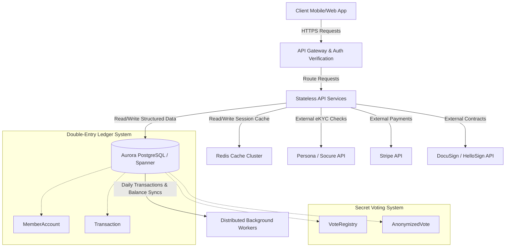

# Technical Requirements Document: Digital Coop Bank (Sprint 2)

**Role**: TECHNICAL_ARCHITECT  
**Project**: Digital Coop Bank (Purely Digital Cooperative Banking Platform)  
**Sprint**: 2  

This document details the abstract data model, API endpoints and schemas, third-party integration architectures, and non-functional requirements (NFRs) to fulfill the functional capabilities and user stories defined for Sprint 2. No source code is included.

---

## 1. Abstract Data Model

The database system must support strong transaction isolation (ACID compliant) to handle core ledger actions, escrow holds, and vote weighting. The entities, attributes, and relationships are designed abstractly as follows:

### Core Entities & Attributes

#### 1. Member
*   `member_id`: UUID (Primary Key, unique)
*   `first_name`: String
*   `last_name`: String
*   `email`: String (Unique, validated index)
*   `phone`: String
*   `date_of_birth`: Date
*   `kyc_status`: Enum (`PENDING`, `PASSED`, `FAILED_REVIEW`, `MANUAL_REVIEW`)
*   `kyc_reference_id`: UUID (External reference to eKYC partner transaction)
*   `membership_status`: Enum (`PENDING_PAYMENT`, `ACTIVE`, `SUSPENDED`)
*   `membership_token`: UUID (Nullable, cryptographically secure identifier)
*   `created_at`: Timestamp
*   `updated_at`: Timestamp

#### 2. MemberAccount
*   `account_id`: UUID (Primary Key)
*   `member_id`: UUID (Foreign Key referencing `Member.member_id`)
*   `account_type`: Enum (`SHARE_CAPITAL`, `SAVINGS`, `TRANSACTIONAL`, `LOAN`)
*   `balance`: Decimal (18, 4)
*   `available_balance`: Decimal (18, 4) (Represents balance minus active collateral holds or escrow locks)
*   `currency`: String (ISO 3-letter, e.g., "USD")
*   `status`: Enum (`ACTIVE`, `HOLD`, `CLOSED`)
*   `created_at`: Timestamp

#### 3. Transaction (Core Double-Entry Ledger)
*   `transaction_id`: UUID (Primary Key)
*   `source_account_id`: UUID (Foreign Key referencing `MemberAccount.account_id`, nullable for external deposits)
*   `destination_account_id`: UUID (Foreign Key referencing `MemberAccount.account_id`, nullable for external withdrawals)
*   `amount`: Decimal (18, 4)
*   `transaction_type`: Enum (`SHARE_PURCHASE`, `DEPOSIT`, `WITHDRAWAL`, `LOAN_DISBURSEMENT`, `LOAN_REPAYMENT`, `DIVIDEND_PATRONAGE`, `ROUND_UP_TRANSFER`, `GRANT_DISBURSEMENT`)
*   `status`: Enum (`PENDING`, `CLEARED`, `FAILED`)
*   `created_at`: Timestamp
*   `cleared_at`: Timestamp

#### 4. SocialLoanCircle
*   `circle_id`: UUID (Primary Key)
*   `borrower_member_id`: UUID (Foreign Key referencing `Member.member_id`)
*   `requested_loan_amount`: Decimal (18, 4)
*   `status`: Enum (`PENDING_INVITES`, `FORMED`, `EXPIRED`, `ACTIVE_LOAN`, `CLOSED`)
*   `created_at`: Timestamp
*   `expires_at`: Timestamp

#### 5. CircleInvitation
*   `invitation_id`: UUID (Primary Key)
*   `circle_id`: UUID (Foreign Key referencing `SocialLoanCircle.circle_id`)
*   `invitee_member_id`: UUID (Foreign Key referencing `Member.member_id`)
*   `status`: Enum (`SENT`, `ACCEPTED`, `DECLINED`, `EXPIRED`)
*   `created_at`: Timestamp
*   `updated_at`: Timestamp

#### 6. CollateralPledge
*   `pledge_id`: UUID (Primary Key)
*   `circle_id`: UUID (Foreign Key referencing `SocialLoanCircle.circle_id`)
*   `guarantor_member_id`: UUID (Foreign Key referencing `Member.member_id`)
*   `pledged_amount`: Decimal (18, 4)
*   `savings_account_id`: UUID (Foreign Key referencing `MemberAccount.account_id`)
*   `escrow_hold_id`: UUID (Reference to ledger asset hold log)
*   `signature_hash`: String (Hash of the signed legal guarantor agreement)
*   `status`: Enum (`PENDING_LOAN`, `LOCKED`, `RELEASED`, `LIQUIDATED`)
*   `created_at`: Timestamp

#### 7. Loan
*   `loan_id`: UUID (Primary Key)
*   `borrower_member_id`: UUID (Foreign Key referencing `Member.member_id`)
*   `circle_id`: UUID (Foreign Key referencing `SocialLoanCircle.circle_id`, nullable)
*   `principal_amount`: Decimal (18, 4)
*   `interest_rate_apr`: Decimal (5, 4)
*   `repayment_term_months`: Integer
*   `status`: Enum (`OFFER_GENERATED`, `ACTIVE`, `FULLY_REPAID`, `DEFAULTED`)
*   `agreement_hash`: String (Hash of signed loan contract)
*   `created_at`: Timestamp

#### 8. Ballot
*   `ballot_id`: UUID (Primary Key)
*   `title`: String
*   `description`: String
*   `resolution_text`: String
*   `category`: Enum (`GREEN_LENDING`, `TREASURY_RATIOS`, `COMMUNITY_GRANTS`, `GENERAL`)
*   `start_time`: Timestamp
*   `end_time`: Timestamp
*   `status`: Enum (`DRAFT`, `ACTIVE`, `CLOSED`)
*   `created_at`: Timestamp

#### 9. VoteRegistry (Audit Log - Decoupled from Choices)
*   `vote_registry_id`: UUID (Primary Key)
*   `ballot_id`: UUID (Foreign Key referencing `Ballot.ballot_id`)
*   `member_id`: UUID (Foreign Key referencing `Member.member_id`)
*   `voted_at`: Timestamp
*   `is_proxy_vote`: Boolean
*   `proxy_member_id`: UUID (Foreign Key referencing `Member.member_id`, nullable)

#### 10. AnonymizedVote (Secret Ballot Storage)
*   `vote_id`: UUID (Primary Key)
*   `ballot_id`: UUID (Foreign Key referencing `Ballot.ballot_id`)
*   `choice`: Enum (`YES`, `NO`, `ABSTAIN`)
*   `weight`: Integer (Derived from direct member vote weight = 1, or proxy aggregate)
*   `cast_at`: Timestamp

#### 11. ProxyDelegation
*   `delegation_id`: UUID (Primary Key)
*   `delegator_member_id`: UUID (Foreign Key referencing `Member.member_id`)
*   `proxy_member_id`: UUID (Foreign Key referencing `Member.member_id`)
*   `category`: Enum (`GREEN_LENDING`, `TREASURY_RATIOS`, `COMMUNITY_GRANTS`, `GENERAL`)
*   `status`: Enum (`ACTIVE`, `REVOKED`)
*   `created_at`: Timestamp
*   `revoked_at`: Timestamp

#### 12. CommunityProject
*   `project_id`: UUID (Primary Key)
*   `organizer_member_id`: UUID (Foreign Key referencing `Member.member_id`)
*   `title`: String
*   `description`: String
*   `target_funding_goal`: Decimal (18, 4)
*   `timeline_days`: Integer
*   `social_yield_description`: String
*   `supporting_doc_url`: String
*   `escrow_account_id`: UUID (Foreign Key referencing `MemberAccount.account_id`)
*   `status`: Enum (`PENDING_REVIEW`, `ACTIVE`, `FUNDED`, `FAILED_REFUNDED`, `CLOSED`)
*   `created_at`: Timestamp

#### 13. ProjectInvestment
*   `investment_id`: UUID (Primary Key)
*   `project_id`: UUID (Foreign Key referencing `CommunityProject.project_id`)
*   `investor_member_id`: UUID (Foreign Key referencing `Member.member_id`)
*   `invested_amount`: Decimal (18, 4)
*   `certificate_hash`: String (SHA-256 hash of generated investment certificate)
*   `status`: Enum (`ACTIVE`, `REFUNDED`, `MATURED`)
*   `created_at`: Timestamp

#### 14. CommunityGrantBallot
*   `grant_ballot_id`: UUID (Primary Key)
*   `total_pool_amount`: Decimal (18, 4)
*   `start_time`: Timestamp
*   `end_time`: Timestamp
*   `status`: Enum (`ACTIVE`, `CLOSED`)
*   `created_at`: Timestamp

#### 15. GrantAllocationVote
*   `allocation_id`: UUID (Primary Key)
*   `grant_ballot_id`: UUID (Foreign Key referencing `CommunityGrantBallot.grant_ballot_id`)
*   `member_id`: UUID (Foreign Key referencing `Member.member_id`)
*   `project_id`: UUID (Foreign Key referencing `CommunityProject.project_id`)
*   `points_allocated`: Integer
*   `created_at`: Timestamp

#### 16. RoundUpConfiguration
*   `config_id`: UUID (Primary Key)
*   `member_id`: UUID (Foreign Key referencing `Member.member_id`, unique index)
*   `is_enabled`: Boolean
*   `destination_project_id`: UUID (Foreign Key referencing `CommunityProject.project_id`, nullable)
*   `multiplier`: Integer (Allowed values: `1`, `2`, `3`)
*   `monthly_cap`: Decimal (18, 4) (Nullable)
*   `accumulated_balance`: Decimal (18, 4) (Pending micro-contribution balance)
*   `created_at`: Timestamp
*   `updated_at`: Timestamp

#### 17. ImpactMetricTranslation
*   `translation_id`: UUID (Primary Key)
*   `project_id`: UUID (Foreign Key referencing `CommunityProject.project_id`)
*   `conversion_factor`: Decimal (10, 4) (Metric outcome per $1.00 USD)
*   `metric_unit`: String (e.g., "kg CO2 offset", "trees planted")
*   `created_at`: Timestamp

---

### Entity Relationship Mapping (High-Level)

*   **Member & Accounts**: 1-to-Many (`Member` has multiple `MemberAccount` rows corresponding to distinct savings, shares, transactional, or loan balances).
*   **Social Loan Circles**: 1-to-Many (`SocialLoanCircle` has multiple `CircleInvitation` rows and multiple `CollateralPledge` rows).
*   **Guarantors & Pledges**: Many-to-Many relationship between `Member` (as a guarantor) and `SocialLoanCircle` resolved by the `CollateralPledge` associative entity.
*   **Voting Audits**: 1-to-Many between `Ballot` and `VoteRegistry` (to track who voted). To maintain voter anonymity, there is NO database relationship link between `VoteRegistry` (who voted) and `AnonymizedVote` (how they voted).
*   **Proxy Delegations**: Unidirectional graph relationships where `Member` (delegator) points to `Member` (proxy) isolated by `category`.
*   **Crowdfunding & Investments**: Many-to-Many relationship between `Member` (investor) and `CommunityProject` resolved by the `ProjectInvestment` associative entity.
*   **Grant Allocation**: Many-to-Many between `Member` (voter) and `CommunityProject` (nominee) resolved by the `GrantAllocationVote` associative entity linked to a specific `CommunityGrantBallot`.

---

## 2. API Endpoints & Schemas

### Epic 1: Member Identity & Onboarding

#### 1. Identity Submission (eKYC)
`POST /api/v1/onboarding/kyc`
*   **Request Headers**:
    *   `Authorization`: Bearer `<SessionToken>` (representing raw signup account before validation)
*   **Request Body Schema**:
    ```json
    {
      "id_photo_front_base64": "string (raw image data)",
      "id_photo_back_base64": "string (raw image data)",
      "selfie_scan_base64": "string (raw image data)",
      "liveness_session_id": "string (UUID reference to client check)"
    }
    ```
*   **Response Body Schema (Success - HTTP 200)**:
    ```json
    {
      "kyc_status": "PASSED",
      "kyc_reference_id": "string (UUID)",
      "extracted_fields": {
        "first_name": "string",
        "last_name": "string",
        "date_of_birth": "string (YYYY-MM-DD)",
        "address": "string",
        "id_number": "string"
      },
      "message": "Identity verified successfully. Proceed to share capital payment."
    }
    ```
*   **Response Body Schema (Manual Review - HTTP 202)**:
    ```json
    {
      "kyc_status": "MANUAL_REVIEW",
      "kyc_reference_id": "string (UUID)",
      "message": "Verification pending manual review. Liveness check requires further authorization."
    }
    ```

#### 2. Mandatory Share Purchase
`POST /api/v1/onboarding/share-purchase`
*   **Request Body Schema**:
    ```json
    {
      "kyc_reference_id": "string (UUID)",
      "payment_provider": "stripe",
      "payment_method_token": "string (tokenized card representation)",
      "currency": "USD",
      "amount": 25.00
    }
    ```
*   **Response Body Schema (Success - HTTP 201)**:
    ```json
    {
      "transaction_id": "string (UUID)",
      "status": "CLEARED",
      "receipt_url": "string (URL path)",
      "ledger_entry": {
        "account_type": "SHARE_CAPITAL",
        "credited_amount": 25.00,
        "is_withdrawable": false
      },
      "message": "Payment processing completed. Cooperative share registered."
    }
    ```

#### 3. Membership Token Initialization
`POST /api/v1/onboarding/membership-token`
*   **Request Body Schema**:
    ```json
    {
      "kyc_reference_id": "string (UUID)",
      "share_purchase_transaction_id": "string (UUID)"
    }
    ```
*   **Response Body Schema (Success - HTTP 201)**:
    ```json
    {
      "membership_token": "string (cryptographically secure UUID)",
      "membership_status": "ACTIVE",
      "unlocked_features": ["GOVERNANCE_PORTAL", "SAVINGS_LEDGER", "COMMUNITY_HUB"],
      "created_at": "string (ISO-8601 UTC timestamp)"
    }
    ```

---

### Epic 2: Peer-Supported Lending (Social Loan Circles)

#### 1. Create Social Loan Circle
`POST /api/v1/loans/circles`
*   **Request Body Schema**:
    ```json
    {
      "requested_loan_amount": 1000.00,
      "invitee_member_ids": ["string (UUID)", "string (UUID)"]
    }
    ```
*   **Response Body Schema (Success - HTTP 201)**:
    ```json
    {
      "circle_id": "string (UUID)",
      "borrower_member_id": "string (UUID)",
      "requested_loan_amount": 1000.00,
      "status": "PENDING_INVITES",
      "expires_at": "string (ISO-8601 UTC timestamp)"
    }
    ```

#### 2. Respond to Circle Invitation
`POST /api/v1/loans/circles/{circle_id}/invitations/respond`
*   **Request Body Schema**:
    ```json
    {
      "response": "ACCEPTED"
    }
    ```
*   **Response Body Schema (Success - HTTP 200)**:
    ```json
    {
      "invitation_id": "string (UUID)",
      "circle_id": "string (UUID)",
      "invitee_member_id": "string (UUID)",
      "status": "ACCEPTED",
      "circle_status": "FORMED"
    }
    ```

#### 3. Pledge Capital
`POST /api/v1/loans/circles/{circle_id}/pledges`
*   **Request Body Schema**:
    ```json
    {
      "pledge_amount": 200.00,
      "savings_account_id": "string (UUID)",
      "guarantor_signature_base64": "string (cryptographic document signature metadata)"
    }
    ```
*   **Response Body Schema (Success - HTTP 201)**:
    ```json
    {
      "pledge_id": "string (UUID)",
      "circle_id": "string (UUID)",
      "guarantor_member_id": "string (UUID)",
      "pledged_amount": 200.00,
      "escrow_hold_id": "string (UUID)",
      "status": "LOCKED",
      "updated_available_balance": 300.00
    }
    ```

#### 4. Underwriting & Interest Pricing Engine Preview
`GET /api/v1/loans/circles/{circle_id}/underwriting-preview`
*   **Response Body Schema (Success - HTTP 200)**:
    ```json
    {
      "circle_id": "string (UUID)",
      "requested_loan_amount": 1000.00,
      "total_pledged_collateral": 600.00,
      "collateral_coverage_ratio": 0.60,
      "pricing_tier": 2,
      "base_rate_apr": 0.1200,
      "rate_discount_apr": 0.0400,
      "final_rate_apr": 0.0800
    }
    ```

#### 5. Accept Loan Agreement and Execute Disbursal
`POST /api/v1/loans/applications`
*   **Request Body Schema**:
    ```json
    {
      "circle_id": "string (UUID)",
      "repayment_term_months": 12,
      "borrower_signature_base64": "string (digital signature metadata)"
    }
    ```
*   **Response Body Schema (Success - HTTP 201)**:
    ```json
    {
      "loan_id": "string (UUID)",
      "borrower_member_id": "string (UUID)",
      "principal_amount": 1000.00,
      "interest_rate_apr": 0.0800,
      "repayment_term_months": 12,
      "monthly_repayment_amount": 86.99,
      "status": "ACTIVE",
      "disbursement_transaction_id": "string (UUID)"
    }
    ```

---

### Epic 3: Democratic Governance (Liquid Democracy)

#### 1. Retrieve Active Ballot List
`GET /api/v1/governance/ballots`
*   **Response Body Schema (Success - HTTP 200)**:
    ```json
    {
      "ballots": [
        {
          "ballot_id": "string (UUID)",
          "title": "Green Energy Lending Policy Change",
          "resolution_text": "string (Markdown content)",
          "category": "GREEN_LENDING",
          "start_time": "string (ISO-8601 UTC timestamp)",
          "end_time": "string (ISO-8601 UTC timestamp)",
          "status": "ACTIVE",
          "has_voted": false,
          "proxy_delegation_active": true,
          "active_proxy_name": "Marcus Aurelius"
        }
      ]
    }
    ```

#### 2. Cast Vote Directly
`POST /api/v1/governance/ballots/{ballot_id}/vote`
*   **Request Body Schema**:
    ```json
    {
      "choice": "YES"
    }
    ```
*   **Response Body Schema (Success - HTTP 201)**:
    ```json
    {
      "vote_receipt_hash": "string (cryptographic hash validating submission)",
      "vote_status": "RECORDED",
      "overrode_proxy": true,
      "timestamp": "string (ISO-8601 UTC timestamp)"
    }
    ```

#### 3. Establish Proxy Delegation
`POST /api/v1/governance/delegations`
*   **Request Body Schema**:
    ```json
    {
      "proxy_member_id": "string (UUID)",
      "category": "GREEN_LENDING"
    }
    ```
*   **Response Body Schema (Success - HTTP 201)**:
    ```json
    {
      "delegation_id": "string (UUID)",
      "delegator_member_id": "string (UUID)",
      "proxy_member_id": "string (UUID)",
      "category": "GREEN_LENDING",
      "status": "ACTIVE",
      "created_at": "string (ISO-8601 UTC timestamp)"
    }
    ```

#### 4. Revoke Proxy Delegation
`DELETE /api/v1/governance/delegations/{delegation_id}`
*   **Response Body Schema (Success - HTTP 200)**:
    ```json
    {
      "delegation_id": "string (UUID)",
      "status": "REVOKED",
      "revoked_at": "string (ISO-8601 UTC timestamp)"
    }
    ```

---

### Epic 4: Cooperative Dividends

#### 1. Retrieve Patronage Footprint
`GET /api/v1/dividends/patronage-footprint`
*   **Response Body Schema (Success - HTTP 200)**:
    ```json
    {
      "member_id": "string (UUID)",
      "fiscal_year": 2026,
      "metrics": {
        "average_savings_balance": 5230.00,
        "total_loan_interest_paid": 120.00,
        "total_card_transaction_volume": 12450.00
      },
      "last_sync_timestamp": "string (ISO-8601 UTC timestamp)"
    }
    ```

#### 2. Get Real-Time Estimate & Recommendations
`GET /api/v1/dividends/estimator`
*   **Response Body Schema (Success - HTTP 200)**:
    ```json
    {
      "projected_scenarios": {
        "conservative": 45.00,
        "expected": 60.00,
        "high_performance": 75.00
      },
      "cooperative_forecast": {
        "net_surplus_projection": 1500000.00,
        "distribution_pool_ratio": 0.60
      },
      "actionable_recommendations": [
        {
          "recommendation_type": "SAVINGS_BOOST",
          "action_text": "Deposit an additional $150.00 to your savings account.",
          "projected_dividend_increase": 5.50
        }
      ]
    }
    ```

---

### Epic 5: Community Crowdfunding & Investments

#### 1. Submit Crowdfunding Project
`POST /api/v1/crowdfunding/projects`
*   **Request Body Schema**:
    ```json
    {
      "title": "Community Solar Array Phase 1",
      "description": "Clean power generation for local co-op housing complexes.",
      "target_funding_goal": 50000.00,
      "timeline_days": 180,
      "social_yield_description": "Clean power for 40 local homes.",
      "supporting_document_url": "string (validated URL referring to uploaded PDF)"
    }
    ```
*   **Response Body Schema (Success - HTTP 201)**:
    ```json
    {
      "project_id": "string (UUID)",
      "status": "PENDING_REVIEW",
      "organizer_member_id": "string (UUID)",
      "created_at": "string (ISO-8601 UTC timestamp)"
    }
    ```

#### 2. Invest in Project
`POST /api/v1/crowdfunding/projects/{project_id}/invest`
*   **Request Body Schema**:
    ```json
    {
      "investment_amount": 500.00,
      "funding_source_account_id": "string (UUID)"
    }
    ```
*   **Response Body Schema (Success - HTTP 201)**:
    ```json
    {
      "investment_id": "string (UUID)",
      "project_id": "string (UUID)",
      "investor_member_id": "string (UUID)",
      "invested_amount": 500.00,
      "escrow_transaction_id": "string (UUID)",
      "certificate_hash": "string (SHA-256 hash)",
      "certificate_url": "string (URL to signed receipt document)",
      "status": "ACTIVE"
    }
    ```

#### 3. Allocate Community Grant Points
`POST /api/v1/crowdfunding/grants/{grant_ballot_id}/allocate`
*   **Request Body Schema**:
    ```json
    {
      "allocations": [
        {
          "project_id": "string (UUID)",
          "points_allocated": 60
        },
        {
          "project_id": "string (UUID)",
          "points_allocated": 40
        }
      ]
    }
    ```
*   **Response Body Schema (Success - HTTP 200)**:
    ```json
    {
      "grant_ballot_id": "string (UUID)",
      "member_id": "string (UUID)",
      "total_points_allocated": 100,
      "remaining_unallocated_points": 0,
      "status": "SUCCESS"
    }
    ```

---

### Epic 6: Micro-Contributions (Ethical Round-Ups)

#### 1. Configure Round-Ups
`POST /api/v1/roundups/config`
*   **Request Body Schema**:
    ```json
    {
      "is_enabled": true,
      "destination_project_id": "string (UUID)",
      "multiplier": 2,
      "monthly_cap": 50.00
    }
    ```
*   **Response Body Schema (Success - HTTP 200)**:
    ```json
    {
      "config_id": "string (UUID)",
      "is_enabled": true,
      "destination_project_id": "string (UUID)",
      "multiplier": 2,
      "monthly_cap": 50.00,
      "updated_at": "string (ISO-8601 UTC timestamp)"
    }
    ```

#### 2. Get Live Impact Dashboard
`GET /api/v1/roundups/impact`
*   **Response Body Schema (Success - HTTP 200)**:
    ```json
    {
      "total_amount_contributed": 25.00,
      "multiplier_setting": 2,
      "monthly_cap_utilized": 12.50,
      "impact_metrics": [
        {
          "project_id": "string (UUID)",
          "project_title": "Green Reforestation Project",
          "amount_contributed": 25.00,
          "translated_value": 5.0,
          "metric_unit": "Trees Planted"
        }
      ]
    }
    ```

---

## 3. Third-party Integrations

### 1. Identity & Compliance Gateway (Socure or Persona API)
*   **Purpose**: Handle digital KYC documentation extraction, liveness scanning, and validation verification.
*   **Integration Flow**:
```
[Client SDK] -- (1) Selfie scan & ID upload ---> [Persona Platform]
    ^                                                   |
    | (3) Return SDK transaction status                 | (2) Run check & generate outcome
    v                                                   v
[Client App] -- (4) POST /kyc (ref_id) -------------> [Backend API]
                                                        |
                                                        | (5) GET /verifications/{ref_id}
                                                        v
                                                  [Persona API]
                                                        |
                                                        | (6) Confirm confidence score >= 95%,
                                                        |     Age >= 18, and Liveness verification
                                                        v
                                                  [Backend API]
                                                        |
                                                        | (7) Set KYC_STATUS = "PASSED"
                                                        v
                                                   [Core DB]
```

### 2. Payment Settlement System (Stripe Gateway API)
*   **Purpose**: Capture credit/debit card and Apple/Google Pay tokens for onboarding shares ($25.00 setup).
*   **Integration Flow**:
    1. Client-side application invokes Stripe Elements (or Apple/Google Pay SDK) to request token authorization.
    2. Client sends payment token via API to the bank backend (`POST /api/v1/onboarding/share-purchase`).
    3. Backend processes payment against the Stripe API `/v1/payment_intents` specifying:
        *   `amount`: `2500` (cents)
        *   `currency`: `usd`
        *   `metadata`: `{"member_id": "uuid", "transaction_type": "share_capital"}`
    4. Upon receipt of Stripe authorization token:
        *   Backend triggers a database transaction.
        *   Inserts record inside `Transaction` registry mapping payment settlement ID.
        *   Crediting `$25.00` to member's `SHARE_CAPITAL` account record.
        *   Updating member status to `PENDING_TOKEN`.
    5. Async Webhook listener handles Stripe charges that clear late, updating ledger records dynamically.

### 3. Electronic Signature Verification (DocuSign or HelloSign API)
*   **Purpose**: Capture legal signatures on Guarantor agreements for collateral pledges and loan contracts.
*   **Integration Flow**:
    1. Backend generates HTML/PDF templates dynamically parsing terms (principal, dynamic interest APR, pledged guarantor assets, liquidation rules).
    2. Backend pushes contract data to HelloSign API requesting signature placement tags, mapping borrower/guarantor emails.
    3. API returns signing URL; backend renders HelloSign Embedded UI iframe in mobile/web views.
    4. Callback handler intercepts client interaction. When signed, HelloSign triggers secure HTTPS webhook to bank endpoint `/api/v1/webhooks/signature`.
    5. Webhook verification checks signature status, extracts the PDF SHA-256 hash, updates `CollateralPledge.status` from `PENDING_LOAN` to `LOCKED` (putting corresponding balance on hold), or activates the `Loan` record to trigger disbursement.

---

## 4. Non-Functional Requirements (NFRs)

### Security (Authentication, Authorization, Data Governance)
*   **Authentication & Session Management**:
    *   Secure OAuth2 / OIDC token-based protocol using JSON Web Tokens (JWT) signed using RS256.
    *   Auth Provider (e.g., Auth0 / Keycloak / AWS Cognito) manages lifecycle, returning access and ID tokens.
*   **Authorization Matrix**:
    *   Role `GUEST`: Restricted read/write access to `/api/v1/onboarding` endpoints.
    *   Role `MEMBER`: Authorized access to all transaction, savings, loan, voting, and crowdfunding resources. Requires active claim validation check: `membership_status` must equal `ACTIVE` and `membership_token` must be present in token claims payload.
    *   Role `ORGANIZER`: Inherits `MEMBER` privileges. Adds authorization to construct project pitches.
    *   Role `ADMIN`: Unlocks access to back-office endpoints, manual compliance overrides, and crowdfunding project reviews.
*   **Cryptographic & Data Privacy Safeguards**:
    *   Personally Identifiable Information (PII) like name, date of birth, and identity numbers must be encrypted at rest using AES-256 GCM authenticated mode. Key management must use AWS KMS or HashiCorp Vault.
    *   All external API traffic must mandate TLS 1.3 encryption.
    *   **Secret Ballot Protocol**: To secure democratic integrity, direct choices (`YES`, `NO`, `ABSTAIN`) on votes must never be linked in the database to individual identifiers. The system registers that a member has voted in `VoteRegistry` (preventing double voting) but inserts the choice randomly into the `AnonymizedVote` table without FK references back to `Member`.

### Performance Guidelines
*   **API Latency SLO**:
    *   Write-heavy transactional APIs (e.g., ledger updates, card authorizations) must respond within 200ms.
    *   Read-heavy query APIs (e.g., ballot lists, crowdfunding catalog) must execute under 50ms at p95 by using distributed Redis read-caches.
*   **Background / Async Workloads**:
    *   Calculation of daily interest accrued, average daily balances (patronage footprints), and checking round-up accumulation thresholds must not run in the synchronous API request pipeline.
    *   These processes must be delegated to distributed background workers running at low-traffic slots (e.g., 2:00 AM UTC) to prevent operational database locks.
*   **Ledger Write Optimization**:
    *   The core ledger must implement optimistic concurrency controls on balances. When high-volume round-up payments or grant distributions trigger, database locks must be localized to specific ledger accounts without locking tables globally.

### Scalability Guidelines
*   **Ledger Consistency**:
    *   The transactional ledger database must operate under Strict Serializability isolation levels. No loose eventual consistency is permitted on `MemberAccount` and `Transaction` tables. Distributed relational backends (e.g., Amazon Aurora PostgreSQL, Spanner) are required.
*   **State Separation**:
    *   Application API services must remain entirely stateless to enable seamless scale-up and scale-down inside container orchestrators (e.g., Kubernetes, AWS ECS) based on CPU and Request-per-Second (RPS) metrics.
*   **Voting Database Partitioning**:
    *   `AnonymizedVote` and `VoteRegistry` tables must be horizontally partitioned by `ballot_id` to allow quick aggregations without full table scans as member counts scale.

---

## 5. Summary of Architecture Decisions



The system design prioritizes **accountability** (through double-entry transaction ledgers), **community governance** (through decoupled, anonymized proxy routing and voting), and **scalability** (through stateless endpoints, caching layers, and decoupled asynchronous background operations). All compliance limits, contract validations, and cryptographic integrity parameters must be asserted programmatically at the API and database constraints layers.