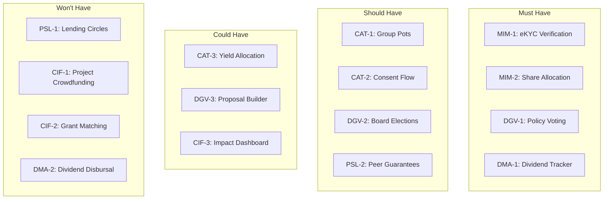
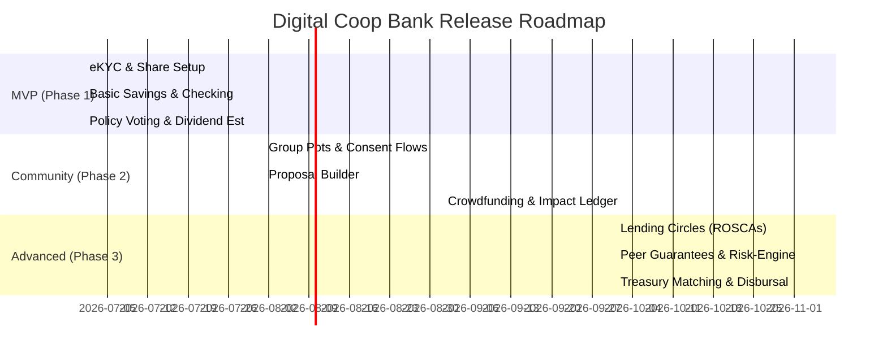

# Product Owner & Team Orchestrator Deliverables

## 1. Product Requirements Document (PRD) Synthesis

### 1.1 Executive Summary
**Digital Coop Bank** is a digital-first, member-owned cooperative banking platform designed to combine the modern, high-velocity user experience of neobanks with the ethical, democratic, and community-driven principles of traditional credit unions. By operating without physical branches, the bank reduces overhead to offer high-yield savings, low consumer loan rates, and direct community investments. In accordance with cooperative principles, all verified members receive a single voting share, giving them direct agency over bank policies, interest rates, board elections, and community matching grants. Surplus capital is returned programmatically to members as dividends or allocated to crowdfunding matching pools.

### 1.2 Target User Personas & Motivations
*   **Persona A: The Values-Driven Saver (Ethical Consumer):** Driven by transparency and ethical capital allocation. They want to ensure their deposits fund local positive impact (e.g., green energy, affordable housing) and actively participate in democratic bank governance.
*   **Persona B: The Frictionless Banking Advocate (Neobank Devotee):** Demands a 100% mobile-native experience, rapid eKYC onboarding (under 8 minutes), instant internal transfers, and highly responsive, real-time data dashboards.
*   **Persona C: The Community Organizer (Local Groups & Co-housing):** Needs specialized collective tools such as shared deposit pots with multi-signature authorization, transparent sub-ledgers, and group-directed voting systems.
*   **Persona D: The Flexible Earner (Gig Worker / Freelancer):** Requires access to credit through non-traditional underwriting models. They benefit from rotating community savings (ROSCAs) and peer-guaranteed collateral arrangements.

### 1.3 Key Performance Indicators (KPIs)
*   **Onboarding Efficiency:** Average time from registration to verified account status under 8 minutes.
*   **Member Acquisition:** 100,000 active, verified members within 18 months of launch.
*   **Deposit Retention:** Cumulative Assets Under Management (AUM) of $150 Million by the end of Year 2, with an average member deposit balance of $1,500.
*   **Portfolio Health:** Loan default rates under 1.5% maintained through social underwriting and peer guarantee models.
*   **Democratic Engagement:** At least 40% member participation in quarterly voting and board elections.
*   **Treasury Returns:** 100% of approved cooperative dividends distributed automatically within 5 business days of the financial audit, with 10% of annual net surplus allocated to community matching grants.

### 1.4 Capability Domain Mapping
The system is divided into six logical domains, managed through isolated, compliant services:
1.  **Member & Identity Management (MIM):** Directs biometric onboarding, automated PEP/AML screening, and the legal allocation of a single cooperative share.
2.  **Core Accounts & Treasury (CAT):** Manages savings accounts, transactional ledgers, group-managed multi-signature pots, and yield routing engines.
3.  **Democratic Governance (DGV):** Controls ballot configuration, anonymous policy parameter voting, and signature collection for member-led proposals.
4.  **Peer-Supported Lending (PSL):** OrchestratesRotating Savings and Credit Associations (ROSCAs) and collateral-free peer guarantee locks.
5.  **Community & Impact Funding (CIF):** Operates project crowdfunding, surplus-matching logic, and real-time social return dashboards.
6.  **Dividend Management & Allocation (DMA):** Computes individual pro-rata returns and runs batch account distributions.

### 1.5 Technical Architecture & Security Policies
*   **Core Infrastructure:** Utilizes a modern, cloud-native core banking engine (e.g., Mambu or Thought Machine) connected through secure REST APIs. The frontend is built on a responsive mobile architecture.
*   **Compliance & eKYC:** Integrates with third-party verification providers (e.g., Persona/Onfido) via webhooks to automate identity verification.
*   **Cryptographic Voter Privacy:** Demands complete decoupling between member identities and ballot contents. Databases tracking member voting status (`VoterRecord`) and anonymous ballots (`Ballot`) reside in separated storage environments, verified via blind signature proofs.
*   **Ledger Immutability:** Uses write-once-read-many (WORM) configurations for financial transactions, the cooperative share registry, and election totals to prevent historical modification and ensure auditability.

---

## 2. Backlog Scoping (Sprint-by-Sprint Allocation)

The 15 user stories identified for the platform have been allocated across consecutive sprints to manage technical complexity, dependencies, and resource constraints. 

```
                                [Sprint-by-Sprint Backlog]
┌─────────────────────────────────┐   ┌─────────────────────────────────┐   ┌─────────────────────────────────┐
│            SPRINT 3             │   │            SPRINT 4             │   │            SPRINT 5             │
│        (Current Sprint)         │   │      (Lending & Funding)      │   │    (Disbursal & Optimization)   │
├─────────────────────────────────┤   ├─────────────────────────────────┤   ├─────────────────────────────────┤
│ • MIM-1: eKYC Verification (L)  │  │ • PSL-1: Lending Circles (XL)   │   │ • DMA-2: Auto Dividend (L)     │
│ • MIM-2: Share Allocation (S)   │   │ • CIF-1: Crowdfunding (L)       │   │                                 │
│ • CAT-1: Group Pots Setup (XL)  │   │ • CIF-2: Grant Matching (L)     │   │                                 │
│ • CAT-2: Pot Consent Flow (L)   │   └─────────────────────────────────┘   └─────────────────────────────────┘
│ • CAT-3: Yield Allocation (M)   │
│ • DGV-1: Policy Voting (M)      │
│ • DGV-2: Board Elections (M)    │
│ • DGV-3: Proposal Builder (L)   │
│ • PSL-2: Peer Guarantees (L)    │
│ • CIF-3: Impact Dashboard (M)   │
│ • DMA-1: Dividend Tracker (M)   │
└─────────────────────────────────┘
```

### Sprint 3 (Current Sprint)
Focuses on establishing verified user identities, setting up the legal cooperative registry, introducing core collaboration tools (Group Pots), and implementing baseline voting and dividend estimation systems.
*   **MIM-1: Automated Identity & Address Verification (eKYC) [Size: L]** - Integrates external check APIs.
*   **MIM-2: Automatic Cooperative Share Allocation [Size: S]** - Registers legal ownership on first deposit.
*   **CAT-1: Group Pot Creation & Multi-Signature Oversight [Size: XL]** - Configures joint balances and signing structures.
*   **CAT-2: Joint Transaction Consent Flow [Size: L]** - Handles approval routing and transaction execution.
*   **CAT-3: Ethical Yield Allocation [Size: M]** - Manages interest routing settings.
*   **DGV-1: Policy & Parameter Voting [Size: M]** - Implements anonymous ballot submissions for policy variables.
*   **DGV-2: Representative Board Elections [Size: M]** - Conducts board vacancy votes.
*   **DGV-3: Member Proposal Builder & Signature Gathering [Size: L]** - Manages community proposal progression.
*   **PSL-2: Peer Guarantee Collateral Locking [Size: L]** - Locks guarantor funds as collateral.
*   **CIF-3: Impact & Investment Ledger Dashboard [Size: M]** - Computes and renders environmental/social metrics.
*   **DMA-1: Projected Dividend Dashboard [Size: M]** - Visualizes dynamic year-to-date dividend estimates.

### Sprint 4 (Lending Circles & Crowdfunding)
Focuses on advanced peer-to-peer financing mechanics and community funding matching engines.
*   **PSL-1: Lending Circle (ROSCA) Setup & Enrollment [Size: XL]** - Sets up rotation ledgers and monthly auto-debit triggers.
*   **CIF-1: Community Project Crowdfunding [Size: L]** - Provides escrow ledgers and deadline trackers for local initiatives.
*   **CIF-2: Surplus Treasury Grant Matching [Size: L]** - Integrates bank matching engines with crowdfunding escrow nodes.

### Sprint 5 (Treasury Operations & Settlement)
Focuses on annual audit operations, administrative sign-offs, and batch financial distribution.
*   **DMA-2: Automated Dividend Disbursal [Size: L]** - Processes annual batch payments and generates tax statements.

---

## 3. Prioritization (Sprint 3 MoSCoW Mapping)

For Sprint 3, we prioritize features based on legal compliance requirements, neobank onboarding expectations, and foundational system dependencies.



### 3.1 Must Have
These features are critical for legal operations, basic platform functions, and proving the platform's core cooperative model.
*   **MIM-1: Automated Identity & Address Verification (eKYC):** Mandatory to satisfy AML/KYC regulations. Without this, no member can open an account.
*   **MIM-2: Automatic Cooperative Share Allocation:** Establishes the legal membership link. It is required to grant members the right to vote on cooperative policies.
*   **DGV-1: Policy & Parameter Voting:** The primary differentiator of a democratic bank. It allows members to vote on key parameters like interest rates.
*   **DMA-1: Projected Dividend Dashboard:** Validates the co-op value proposition by showing users the direct financial return on their participation.

### 3.2 Should Have
These features are important for core user cohorts (Community Organizers and Freelancers) and key security needs, but they can be delayed briefly if team capacity requires it.
*   **CAT-1: Group Pot Creation & Multi-Signature Oversight:** Essential for co-housing groups and local teams to pool resources.
*   **CAT-2: Joint Transaction Consent Flow:** Enforces security on group pots by requiring multiple approvals before executing outbound payments.
*   **DGV-2: Representative Board Elections:** Provides democratic representation for members to elect board directors.
*   **PSL-2: Peer Guarantee Collateral Locking:** Establishes the risk-mitigation framework needed before launching loans to gig workers.

### 3.3 Could Have
These features represent useful enhancements to the user experience but are not critical to core operations.
*   **CAT-3: Ethical Yield Allocation:** Allows members to donate a percentage of interest earned to local projects.
*   **DGV-3: Member Proposal Builder & Signature Gathering:** Moves proposal creation to a grassroots level, allowing members to draft ideas.
*   **CIF-3: Impact & Investment Ledger Dashboard:** Provides transparency on the social and environmental impact of the bank's investments.

### 3.4 Won't Have (Deferred to Later Sprints)
These features are deferred to manage technical risk and focus team capacity on foundational capabilities.
*   **PSL-1: Lending Circle (ROSCA) Setup & Enrollment:** Highly complex scheduling logic. Deferred to Sprint 4 once core collateral systems are tested.
*   **CIF-1: Community Project Crowdfunding:** Postponed to Sprint 4 to align with the release of matching grants.
*   **CIF-2: Surplus Treasury Grant Matching:** Depends on the crowdfunding portal. Deferred to Sprint 4.
*   **DMA-2: Automated Dividend Disbursal:** Since actual dividend distribution occurs annually after audit approvals, this engine is not required in the current sprint.

---

## 4. Roadmap (Phased Release Plan)

The product release is structured in three phases to validate compliance, test group mechanics, and scale mutual credit systems.



### Phase 1: Minimum Viable Product (MVP) - "The Democratic Credit Union"
*Focus: Compliant digital onboarding, deposit accounts, and core parameter voting.*
*   **Features:** eKYC verification, share registry integration, personal savings and checking accounts, policy voting, and the estimated dividend calculator.
*   **Primary Value:** Establishes the legal entity, satisfies regulatory requirements, and allows users to deposit capital and vote on interest rates.
*   **Key Metrics:** Onboarding drop-off rates, total deposits, and voting participation.

### Phase 2: Community & Growth - "The Collaborative Platform"
*Focus: Group accounts, community proposal building, and crowdfunding.*
*   **Features:** Multi-signature group pots, grassroots proposal builder with digital signature tracking, community project crowdfunding, and the social return dashboard.
*   **Primary Value:** Attracts community groups, enables grassroots policy proposals, and displays the direct social impact of deposited funds.
*   **Key Metrics:** Group pots created, user-submitted proposals, and crowdfunding campaigns successfully funded.

### Phase 3: Advanced Cooperative Ecosystem - "The Peer-to-Peer Network"
*Focus: Mutual credit pools, risk-sharing agreements, and automated treasury disbursal.*
*   **Features:** Rotating Savings and Credit Association (ROSCA) engine, peer loan guarantees with savings collateral locking, automated annual dividend disbursal, and surplus matching grants.
*   **Primary Value:** Expands credit access to gig-economy workers through peer guarantees and automates annual dividend payouts.
*   **Key Metrics:** Loan defaults, ROSCA participation, and dividend distribution speed.