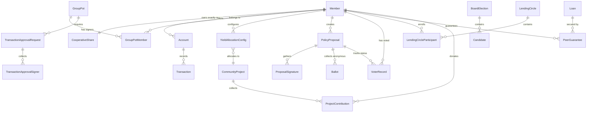

# Technical Requirements Specification: Digital Coop Bank (Sprint 3)

This document contains the Technical Architecture design for Sprint 3 of the Digital Coop Bank platform. It outlines the abstract data model, system APIs, external integrations, and non-functional requirements to support the sprint's user stories and acceptance criteria without defining source code.

---

## 1. Abstract Data Model

The data schema is structured to guarantee standard retail banking compliance, democratic governance auditability, and peer-to-peer risk management rules.

### 1.1 Core Entities & Attributes

#### Member
- `id` (UUID): Primary key. Unique member identifier.
- `external_user_id` (String): ID reference in the identity provider (e.g., Auth0).
- `first_name` (String): Legal first name.
- `last_name` (String): Legal last name.
- `email` (String): Verified email address.
- `phone_number` (String): Mobile number.
- `address_street` (String): Residential street address.
- `address_city` (String): Residential city.
- `address_postal_code` (String): Postal code.
- `address_country` (String): Country.
- `kyc_status` (Enum): `PENDING`, `VERIFIED`, `REJECTED`, `MANUAL_REVIEW`.
- `membership_status` (Enum): `PENDING_FUNDING`, `ACTIVE`, `SUSPENDED`, `INACTIVE`.
- `created_at` (Timestamp): Record creation date.
- `updated_at` (Timestamp): Last update date.

#### CooperativeShare
- `id` (UUID): Primary key.
- `member_id` (UUID): Foreign key referencing `Member`.
- `share_certificate_number` (String): Unique identifier for the legal share certificate.
- `par_value` (Decimal): Fixed at `$5.00`.
- `purchase_date` (Timestamp): Date of initial $5.00 deduction.
- `status` (Enum): `RESERVED`, `ACTIVE`, `REDEEMED`.
- `redeemed_at` (Timestamp): Date of share redemption/account closure.

#### Account
- `id` (UUID): Primary key.
- `member_id` (UUID): Foreign key referencing `Member` (owner).
- `account_number` (String): Unique banking account number.
- `routing_number` (String): Financial routing transit number.
- `account_type` (Enum): `CHECKING`, `SAVINGS`.
- `balance` (Decimal): Current account balance.
- `available_balance` (Decimal): Balance minus any holds (e.g., multi-sig pending, guarantees).
- `status` (Enum): `ACTIVE`, `FROZEN`, `CLOSED`.
- `created_at` (Timestamp): Creation date.

#### GroupPot
- `id` (UUID): Primary key.
- `name` (String): Custom group name.
- `creator_id` (UUID): Foreign key referencing `Member` (pot administrator).
- `required_approvals` (Integer): Number of signatures required to execute transactions (e.g., 2).
- `total_signers` (Integer): Total number of authorized signers in the pot.
- `balance` (Decimal): Current total balance in the pot.
- `created_at` (Timestamp): Creation date.

#### GroupPotMember
- `id` (UUID): Primary key.
- `group_pot_id` (UUID): Foreign key referencing `GroupPot`.
- `member_id` (UUID): Foreign key referencing `Member`.
- `role` (Enum): `ADMIN`, `SIGNER`, `CONTRIBUTOR`.
- `status` (Enum): `PENDING_ACCEPTANCE`, `ACTIVE`, `REMOVED`.
- `total_contributed` (Decimal): Aggregated sum of contributions.
- `joined_at` (Timestamp): Time of accepting invitation.

#### Transaction
- `id` (UUID): Primary key.
- `source_account_id` (UUID): Foreign key referencing `Account` (nullable for external incoming).
- `destination_account_id` (UUID): Foreign key referencing `Account` (nullable for external outgoing).
- `amount` (Decimal): Transaction value.
- `currency` (String): Currency code (e.g., `USD`).
- `transaction_type` (Enum): `DEPOSIT`, `WITHDRAWAL`, `TRANSFER`, `SHARE_PURCHASE`, `YIELD_DONATION`, `DIVIDEND_PAYOUT`, `LENDING_CIRCLE_CONTRIBUTION`, `LENDING_CIRCLE_PAYOUT`.
- `status` (Enum): `PENDING`, `COMPLETED`, `FAILED`, `CANCELLED`.
- `reference_note` (String): Memo or narration.
- `created_at` (Timestamp): Transaction timestamp.

#### TransactionApprovalRequest
- `id` (UUID): Primary key.
- `group_pot_id` (UUID): Foreign key referencing `GroupPot`.
- `transaction_id` (UUID): Foreign key referencing `Transaction` (held in `PENDING` status).
- `initiated_by_member_id` (UUID): Foreign key referencing `Member`.
- `expires_at` (Timestamp): Expiration timeline (exactly 48 hours from creation).
- `status` (Enum): `PENDING`, `APPROVED`, `REJECTED`, `EXPIRED`.
- `approvals_received` (Integer): Current count of valid approvals.

#### TransactionApprovalSigner
- `id` (UUID): Primary key.
- `approval_request_id` (UUID): Foreign key referencing `TransactionApprovalRequest`.
- `signer_member_id` (UUID): Foreign key referencing `Member`.
- `decision` (Enum): `PENDING`, `APPROVED`, `REJECTED`.
- `signed_at` (Timestamp): Time decision was recorded.
- `biometric_signature_hash` (String): Cryptographic proof of authorization.

#### YieldAllocationConfig
- `id` (UUID): Primary key.
- `member_id` (UUID): Foreign key referencing `Member`.
- `donation_percentage` (Decimal): Allocation value between 0.00 and 1.00 (e.g., 0.15 for 15%).
- `target_project_id` (UUID): Foreign key referencing `CommunityProject`.
- `is_active` (Boolean): Current toggle status.
- `updated_at` (Timestamp): Last modification date.

#### PolicyProposal
- `id` (UUID): Primary key.
- `creator_member_id` (UUID): Foreign key referencing `Member`.
- `title` (String): Between 10 and 100 characters.
- `summary` (String): Between 50 and 500 characters.
- `description` (String): Detailed body text (100–5000 characters).
- `category` (Enum): `INTEREST_RATE`, `CREDIT_POLICY`, `COMMUNITY_INITIATIVE`, `BYLAWS`.
- `status` (Enum): `DRAFT`, `SUBMITTED`, `ACTIVE_VOTING`, `ARCHIVED`, `PASSED`, `DEFEATED`.
- `signatures_count` (Integer): Accumulated count of support signatures.
- `signatures_target` (Integer): Target threshold (e.g., 500).
- `voting_starts_at` (Timestamp): Open date for ballot casting.
- `voting_ends_at` (Timestamp): Close date for ballot casting.
- `created_at` (Timestamp): Creation date.
- `expires_at` (Timestamp): 30-day limit from draft publication.

#### ProposalSignature
- `id` (UUID): Primary key.
- `proposal_id` (UUID): Foreign key referencing `PolicyProposal` (in `DRAFT` status).
- `member_id` (UUID): Foreign key referencing `Member`.
- `signed_at` (Timestamp): Timestamp of signature.

#### VoterRecord
- `id` (UUID): Primary key.
- `member_id` (UUID): Foreign key referencing `Member`.
- `proposal_id` (UUID): Foreign key referencing `PolicyProposal` or `BoardElection`.
- `has_voted` (Boolean): Prevent duplicate voting.
- `voted_at` (Timestamp): Time when vote status was set (decoupled from the vote content).

#### Ballot (Anonymous)
- `id` (UUID): Primary key, decoupled from `Member`.
- `proposal_id` (UUID): Foreign key referencing `PolicyProposal`.
- `vote_selection` (Enum): `YES`, `NO`, `ABSTAIN`.
- `cryptographic_proof_hash` (String): Security hash verifying ballot validity.
- `cast_at` (Timestamp): Time vote was recorded.

#### BoardElection
- `id` (UUID): Primary key.
- `title` (String): Election description (e.g., "2026 Board of Directors").
- `vacant_seats` (Integer): Maximum number of candidates a member can elect (e.g., 2).
- `starts_at` (Timestamp): Start time.
- `ends_at` (Timestamp): End time.
- `status` (Enum): `UPCOMING`, `ACTIVE`, `CLOSED`.

#### Candidate
- `id` (UUID): Primary key.
- `election_id` (UUID): Foreign key referencing `BoardElection`.
- `member_id` (UUID): Foreign key referencing `Member` (candidate profile).
- `statement` (String): Profile bio/statement.
- `photo_url` (String): Candidate image link.
- `votes_received` (Integer): Aggregated vote tally.

#### LendingCircle (ROSCA)
- `id` (UUID): Primary key.
- `name` (String): Circle nickname.
- `monthly_contribution` (Decimal): Standard deposit amount per member.
- `current_cycle` (Integer): Current round (e.g., 2nd month out of 5).
- `total_cycles` (Integer): Total rounds, matching number of participants.
- `status` (Enum): `PENDING_ACTIVATION`, `ACTIVE`, `COMPLETED`, `HALTED`.
- `payment_day_of_month` (Integer): Date when auto-debits run.
- `created_at` (Timestamp): Creation date.

#### LendingCircleParticipant
- `id` (UUID): Primary key.
- `lending_circle_id` (UUID): Foreign key referencing `LendingCircle`.
- `member_id` (UUID): Foreign key referencing `Member`.
- `draw_order_position` (Integer): Sequence index determining when this participant receives the payout.
- `draw_status` (Enum): `WAITING`, `PAID`.
- `account_id` (UUID): Foreign key referencing `Account` to debit/credit.

#### Loan
- `id` (UUID): Primary key.
- `borrower_member_id` (UUID): Foreign key referencing `Member`.
- `principal_amount` (Decimal): Original borrowing value.
- `remaining_principal` (Decimal): Current outstanding principal.
- `interest_rate` (Decimal): Applied interest rate.
- `guaranteed_amount` (Decimal): Cumulative value of locks on guarantor accounts.
- `status` (Enum): `APPLICATION`, `ACTIVE`, `DEFAULT`, `SETTLED`.
- `due_date` (Timestamp): Final maturity date.

#### PeerGuarantee
- `id` (UUID): Primary key.
- `loan_id` (UUID): Foreign key referencing `Loan`.
# Technical Requirements Specification: Digital Coop Bank (Sprint 3)

This specification defines the system architecture, database design, API interfaces, integration workflows, and security/performance guidelines for Sprint 3.

---

## 1. Abstract Data Model

The database schema must enforce financial tracking, democratic voting privacy, multi-signature consensus, and peer-to-peer risk management rules.



### 1.1 Core Entities & Primary Attributes

#### Member
- `id` (UUID, PK): Unique member identifier.
- `external_user_id` (String, Unique): ID reference in the identity provider (e.g., Auth0).
- `legal_name` (String): Combined verified first and last name.
- `email` (String): Verified email address.
- `kyc_status` (Enum): `PENDING`, `VERIFIED`, `REJECTED`, `MANUAL_REVIEW`.
- `membership_status` (Enum): `PENDING_FUNDING`, `ACTIVE`, `SUSPENDED`, `INACTIVE`.
- `created_at` (Timestamp): Record creation date.

#### CooperativeShare
- `id` (UUID, PK): Unique share identifier.
- `member_id` (UUID, FK): References `Member.id`.
- `share_certificate_number` (String, Unique): Legal identifier.
- `par_value` (Decimal): Fixed at `$5.00`.
- `status` (Enum): `RESERVED`, `ACTIVE`, `REDEEMED`.
- `purchase_date` (Timestamp): Date of initial $5.00 deduction.

#### Account
- `id` (UUID, PK): Unique bank account identifier.
- `member_id` (UUID, FK): References `Member.id` (Owner).
- `account_number` (String, Unique): Standard IBAN or internal account token.
- `account_type` (Enum): `CHECKING`, `SAVINGS`.
- `balance` (Decimal): Total absolute balance.
- `available_balance` (Decimal): Available balance minus locks (e.g., multi-sig holds, guarantor holds).
- `status` (Enum): `ACTIVE`, `FROZEN`, `CLOSED`.

#### GroupPot
- `id` (UUID, PK): Unique group pot identifier.
- `name` (String): Display name of the pot.
- `creator_member_id` (UUID, FK): References `Member.id` (Pot admin).
- `required_approvals` (Integer): Required signatures to execute transactions.
- `balance` (Decimal): Total available funds.

#### GroupPotMember
- `id` (UUID, PK): Unique join identifier.
- `group_pot_id` (UUID, FK): References `GroupPot.id`.
- `member_id` (UUID, FK): References `Member.id`.
- `role` (Enum): `ADMIN`, `SIGNER`, `CONTRIBUTOR`.
- `status` (Enum): `PENDING_ACCEPTANCE`, `ACTIVE`, `REMOVED`.

#### Transaction
- `id` (UUID, PK): Unique ledger entry identifier.
- `source_account_id` (UUID, FK, Nullable): References `Account.id` (Debit). Null for external incoming.
- `destination_account_id` (UUID, FK, Nullable): References `Account.id` (Credit). Null for external outgoing.
- `amount` (Decimal): Value of the transfer.
- `transaction_type` (Enum): `DEPOSIT`, `WITHDRAWAL`, `TRANSFER`, `SHARE_PURCHASE`, `YIELD_DONATION`, `DIVIDEND_PAYOUT`, `LENDING_CIRCLE_CONTRIBUTION`, `LENDING_CIRCLE_PAYOUT`.
- `status` (Enum): `PENDING`, `COMPLETED`, `FAILED`, `CANCELLED`.
- `created_at` (Timestamp): Date of transaction.

#### TransactionApprovalRequest
- `id` (UUID, PK): Unique approval transaction identifier.
- `group_pot_id` (UUID, FK): References `GroupPot.id`.
- `transaction_id` (UUID, FK): References `Transaction.id` (Held in `PENDING`).
- `initiated_by_member_id` (UUID, FK): References `Member.id`.
- `expires_at` (Timestamp): Threshold execution date (48 hours from creation).
- `status` (Enum): `PENDING`, `APPROVED`, `REJECTED`, `EXPIRED`.

#### TransactionApprovalSigner
- `id` (UUID, PK): Unique signature identifier.
- `approval_request_id` (UUID, FK): References `TransactionApprovalRequest.id`.
- `signer_member_id` (UUID, FK): References `Member.id`.
- `decision` (Enum): `PENDING`, `APPROVED`, `REJECTED`.
- `biometric_signature_hash` (String): Secure local cryptographic validation proof.
- `signed_at` (Timestamp, Nullable): Date of sign off.

#### YieldAllocationConfig
- `id` (UUID, PK): Unique allocation identifier.
- `member_id` (UUID, FK): References `Member.id`.
- `donation_percentage` (Decimal): Range `0.00` to `1.00`.
- `target_project_id` (UUID, FK): References `CommunityProject.id`.
- `is_active` (Boolean): Enable/disable flag.

#### PolicyProposal
- `id` (UUID, PK): Unique proposal identifier.
- `creator_member_id` (UUID, FK): References `Member.id`.
- `title` (String): Proposal title.
- `summary` (String): Short abstract.
- `description` (String): Detailed parameters.
- `category` (Enum): `INTEREST_RATE`, `CREDIT_POLICY`, `COMMUNITY_INITIATIVE`, `BYLAWS`.
- `status` (Enum): `DRAFT`, `SUBMITTED`, `ACTIVE_VOTING`, `ARCHIVED`, `PASSED`, `DEFEATED`.
- `signatures_count` (Integer): Count of support signatures.
- `signatures_target` (Integer): Signature target (e.g., 500).
- `expires_at` (Timestamp): 30-day limit from draft publication.

#### ProposalSignature
- `id` (UUID, PK): Unique signature tracking ID.
- `proposal_id` (UUID, FK): References `PolicyProposal.id`.
- `member_id` (UUID, FK): References `Member.id`.

#### VoterRecord
- `id` (UUID, PK): Unique voting status record.
- `member_id` (UUID, FK): References `Member.id`.
- `proposal_id` (UUID, FK, Nullable): References `PolicyProposal.id`.
- `election_id` (UUID, FK, Nullable): References `BoardElection.id`.
- `has_voted` (Boolean): Double-vote prevention flag.
- `voted_at` (Timestamp): Registration timestamp.

#### Ballot (Anonymous)
- `id` (UUID, PK): Decoupled record identifier. No foreign key to Member.
- `proposal_id` (UUID, FK, Nullable): References `PolicyProposal.id`.
- `election_id` (UUID, FK, Nullable): References `BoardElection.id`.
- `candidate_id` (UUID, FK, Nullable): References `Candidate.id`.
- `vote_selection` (Enum): `YES`, `NO`, `ABSTAIN`.
- `cryptographic_proof_hash` (String): Token showing registration validation.

#### BoardElection
- `id` (UUID, PK): Unique election identifier.
- `title` (String): Name of election window.
- `vacant_seats` (Integer): Allowed candidate selections.
- `starts_at` (Timestamp): Opening date.
- `ends_at` (Timestamp): Closing date.
- `status` (Enum): `UPCOMING`, `ACTIVE`, `CLOSED`.

#### Candidate
- `id` (UUID, PK): Unique candidate profile ID.
- `election_id` (UUID, FK): References `BoardElection.id`.
- `member_id` (UUID, FK): References `Member.id`.
- `statement` (String): Profile description text.
- `votes_received` (Integer): Aggregate count.

#### LendingCircle (ROSCA)
- `id` (UUID, PK): Unique ROSCA circle identifier.
- `name` (String): Label name.
- `monthly_contribution` (Decimal): Standard monthly payment.
- `current_cycle` (Integer): Active round.
- `total_cycles` (Integer): Duration (equivalent to number of participants).
- `payment_day_of_month` (Integer): Recurring date.
- `status` (Enum): `PENDING_ACTIVATION`, `ACTIVE`, `COMPLETED`, `HALTED`.

#### LendingCircleParticipant
- `id` (UUID, PK): Unique participant tracking ID.
- `lending_circle_id` (UUID, FK): References `LendingCircle.id`.
- `member_id` (UUID, FK): References `Member.id`.
- `draw_order_position` (Integer): Allocation schedule index.
- `draw_status` (Enum): `WAITING`, `PAID`.

#### Loan
- `id` (UUID, PK): Unique loan identifier.
- `borrower_member_id` (UUID, FK): References `Member.id`.
- `principal_amount` (Decimal): Disbursed amount.
- `remaining_principal` (Decimal): Owed amount.
- `interest_rate` (Decimal): Base interest rate.
- `status` (Enum): `APPLICATION`, `ACTIVE`, `DEFAULT`, `SETTLED`.

#### PeerGuarantee
- `id` (UUID, PK): Unique guarantee identifier.
- `loan_id` (UUID, FK): References `Loan.id`.
- `guarantor_member_id` (UUID, FK): References `Member.id`.
- `locked_amount` (Decimal): Locked collateral value in Guarantor savings.
- `released_amount` (Decimal): Amount returned to Guarantor availability.
- `status` (Enum): `PENDING`, `ACTIVE`, `RELEASED`, `SEIZED`, `REJECTED`.

#### CommunityProject
- `id` (UUID, PK): Unique crowdfunding identifier.
- `creator_member_id` (UUID, FK): References `Member.id`.
- `title` (String): Project name.
- `description` (String): Impact proposal detail.
- `funding_target` (Decimal): Goal.
- `total_funded` (Decimal): Amount donated by members.
- `surplus_matched_funded` (Decimal): Match amount from bank.
- `deadline` (Timestamp): Expiration date (1–90 days).
- `status` (Enum): `PENDING_REVIEW`, `ACTIVE`, `FULLY_FUNDED`, `UNSUCCESSFUL`, `COMPLETED`.
- `matching_eligible` (Boolean): Flag for surplus matching.
- `matching_cap` (Decimal): Maximum matching allowance.

#### ProjectContribution
- `id` (UUID, PK): Unique donation identifier.
- `project_id` (UUID, FK): References `CommunityProject.id`.
- `member_id` (UUID, FK): References `Member.id`.
- `donation_amount` (Decimal): Member deposit value.
- `matched_amount` (Decimal): Matching engine payout.
- `status` (Enum): `ESCROWED`, `DISBURSED`, `REFUNDED`.

#### SurplusTreasury
- `id` (UUID, PK): Annual ledger tracking ID.
- `fiscal_year` (Integer): Calendar year.
- `cumulative_net_surplus` (Decimal): YTD profits.
- `matching_grant_budget` (Decimal): Available matching pool.
- `matching_grant_spent` (Decimal): Disbursed matching pool.

---

## 2. API Endpoints & Schemas

### 2.1 Member & Identity Management (MIM)

#### `POST /api/v1/onboarding/kyc/verify`
Triggers external identity validation and KYC check.
- **Request Body Keys:**
  - `document_type` (String)
  - `document_front_base64` (String)
  - `document_back_base64` (String)
  - `selfie_video_base64` (String)
- **Response Keys:**
  - `kyc_request_id` (UUID)
  - `status` (String) -> `VERIFIED` | `MANUAL_REVIEW` | `REJECTED`
  - `details` (String)
  - `onboarding_duration_seconds` (Integer)

#### `POST /api/v1/onboarding/share/allocate`
Initiates mandatory $5.00 share allocation from initial deposit.
- **Request Body Keys:**
  - `deposit_transaction_id` (UUID)
- **Response Keys:**
  - `share_id` (UUID)
  - `share_certificate_number` (String)
  - `par_value` (Decimal)
  - `membership_status` (String) -> `ACTIVE`

---

### 2.2 Core Accounts & Treasury (CAT)

#### `POST /api/v1/accounts/group-pots`
Configures a multi-signature group savings pot.
- **Request Body Keys:**
  - `name` (String)
  - `required_approvals` (Integer)
  - `invitee_member_ids` (Array of UUIDs)
- **Response Keys:**
  - `group_pot_id` (UUID)
  - `name` (String)
  - `required_approvals` (Integer)
  - `balance` (Decimal)
  - `members` (Array of objects with keys: `member_id`, `role`, `status`)

#### `POST /api/v1/accounts/group-pots/{id}/transactions`
Initiates a transaction hold waiting for multi-sig approval.
- **Request Body Keys:**
  - `amount` (Decimal)
  - `destination_account_id` (UUID)
  - `reference_note` (String)
- **Response Keys:**
  - `transaction_id` (UUID)
  - `approval_request_id` (UUID)
  - `status` (String) -> `PENDING_APPROVAL`
  - `expires_at` (Timestamp)

#### `POST /api/v1/accounts/group-pots/approvals/{requestId}/action`
Records signer decision for pending transaction.
- **Request Body Keys:**
  - `decision` (String) -> `APPROVED` | `REJECTED`
  - `biometric_auth_token` (String)
- **Response Keys:**
  - `approval_request_id` (UUID)
  - `status` (String) -> `COMPLETED` | `REJECTED`
  - `approvals_received` (Integer)
  - `transaction_status` (String) -> `EXECUTED` | `CANCELLED`

#### `PUT /api/v1/accounts/yield-allocator`
Sets user interest donation routing config.
- **Request Body Keys:**
  - `donation_percentage` (Decimal)
  - `target_project_id` (UUID)
- **Response Keys:**
  - `config_id` (UUID)
  - `donation_percentage` (Decimal)
  - `target_project_id` (UUID)
  - `status` (String) -> `ACTIVE`

---

### 2.3 Democratic Governance (DGV)

#### `POST /api/v1/governance/proposals`
Submits a draft policy proposal.
- **Request Body Keys:**
  - `title` (String)
  - `summary` (String)
  - `description` (String)
  - `category` (String)
- **Response Keys:**
  - `proposal_id` (UUID)
  - `status` (String) -> `DRAFT`
  - `signatures_count` (Integer)
  - `signatures_target` (Integer)

#### `POST /api/v1/governance/proposals/{id}/sign`
Records support signature for a draft.
- **Response Keys:**
  - `proposal_id` (UUID)
  - `signatures_count` (Integer)
  - `status` (String) -> `DRAFT` | `SUBMITTED`

#### `POST /api/v1/governance/proposals/{id}/vote`
Submits an anonymous policy vote.
- **Request Body Keys:**
  - `vote_selection` (String) -> `YES` | `NO` | `ABSTAIN`
  - `blind_signature_proof` (String)
- **Response Keys:**
  - `status` (String) -> `RECORDED`
  - `cryptographic_receipt` (String)

---

### 2.4 Peer-Supported Lending (PSL)

#### `POST /api/v1/lending/circles`
Establishes a rotating savings circle.
- **Request Body Keys:**
  - `name` (String)
  - `monthly_contribution` (Decimal)
  - `payment_day_of_month` (Integer)
  - `participants` (Array of objects with keys: `member_id`, `draw_order`)
- **Response Keys:**
  - `circle_id` (UUID)
  - `status` (String) -> `ACTIVE`
  - `next_execution_date` (Timestamp)

#### `POST /api/v1/lending/loans/guarantees`
Requests peer guarantee.
- **Request Body Keys:**
  - `loan_id` (UUID)
  - `guarantor_member_id` (UUID)
  - `requested_amount` (Decimal)
- **Response Keys:**
  - `guarantee_request_id` (UUID)
  - `status` (String) -> `PENDING`

#### `POST /api/v1/lending/loans/guarantees/{requestId}/action`
Approves or rejects a peer guarantee request.
- **Request Body Keys:**
  - `action` (String) -> `APPROVE` | `REJECT`
- **Response Keys:**
  - `guarantee_request_id` (UUID)
  - `status` (String) -> `ACTIVE` | `REJECTED`
  - `locked_amount` (Decimal)
  - `borrower_rate_adjustment` (Decimal)

---

### 2.5 Community & Impact Funding (CIF)

#### `POST /api/v1/funding/projects`
Creates crowdfunding project proposal.
- **Request Body Keys:**
  - `title` (String)
  - `description` (String)
  - `funding_target` (Decimal)
  - `deadline_days` (Integer)
- **Response Keys:**
  - `project_id` (UUID)
  - `status` (String) -> `PENDING_REVIEW`

#### `POST /api/v1/funding/projects/{id}/donate`
Processes member project donation.
- **Request Body Keys:**
  - `donation_amount` (Decimal)
- **Response Keys:**
  - `donation_id` (UUID)
  - `member_donation` (Decimal)
  - `treasury_match` (Decimal)
  - `status` (String) -> `ESCROWED`

#### `GET /api/v1/funding/impact-dashboard`
Calculates aggregated and personal impact metrics.
- **Response Keys:**
  - `aggregated_metrics` (Object with keys: `co2_offset_tons`, `local_jobs_created`)
  - `personal_metrics` (Object with keys: `equivalent_co2_offset_tons`, `equivalent_jobs_supported`)

---

### 2.6 Dividend Management & Allocation (DMA)

#### `GET /api/v1/dividends/projection`
Calculates projected member dividend.
- **Response Keys:**
  - `cooperative_net_surplus_ytd` (Decimal)
  - `estimated_dividend_payout` (Decimal)
  - `calculation_breakdown` (Object with keys: `average_deposit_balance`, `voting_participation_rate`)

---

## 3. Third-party Integrations

The architecture utilizes isolated third-party services to ensure zero legacy banking footprint.

```
       ┌──────────────────────────────────────────────────────────┐
       │                       Bank Client                        │
       └─────┬──────────────────────────────────────────────┬─────┘
             │                                              │
             │ (ID & Selfie Capture)                        │ (Credentials)
             ▼                                              ▼
┌──────────────────────────┐                  ┌──────────────────────────┐
│  eKYC Verification SaaS  │                  │   IDP / Auth0 Service    │
│    (Persona / Onfido)    │                  │  (OAuth2 / OIDC Engine)  │
└────────────┬─────────────┘                  └─────────────┬────────────┘
             │                                              │
             │ (Webhook: verification.passed)               │ (Access Token)
             ▼                                              ▼
┌────────────────────────────────────────────────────────────────────────┐
│                        Digital Banking API Gateway                     │
└────────────────────────────────────┬───────────────────────────────────┘
                                     │
                                     │ (REST API)
                                     ▼
                      ┌──────────────────────────┐
                      │   Core Ledger Engine     │
                      │ (Thought Machine/Mambu)  │
                      └──────────────────────────┘
```

### 3.1 Identity Verification (Persona/Onfido)
- **Purpose:** Secure document capture, OCR text extraction, biometric comparison, and AML/PEP database validation.
- **Integration Flow:**
  1. The client app initializes the provider SDK. The user scans ID and records selfie video.
  2. Media payloads bypass banking servers and upload to the provider's PCI-compliant host.
  3. The provider verifies validity and triggers a backchannel HTTPS Webhook (`verification.passed`) to the bank's API gateway.
  4. The Bank API triggers core customer creation.

### 3.2 Core Banking Engine (Thought Machine/Mambu)
- **Purpose:** Ledger accounting engine, checking/savings account lifecycle, and hold configurations.
- **Integration Flow:**
  1. Standard account deposits utilize core ledger APIs.
  2. For Group Pot multi-sig requests, the bank API calls core APIs to place a holding freeze on the target balance.
  3. Upon approval threshold completion, the bank API triggers ledger release and execution.

### 3.3 Notification Service (Firebase Cloud Messaging)
- **Purpose:** Real-time push notifications.
- **Integration Flow:**
  1. Backend processes trigger push notifications (e.g., pending guarantor locks, multi-sig alerts).
  2. Messages publish to FCM REST interface to alert targeted user devices.

---

## 4. Non-Functional Requirements (NFRs)

### 4.1 Security & Compliance Guidelines
- **Authentication:** Enforce OAuth 2.0 / OIDC utilizing PKCE. MFA is mandatory.
- **Authorization:** Implement Role-Based Access Control (RBAC) separating Standard Member, Compliance Officer, and Treasury Administrator scopes.
- **Voting Anonymity:** Enforce physical separation of voter registration logs and ballot entries. The database schemas for `VoterRecord` and `Ballot` must reside in disconnected storage nodes. Decouple relations using zero-knowledge validation proofs (ZKP) or blind signatures.
- **Data Protection:** Encrypt database fields containing PII using AES-256-GCM. Encrypt all in-transit APIs using TLS 1.3. Enforce client SSL certificate pinning.
- **Ledger Immutability:** Write transactions, share registry data, and completed votes to write-once-read-many (WORM) tables to prevent historical modification.

### 4.2 Performance, Scale & Availability
- **CQRS Pattern:** Separate transactional writes from dashboard reads. Read queries for dynamic dividend calculations and impact boards query local Redis caches, synchronized via event-driven messaging.
- **Scale Out Configuration:** Deploy microservices inside auto-scaling containers (Kubernetes/ECS) configured to scale horizontally when node CPU usage exceeds 70%.
- **Response Latency SLAs:**
  - Standard Banking APIs: 95th percentile under 200ms.
  - eKYC Verification Completion: External webhook response under 30 seconds.
- **Concurrency Control:** Queue high-contention actions (such as voting submissions, peer guarantees, and crowdfunding updates) in Redis queues to resolve writes sequentially and eliminate row-level database locks.